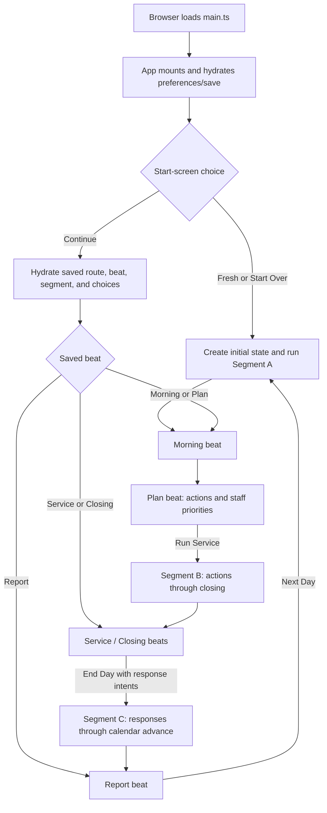
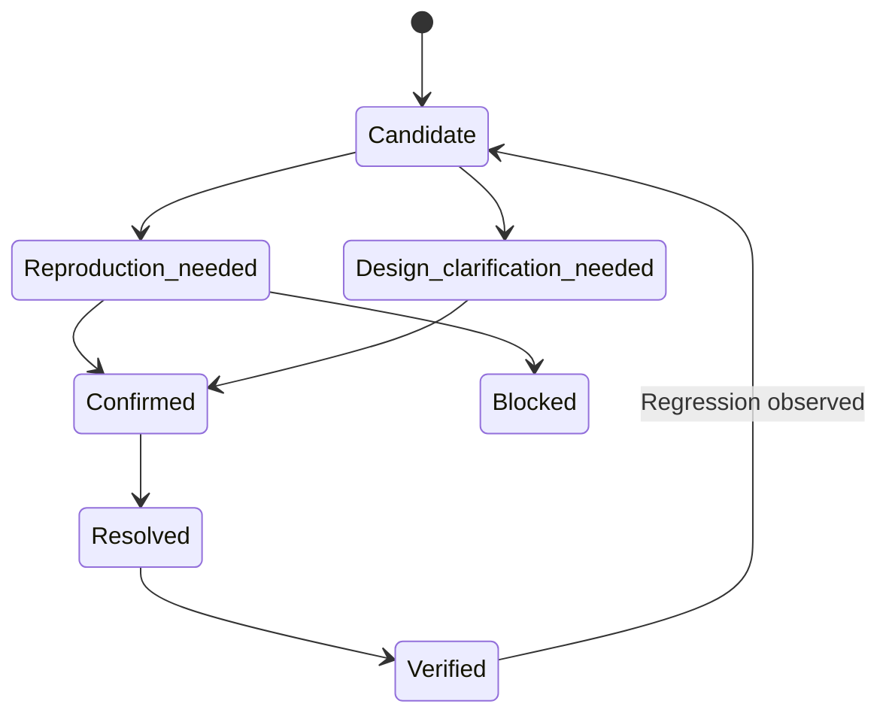

# Goblin Tavern Gameplay Audit Framework

> **Status:** Repository-derived audit preparation only  
> **Source snapshot:** `Goblin-Tavern-main (8).zip`, inspected 2026-07-25  
> **Audit status:** No gameplay finding is confirmed or assigned by this document

## 1. Purpose and guardrails

This document maps the current Goblin Tavern repository and turns that map into a plan for a later gameplay audit. It reconstructs what the code appears to run, which systems contribute to the playable experience, how responsibility and state cross system boundaries, and which routes should be exercised at runtime.

This is not the audit itself. Static evidence can establish that a symbol is registered, a route is wired, or a state mutation is implemented. It cannot establish that the player reaches the behaviour naturally, understands it, finds it meaningful, or experiences all connected systems coherently. Those claims are deliberately deferred to the future audit.

The framework follows these rules:

- Treat current source, current configuration, registrations, imports, callbacks, and state writes as the strongest static evidence.
- Treat tests as evidence of intended contracts and available test support, not proof of the actual play experience.
- Treat plans, prior audits, issue notes, and generated diagnostic reports as historical or design evidence unless current code corroborates them.
- Treat compatibility aliases, empty registries, and placeholder modules as supporting or uncertain material, not as player-facing features.
- Do not infer conventional combat, inventory, levels, quests, win states, or failure states. The repository instead supports a text-forward tavern-management simulation organized around day planning, service resolution, issue response, and reports.
- Record uncertainty explicitly. An unclear design intention is a question, not a defect.

### 1.1 Interpretation confidence

| Label | Meaning in this document |
|---|---|
| **High confidence** | Current registrations, imports, state writes, and/or UI call paths agree on the responsibility. |
| **Moderate confidence** | The implementation is present and connected, but player reachability, cadence, or intended prominence needs runtime confirmation. |
| **Low confidence** | Evidence is partial, historical, compatibility-oriented, or only indirectly connected. |
| **Unknown** | Static inspection cannot determine the purpose or intended experience. |

### 1.2 Static-map vocabulary

- **Live runtime:** reachable from `web/src/main.ts`, `web/src/App.svelte`, the game store, or the canonical simulation pipeline.
- **Player-facing:** presented to the player or able to change player-visible state, choices, outcomes, timing, or feedback.
- **Supporting:** required to construct, validate, persist, project, test, or explain the player-facing runtime.
- **Development-only:** test runners, scripts, authoring specifications, editor hooks, diagnostics, and generated audit output.
- **Dormant/placeholder:** present in the tree but not registered in the live path, or intentionally empty pending later work.
- **Seam:** a transfer of control, data, state, responsibility, or feedback between components.

### 1.3 Preparation method and limitations

The archive was safely unpacked and inventoried in full. Current manifests, configuration, source trees, registrations, state definitions, screen callbacks, persistence code, tests, specifications, scripts, documentation, generated material, and development configuration were inspected. Runtime flow was reconstructed by following imports, calls, phase/module order, callbacks, state writes, serialization, and projection consumers.

The application was not played, and no gameplay route, automated test suite, diagnostic generator, or production build was used as gameplay evidence for this preparation. Accordingly, all experience-level questions remain open and all expected runtime results in this document are test contracts rather than observations.

## 2. Repository inventory

The snapshot contains 1,217 files across the application, simulation, content, test, documentation, and tooling trees. It is a TypeScript/Svelte browser project with a deterministic, headless simulation core.

### 2.1 Top-level organization

| Area | Approximate size | Current role | Runtime relationship | Confidence |
|---|---:|---|---|---|
| Root configuration | `package.json`, lockfile, TypeScript/Vite/Vitest/Svelte configs | Defines package scripts, dependency versions, compilation, browser build, and test tiers | Build and validation support | High |
| `src/sim/` | 353 files / 71k lines | Canonical state, engine, modules, registries, content, signals, and simulation test helpers | Primary gameplay state and rules | High |
| `src/cards/` | 216 files / 30k lines | Issue-seed-to-card selection, templates, snippet composition, gates, and card context | Player-facing issue interpretation and choices | High |
| `src/reports/` | 51 files / 9k lines | Daily, weekly, monthly, tavern, world, log, cause, and missed-opportunity projections | Player-facing retrospective and explanatory feedback | High |
| `src/surface/` | 6 files / 800 lines | Evidence/fact extraction and narrative projection boundaries | Supporting bridge between simulation truth and presented text | High |
| `web/` | 92 source files / 22k lines | Svelte application shell, screens, interaction components, store, persistence, snapshots, import/export, and preferences | Browser-playable surface | High |
| `tests/` | 295 files / 89k lines | Unit, integration, component, architecture, card, report, simulation, long-run, and web tests | Development evidence; not a substitute for play | High |
| `specs/cards/` | 21 YAML files | Human-readable card authoring/contract specifications | Authoring support; current runtime uses TypeScript card implementations | Moderate |
| `docs/` | 161 files / 113k lines | Plans, prior audits, issue tracker, implementation notes, generated reports, and design history | Design/history evidence; freshness varies | High |
| `scripts/` | 7 files / 1.4k lines | Tiered test launcher and card/cause/readiness diagnostics | Development-only | High |
| `.github/workflows/` | GitHub Pages workflow | Installs, checks, typechecks, builds, and deploys `dist` | Delivery infrastructure | High |
| `.claude/` and `CLAUDE.md` | Hooks/settings and contributor instructions | Development workflow support | Development-only | High |
| `web/public/` | `favicon.svg` | Static browser asset | Presentation only | High |

No conventional scene/level files, external game-engine project file, audio library, sprite collection, or authored map hierarchy is present. The equivalent runtime “scenes” are Svelte screens and the day-beat state machine. The snapshot also does not contain an installed dependency tree or built `dist/`; those are generated from the manifests.

### 2.2 Technology and launch/build paths

| Concern | Repository evidence | Apparent path |
|---|---|---|
| Application | Svelte 5, TypeScript, Vite | `npm run dev` starts Vite with `web/` as root; `web/src/main.ts` mounts `App.svelte` |
| Production build | `vite.config.ts`, `package.json` | `npm run build` writes the browser bundle to root `dist/` |
| Static deployment | `.github/workflows/` | GitHub Pages workflow checks, typechecks, builds, then deploys `dist` |
| Simulation randomness | `prando`, `src/sim/core/rng.ts`, named streams and segment seeds | Seeded deterministic simulation; no serialized RNG cursor is required between day segments |
| Runtime validation | Zod state/save schemas, registry/reference validation | Load/import/migration and end-of-simulation validation boundaries |
| Fast tests | `npm test`, `scripts/run-tests.mjs` | Default tier excludes eight identified heavy/long-run files |
| Full/heavy tests | `npm run test:full`, `npm run test:heavy` | Full suite or the long-running subset |
| Static checks | `npm run typecheck`, `npm run check` | Core TypeScript and Svelte-aware checks |
| Diagnostic generation | card/cause scripts | Developer-invoked analysis; some scripts write derived files under `docs/audits/` |

The deployment workflow’s exact validation coverage should be confirmed in Phase A. Its static contents are relevant architecture evidence, but this framework does not label the workflow sufficient or insufficient.

### 2.3 Source-of-truth hierarchy for the later audit

1. **Current live registrations and call paths:** `web/src/main.ts`, `web/src/App.svelte`, `web/src/lib/sim/gameStore.svelte.ts`, `src/sim/canonicalPipeline.ts`, screen callbacks, registries, and runtime projection imports.
2. **Current state and contracts:** state schemas/defaults, engine context/mutators, issue/card/response types, persistence schemas, and validation.
3. **Current tests:** executable examples of intended behaviour, including headless and component paths.
4. **Current plans and issue notes:** evidence of intention or status, to be reconciled with code.
5. **Historical audits and generated reports:** useful provenance, but not assumed current. For example, older documents may describe a testing-layer pipeline import that the current store no longer uses.
6. **Placeholders and compatibility surfaces:** mapped so they are not mistaken for active gameplay.

## 3. Repository-derived functional taxonomy

The taxonomy below is based on observed responsibilities and live connections. It intentionally mixes gameplay and technical categories only where the repository does.

### 3.1 Catalogue: identity, evidence, entry, status

| ID | Name and apparent responsibility | Main evidence | Runtime entry point | Development status | Confidence |
|---|---|---|---|---|---|
| R1 | **Build and browser delivery** — compile the web application and publish a static bundle | `package.json`, `vite.config.ts`, `tsconfig*.json`, `.github/workflows/` | Package scripts / Pages workflow | Current supporting infrastructure | High |
| R2 | **Application bootstrap and route shell** — hydrate settings/save, select start or continued session, render top-level screens and global overlays | `web/src/main.ts`, `web/src/App.svelte`, `AppShell.svelte`, `TopBar.svelte`, `BottomNav.svelte` | Browser load | Current live runtime | High |
| R3 | **Day-session coordinator** — own web-session state and invoke Segments A, B, and C | `web/src/lib/sim/gameStore.svelte.ts`, `daySession.ts`, `actionBuilder.ts`, `intentBuilder.ts` | App start/continue; Day screen callbacks | Current live runtime | High |
| R4 | **Persistence and recovery** — autosave, migration, hydration, named snapshots, export/import, and preferences | `persistence.ts`, `snapshots.ts`, `exportImport.ts`, `preferences.ts`, `prefsStore.svelte.ts`, `SavesSection.svelte` | App mount, reactive autosave, Saves UI | Current live runtime | High |
| R5 | **Navigation and detail projection** — Day/Reports/Tavern/World/More routes, subroutes, links, sheets, glossary, and cause drilldown | `web/src/lib/screens/`, `components/links/`, detail sheets, glossary/drilldown stores | App route and user taps | Current live runtime | High |
| S1 | **Deterministic simulation engine** — order modules, run phases/segments, supply RNG/context, collect logs/diffs/reports/validation | `src/sim/core/`, `canonicalPipeline.ts` | `advanceDaySegment()` from game store; `simulateDay()` in headless paths | Current live runtime | High |
| S2 | **Canonical state and initialization** — define `TavernState`, defaults, difficulty presets, migration, normalization, and validation | `src/sim/state/` | New game, load/import, engine result | Current live runtime | High |
| S3 | **Registries and authored content** — define areas, stock, recipes, customer groups, roles, priorities, actions, reputation axes, cultures, factions, suppliers, characters, traits, and upgrades | `src/sim/registries/`, `src/sim/content/` | State defaults and modules | Current content foundation | High |
| S4 | **Tavern resources and physical condition** — area decay/problems/upgrades, stock quantity/quality/spoilage/price, recipes/menu/ingredients | `src/sim/modules/areas/`, `src/sim/modules/stock/`, recipe definitions and action implementations | Daily phases, owner actions, service, weekly effects | Current live gameplay | High |
| S5 | **Staff operations** — identities, roles, skill, morale/stress/fatigue/loyalty/wages, sticky priorities, hiring/firing, service contribution | `src/sim/modules/staff/`, staff registries/content, `StaffPanel.svelte`, `StaffPrioritySheet.svelte` | Segment A/B and player planning | Current live gameplay | High |
| S6 | **Demand and service resolution** — forecast customer traffic, admit groups, calculate purchases/satisfaction/incidents/scenes, change coin/resources/relationships | `src/sim/modules/customers/`, `src/sim/modules/service/`, service report types | Forecast in Segment A; service in Segment B | Current central gameplay | High |
| S7 | **Owner decision portfolio** — queue immediate, project, policy, social, staff-management, and expedition actions under a daily time budget | `src/sim/modules/ownerActions/`, action registry/content, `ActionPicker.svelte`, quick-action components | Plan beat and cross-screen action CTAs | Current live gameplay | High |
| S8 | **Calendar and periodic settlement** — day types/seasons, weekly and monthly accumulation, wages/rent/inspection/community/maintenance/history | `src/sim/modules/calendar/`, `src/sim/modules/weekly/`, `src/sim/modules/monthly/`, calendar UI | Every day; boundary-gated phases in Segment C | Current long-horizon gameplay | High |
| S9 | **Suppliers and market flow** — availability, delivery, pricing, reliability, relationship, and restock consequences | `src/sim/modules/suppliers/`, supplier and market content, World supplier UI | Segment A/world update and owner restock paths | Current connected gameplay | High |
| S10 | **Regular patrons** — emergence, identity, visits, loyalty/irritation, memories, complaint/relationship seeds | `src/sim/modules/regulars/`, regular content, World regular UI | Segment A/B and issue generation | Current connected gameplay | High |
| S11 | **Social world model** — cultures, factions, NPCs, reputation relationships, tensions, tavern identity, events/rumours, and world views | `src/sim/modules/world/`, `src/sim/modules/cultures/`, `src/sim/modules/factions/`, `src/sim/modules/tavernIdentity/`, related content/UI | Segment A/C and World screen | Current, with some empty content registries | Moderate |
| S12 | **Adventurers and expeditions** — maintain a hireable roster; commission timed ingredient expeditions; resolve success, loss, injury, return, and cost | `src/sim/modules/adventurers/`, `src/sim/modules/expeditions/`, `CommissionExpeditionSheet.svelte` | Tavern Stock flow and start-day progress | Current long-horizon gameplay | High |
| C1 | **Memory and history** — retain bounded actor/system events and decay or pattern them for later explanation and generation | `src/sim/modules/memories/`, `src/sim/modules/history/` | End-day analysis stack | Current supporting/gameplay feedback state | High |
| C2 | **Causality and pressure analysis** — record causes, infer attribution beliefs, calculate 21 pressure domains, and identify feedback loops | `src/sim/modules/causes/`, `src/sim/modules/attribution/`, `src/sim/modules/pressures/`, `src/sim/modules/feedback/`, `src/sim/core/changeTracker.ts` | State mutation and end-day analysis | Current connective gameplay | High |
| C3 | **Local long-form arcs** — start/progress monthly local situations and apply cross-domain effects | `src/sim/modules/localArcs/`, `src/sim/content/events/localArcRegistry.ts` | Month boundary in Segment C | Implemented long-horizon content; runtime cadence unverified | Moderate |
| C4 | **Teleology openings, ventures, and transformations** — surface opportunities, park/return them, pursue a venture, and activate a persistent capability | `src/sim/modules/kernel/`, `src/sim/modules/openings/`, `src/sim/modules/ventures/`, transformation state/content | Segment A/C; response choices | Implemented, deliberately narrow current blueprint set | Moderate |
| C5 | **Staff mastery arc** — automatically seed and progress a staff-development arc and present recognition/continuation choices | `src/sim/modules/arcs/`, staff-arc card/content | Start-day and response path | Implemented long-horizon path | Moderate |
| P1 | **Issue-seed generation and triage** — convert simulation conditions into timed, ranked, bounded issue seeds; retain displaced-but-surfaced seeds for response resolution | `src/sim/modules/issues/`, issue types/generators/ranking/fairness tests | Segment A/B and periodic generation passes | Current live bridge | High |
| P2 | **Card selection and composition** — choose a dedicated or fallback card and compose deterministic player-readable text, stakes, choices, and previews | `src/cards/`, `specs/cards/`, `realCardRegistry.ts`, `CardRenderer.svelte` | CardDeck receives visible seeds | Current live presentation/choice system | High |
| P3 | **Pending decisions and responses** — allow selection/revision, resolve choice profiles, apply immediate effects, and enqueue delayed/future effects | `web/src/lib/sim/intentBuilder.ts`, `src/sim/modules/responses/`, pending state in game store | Card choice; Segment C `applyResponses`; next-day pending processing | Current live gameplay | High |
| P4 | **Reports and explanatory navigation** — summarize the day/week/month, expose state/cause views, link metrics/entities, and offer pressure-to-plan routing | `src/reports/`, `DailyReport.svelte`, Reports screen, cause drilldown | Report beat and persistent tabs | Current live feedback/decision support | High |
| P5 | **Signal vocabulary** — derive banded conditions, trends, and repeats from state/entities for cards and snippets | `src/sim/signals/` | Card context/composition and related projections | Current supporting layer | High |
| P6 | **Day-beat interaction surface** — bracket the simulation’s three segments with morning, plan, service, closing, and report beats | `DayScreen.svelte`, `BeatTransition.svelte`, `CardDeck.svelte`, day components | Day route | Current primary player-facing loop | High |
| D1 | **Automated verification and headless play** — unit/component/integration tests, cardless multi-day simulation, bots, and balance/coverage probes | `tests/`, `src/sim/testing/`, `scripts/run-tests.mjs` | Developer commands | Development-only; broad coverage | High |
| D2 | **Authoring and diagnostic tools** — card specs, choice sampling, card audits, cause-gap analysis, and readiness diagnostics | `specs/`, `scripts/` | Developer commands | Development-only | High |
| D3 | **Plans, issue history, prior audits, and generated output** — explain design evolution and record earlier analysis | `docs/`, especially `docs/plans/`, `docs/audits/`, `docs/ISSUE_TRACKER.md` | Human reference | Mixed freshness; not a live runtime source | High |
| D4 | **Compatibility and inactive seams** — legacy aliases, empty general registries, deprecated entry points, and unregistered placeholders | `modules/issueSeeds/`, `moduleRegistry.ts`, generic issue-seed registry, `economy/`, `reports/`, `runSimulation()` | Compatibility imports or no live entry | Dormant/supporting/uncertain | Moderate |
| D5 | **Contributor automation** — repository-specific Claude instructions/hooks/settings | `CLAUDE.md`, `.claude/` | Contributor environment | Development-only | High |

### 3.2 Catalogue: contracts, dependencies, effects, persistence, and runtime questions

| ID | Inputs received | Outputs/state changes | Calls / is called by | Player-facing effect | Persistence requirement | Main runtime question |
|---|---|---|---|---|---|---|
| R1 | Source/config/dependencies | Browser bundle and deploy artifact | Package manager, Svelte/Vite/TypeScript | Access to the application | None in gameplay save | Can a clean supported environment build, launch, and load the same path later audited? |
| R2 | Preferences, load outcome, route, store state | Mounted screen, navigation, autosave scheduling, global overlays | Calls persistence/store; called by browser | Determines entry, continuation, visible context, and recovery UI | Route/subroutes in session; preferences separately | Do fresh, valid-save, invalid-save, and incompatible-save launches all expose a comprehensible path forward? |
| R3 | Seed, difficulty-derived initial state, picks, priorities, intents | Segment results, beats, route state, pending choices, latest result | Calls canonical engine/cards/report adapters; screens call it | Controls when the day advances and when decisions take effect | Most day-session fields; selected transient fields intentionally omitted | Does every saved beat resume against the correct segment without replay, omission, or misleading feedback? |
| R4 | Store session, browser storage, import file, snapshot operation | Saved/hydrated/replaced session, warnings/errors | Called by App and Saves UI | Continuity, recovery, transfer, and trust | Core responsibility | Do state, choices, route, explanation, and time position survive each supported save/reload path coherently? |
| R5 | State projections, route targets, user taps | Route/subview changes, detail sheets, planner requests, glossary/drilldown state | Screens call projections/store | Lets the player inspect and act on the world | Route/subroutes; overlays/selected detail generally transient | Do links land on the intended entity/metric and preserve enough context to continue the day? |
| S1 | TavernState, SimInput, modules, seed, phase/segment range | New state, logs, validation, reports, tagged diffs | Called by R3/D1; invokes all registered modules | Makes the simulation advance | Resulting state, not runtime object/RNG cursor | Are interactive segmented and headless full-day execution semantically consistent? |
| S2 | New-game preset or serialized data | Valid normalized state and module slices | Used by R3/R4/S1/modules | Establishes all starting conditions and continuity | Entire canonical state | Are defaults, difficulty changes, migration, and validation visible and internally consistent at runtime? |
| S3 | Authored definitions/IDs | Runtime instances and lookup contracts | State defaults/modules/UI actions call registries | Defines available content and legal references | IDs and instance state, not registry objects | Which registered definitions are intended to be available at day zero versus merely known to the runtime? |
| S4 | Calendar, service demand, actions, recipes, suppliers | Condition, cleanliness, problems, quantities, quality, spoilage, prices, menu, coin effects | S6/S7/S8/S9 call or read it | Creates resource constraints and tavern condition decisions | Canonical state and histories | Can the player predict and observe the full cause-to-resource-to-service chain? |
| S5 | Staff state, priorities, actions, service demand, periodic settlement | Work allocation, fatigue/stress/morale/skill/loyalty/wages, roster changes | S6/S7/S8/cards/reports/UI | Staffing choices and consequences | Staff and sticky web priorities; some ephemeral service detail | Does a chosen priority measurably affect service and remain understandable across days/reloads? |
| S6 | Forecasts, customers, staff, areas, stock, recipes, policies, RNG | Turnout, sales, satisfaction, incidents/scenes, coin/resource/staff/customer changes | Runs in S1; feeds C/P/report systems | Resolves the central day’s activity | Result state, causes/history/report summaries | Does forecast → planning → service → report form a legible and consequential loop? |
| S7 | Player picks, targets, budget, applicability, current state | Immediate mutations, projects/policies/social outcomes, queued expedition | UI/R3 call registry definitions; owner-actions module applies | Main proactive decision channel | Queued picks until service; resulting state thereafter | Are availability, time cost, target validity, preview, execution, and report feedback consistent through normal entry points? |
| S8 | Daily results, calendar boundary, accumulated history | Calendar advance, day-type changes, wages/rent/inspection/community/maintenance and weekly/monthly records | S1 invokes; many systems consume boundary state | Creates cadence and deferred consequences | Calendar and periodic module slices/history | Are boundary events announced before, resolved when expected, and explained after? |
| S9 | Market conditions, supplier relation/reliability, restock request | Availability/price/delivery/relationship and stock changes | World update and owner actions; cards/reports read it | Makes procurement conditional and relational | Supplier/world/stock state | Does the displayed supplier context match restock cost, delivery, and later availability? |
| S10 | Customer activity, identity generation, history, interactions | Regular creation/visits/loyalty/irritation/memories/seeds | Customers/world/issues/cards/UI | Recurring named patrons and social consequence | World regulars and memories | Can the player recognize a regular across visit, issue, response, and later state? |
| S11 | Calendar, cultures/factions/NPC data, service/action effects | Relationships, tensions, identity descriptors, rumours/events | World modules and UI; feeds customers/issues/reports | Gives social/world context to tavern decisions | World state, history/memory | Which empty or sparse event/rumour surfaces are intentional, and which world changes should be naturally encounterable? |
| S12 | Commission choice, adventurer, target/mode/tier, coin, elapsed days | Cost, active/completed expedition, runner outcome, returned ingredients | Tavern UI/S7 starts; start-day modules progress | Long-horizon procurement/risk decision | Expedition and roster state | Are duration, risk, return, injury/loss, and stock arrival visible before and after interruption/reload? |
| C1 | State mutations, actors, causes, elapsed time | Bounded memories and history patterns | Called in analysis stack; read by cards/reports/world UI | Establishes continuity and explanatory recall | Canonical state | Are retained events the events the player actually needs to understand later reactions? |
| C2 | Tagged changes, state/history/memories | Cause records, beliefs, pressure values/trends, feedback loops | Context mutators feed it; issues/reports/UI consume it | Turns hidden state into warnings, explanations, and future problems | Canonical state | Do cause labels, pressure movement, visible consequences, and suggested actions agree after real play? |
| C3 | Month boundary and current world/tavern state | Arc start/progress/completion and cross-domain effects/seeds | Monthly path invokes; issues/reports consume | Adds longer narrative continuity | Arc/module/history state | Can a naturally started arc be followed and understood over its full cadence? |
| C4 | Tavern identity, elapsed days, standing delta, response choices | Opening lifecycle, venture progress, transformation activation, family gating | Start-day/response/issue/card modules cooperate | Offers an optional long-term direction and persistent capability | Teleology state | Is the opening naturally reachable, is parking/pursuit meaningful, and does the transformation visibly alter later play? |
| C5 | Staff state and elapsed days; recognition choice | Arc progress/branch/completion and related issue seed | Arc/issues/cards/responses | Long-running staff-development story | Arc state | Does passive progress feel connected to staff behaviour, and what effect should recognition have? |
| P1 | Pressures, causes, state thresholds, memories, teleology, timing | Active/generated/surfaced issue seeds, hand selection metadata | Simulation modules generate; P2/P3/P4 consume | Determines which situations reach the player | Issue module state and pending choice references | Are important conditions surfaced at the right beat without displacement making them unanswerable or confusing? |
| P2 | Valid issue seed, signals, context, card registry | Deterministic title/body/stakes/choices/previews | Called by CardDeck adapter; choices feed P3 | Converts simulation state into understandable decisions | Composed card itself need not persist; pending selection does | Do dedicated and fallback cards truthfully explain the seed and distinguish available consequences? |
| P3 | Pending selected choice, seed slots/profiles, state at Segment C | Immediate effects, memories, delayed/future queue, resolution report | R3 builds intents; response module applies | Makes reactive choices consequential | Pending choice and response queue/result state | Does revising, ignoring, delaying, reloading, and resolving produce one clear and durable outcome? |
| P4 | Full-day result, persistent histories/state, causes/pressures | Summaries, grouped changes, digests, links, suggested plan route | Called by UI; links call R5/R3 | Primary explanation and retrospective planning surface | Latest result lite and histories; some live report details may be ephemeral | Does every important player-visible change have accurate, non-duplicated, actionable explanation? |
| P5 | State/entity and signal definition | Categorical bands/trends/repetition indicators | P2 and projections call it | Indirectly changes wording/emphasis | Derived, not persisted | Are band boundaries stable and does the text remain faithful near thresholds? |
| P6 | Segment/beat, visible seeds, pending choices, state projections | Player action sequence and segment calls | Calls R3/P2/P3/P4 | Defines the perceived daily rhythm | Beat/segment/choices/flags | Can the player always tell what has happened, what is editable, and what will become final? |
| D1 | Source and fixtures/seeds | Pass/fail evidence, generated states, long-run samples | Directly invokes engine/UI components | None directly | None | Which behaviours are only covered headlessly, and where does segmented UI need equivalent runtime evidence? |
| D2 | Specs/source/seeds | Diagnostic output and generated audit data | Developer-invoked | None directly | Derived files only | Can tools reproduce evidence without mutating or being mistaken for the normal game path? |
| D3 | Human-authored plans/audits/issues | Intent, status, historical claims | Human reference | None directly | Repository files | Which statements remain current, and which need design-owner clarification? |
| D4 | Legacy imports or no inputs | Alias, thrown deprecated call, empty registration, or no-op placeholder | Compatibility callers if any | No confirmed player-facing effect | Varies | Is each seam intentionally retained, future-facing, or safe to exclude from gameplay scope? |
| D5 | Contributor actions | Hook/instruction effects | Contributor tooling | None | None | No gameplay audit route unless it changes reproducibility of the build/test path. |

## 4. Canonical state and content footprint

### 4.1 Meaningful state ownership

`TavernState` is the simulation source of truth. Its major branches are:

- `meta` and `calendar`
- `coin`
- `areas`
- `stock`
- `staff`
- `customerGroups`
- `reputation`
- `recipes`
- `expeditions`
- `world`
- `ventures`, `arcs`, and `transformations`
- `memories`, `history`, `causes`, and `pressures`
- module-owned slices under `modules`

The web store owns the interaction/session layer around that state:

- current `state`, `latestResult`, prior calendar context, and seed string
- queued owner-action picks and sticky staff priorities
- current day `beat` and completed simulation `segment`
- pending card decisions and service/closing completion flags
- current route and Reports/Tavern/World subviews
- save/error/welcome-back and missed-opportunity dismissal state
- transient UI targets, open sheets, transition fields, day logs, and the service-outcome presentation

The later audit must distinguish simulation ownership from web-session ownership. A value can be correct inside `TavernState` while its selection, presentation, or recovery context is stale in the web layer.

### 4.2 Authored runtime footprint

The current registrations establish the following footprint. Counts and identifiers are a map, not a claim that every item is equally prominent or reachable in natural play.

| Domain | Current registered content |
|---|---|
| Tavern areas | `main_room`, `kitchen`, `cellar`, `privy`, `roof`, `herb_garden`, `cold_cellar`, `private_booth`, `stage_corner` |
| Stock/ingredients | Six basic supplies plus fourteen specialty ingredients, including bog truffle, frost cap, river eel, wild thyme, smoked boar, moonpetal, kraken ink, dragontongue, silvercap, ironbark honey, cave pearl, phoenix pepper, wyrmheart tea, and sunblood orange |
| Recipes | Twenty recipe definitions; a starter subset is placed on the active menu while other definitions remain runtime-known |
| Staff | Six roles, with three day-zero staff identities selected by `seedOnDayZero`; twelve role priorities |
| Customer groups | Nine groups ranging from local goblins/miners/merchants/ogres/adventurers to renown-gated specialist or elite groups |
| Social world | Eight cultures, nine factions, nine suppliers, starter regular/NPC/adventurer pools, tavern identity descriptors, traits, and upgrades |
| Calendar | Seven day types, seven-day weeks, 28-day months, twelve months, four seasons, and a configured festival period |
| Reputation | Ten axes: cheap, tasty, filthy, dangerous, cozy, strange, reliable, goblin-authentic, respectable, and culinary renown |
| Pressures | 21 domains covering food safety, inspection, burnout, pests, debt, maintenance, violence, reputation drift, stock, landlord, suppliers, regulars, staff loyalty, factions, cultures, rivals, festivals, markets, rumours, policy backlash, and arc escalation |
| Issue families | 25 families across operational, social, periodic, teleological, transformation, and staff-arc situations |
| Card templates | 23 dedicated templates plus a valid fallback template |
| Local arcs | Five registered local-arc definitions |
| Teleology | A generic lifecycle, one currently registered liquor-license venture blueprint, a resulting licensed-liquor transformation, and a staff-mastery arc path |

Day-zero defaults should be verified by inspecting the live rendered state, because “registered,” “instantiated in defaults,” “on the active menu,” and “naturally discoverable” are different conditions.

### 4.3 Default and difficulty initialization

Static tracing indicates:

- New state starts at calendar day 1 with the tavern named **The Crooked Keg** and a standard baseline of 100 coin.
- Difficulty presets alter initial conditions: easy raises starting coin and softens selected condition/pressure values; hard lowers starting coin and worsens selected starting values; standard retains the baseline.
- Difficulty is applied when the initial state is constructed. The later audit should not assume an ongoing difficulty multiplier unless runtime tracing identifies one.
- Preferences remember the last selected difficulty independently of the game save.

These are initial-state contracts to verify, not balance conclusions.

## 5. Reconstructed playable runtime

### 5.1 Apparent launch-to-replay flow



This is an intended flow reconstructed from the store and screen callbacks. The audit must still observe each arrow at runtime.

### 5.2 Simulation segments and player pauses

| Segment / beat | Canonical phases or responsibility | Player input available | Main outputs | State owner | Save expectation |
|---|---|---|---|---|---|
| Ready for next day (`segment C` after prior completion) | Stable post-day state awaiting `beginDay()` | Start/continue or Next Day | None until invoked | Store + canonical state | Persisted |
| **Segment A** | `startDay` through `forecastTraffic` | No mid-segment input | Day setup, identity/world updates, pending-effect processing, issue generation, forecast | Simulation | Result state persisted |
| **Morning** | Present Segment A output | Inspect yesterday, forecast, pressures, cards; choose Plan or eligible Quick Day | Understanding and pending card selection | Web store + derived projections | Beat, pending selections persisted |
| **Plan** | Pause before owner-action phase | Queue/revise owner actions within 360 minutes; choose sticky staff priorities; inspect other screens | Picks/priorities | Web store | Persisted |
| **Segment B** | `beforeOwnerActions` through `closing` | Picks/priorities supplied at entry | Applied proactive actions, service outcome, operational state changes, new service/closing seeds | Simulation | State/result position persisted |
| **Service** | Present service outcome and `during_service` cards | Inspect outcome; select/revise responses | Pending choices | Web store + projections | Pending selections persisted |
| **Closing** | Present closing cards | Select/revise responses; choose End Day | Final response-intent set | Web store | Pending selections persisted |
| **Segment C** | `applyResponses` through `advanceCalendar` | Response intents supplied at entry | Immediate/delayed response effects, end-day analysis, periodic rollups, reports, validation, calendar advance | Simulation | Result state and latest-result summary persisted |
| **Report** | Present full-day and boundary output | Inspect changes/causes/missed opportunities; navigate elsewhere; Next Day | Player understanding and next-day intent | Reports/UI | Beat/route/latest result persisted |

The five visible beats are therefore not five independent simulations. They bracket three deterministic simulation segments.

### 5.3 Canonical phase and module order

The 25 canonical phases are:

`startDay → identityGeneration → applyDayTypeModifiers → cultureUpdate → supplierUpdate → factionUpdate → regularCustomerUpdate → localEventUpdate → rumourUpdate → forecastTraffic → beforeOwnerActions → applyOwnerActions → afterOwnerActions → assignStaffPriorities → beforeService → service → afterService → closing → applyResponses → endDay → endWeek → endMonth → generateReports → validate → advanceCalendar`

The 29 registered modules are:

`areas → stock → staff → customers → world → cultures → factions → suppliers → regulars → adventurers → expeditions → ownerActions → service → weekly → monthly → localArcs → tavernIdentity → memories → history → causes → attribution → pressures → feedback → kernel → ventures → arcs → openings → issueSeeds → responses`

The array in `src/sim/canonicalPipeline.ts` is load-bearing. The engine also orders hooks by same-phase dependencies. The audit should map observable outcomes to both the phase boundary and the owning module rather than assuming the file order alone explains every data dependency.

### 5.4 Global versus contextual initialization

| Scope | Initialized/available |
|---|---|
| Browser-global | Svelte application, preference store, game store singleton, glossary store, cause-drilldown store, design CSS/fonts |
| New session | Difficulty-adjusted initial `TavernState`, seed string, route/beat defaults, all default module slices |
| Load/import | Validated/migrated canonical state plus persisted web-session fields |
| Per day | Day seed derived from base seed and elapsed-day count; baseline/diff context; Segment A updates and forecast |
| Per segment | Fresh engine runtime/context and segment-specific deterministic seed; only state and explicit input cross the pause |
| Per screen/detail | Derived tavern/world/report projection and transient selected entity/sheet |
| Per card | Visible issue seed, current state/context/signals, deterministic template/snippet selection |

### 5.5 Progress, completion, reset, and alternate paths

The repository does not expose a confirmed global victory or game-over condition in the primary web flow. Observable progress instead appears to consist of daily state change, calendar advancement, economic/resource/social trajectories, weekly/monthly settlements, issue responses, projects/policies, expeditions, arcs, ventures, and transformations. Whether indefinite stewardship is the intended whole-game structure is an open design question.

Supported alternate paths visible in current code include:

| Path | Static reconstruction | Later verification focus |
|---|---|---|
| Continue | Hydrate a valid saved route/beat/segment and enter from Start | Exact resume point, retained context, no replay or skipped work |
| Start Over | Clear game session, retain preferences, apply selected difficulty, run Segment A | Clear separation between game state and preferences |
| Quick Day | Available at Morning only when no visible seeds; runs Segment B and either stops at emergent Service/Closing content or completes Segment C to Report | Eligibility truth, emergent interruption, feedback, and equivalence to manual path |
| Cross-screen planning | Tavern/World/report drilldown actions request or queue work through the same owner-action contracts | Target validity, time budget, return path, and consistent preview |
| Named snapshot | Create, rename, load, delete, and recover indexed snapshot payloads | Complete session restoration and quota/error handling |
| Export/import | Download a session JSON and replace current state after validation/migration/confirmation | Identity, compatibility, replacement warning, and route restoration |
| Invalid/incompatible save | Remain on Start with an explanatory banner and fresh-start route | Recovery without silent state loss |
| Projection error | Local projection fallback or top-level error boundary with Go to Day/Reload options | Containment, diagnostic usefulness, and recoverability |
| Headless full day | Tests/tools call the engine without the interactive pauses | Semantic parity with, but not substitution for, segmented play |

## 6. Gameplay-relevant behaviour map

The following map describes what the player appears able to do. “Expected” means expected by static contract and remains subject to play verification.

| Behaviour | Allowed/prevented by | State read | State changed | Static success/failure rule | Player feedback | Cooperating systems | Assumption to challenge in play |
|---|---|---|---|---|---|---|---|
| Start a seeded session at a chosen difficulty | Start screen; preset must exist | Preferences and state defaults | Entire initial state/session | Successful construction and Segment A result | Start-to-Morning transition and initial projections | R2/R3/S1/S2/S3 | The differences are visible enough to set expectations |
| Continue a saved session | Valid/migratable save | Persisted state, beat, segment, route, choices | Hydrated web/store state | Save validates and references remain legal | Continue option/welcome-back/error banner | R2/R3/R4/S2 | Resuming conveys what was happening before interruption |
| Navigate and inspect Day/Reports/Tavern/World/More | Route and entity existence | State and projections | Route/subroute/transient detail target | Link target resolves to a known view/entity/metric | Active tab, detail sheet, glossary, drilldown | R5/P4/UI projections | Presentation stays synchronized with canonical state |
| Queue an immediate owner action | Registry `canApply`, valid target, remaining 360-minute budget | Current state, existing picks, target/action definition | Pick queue; state later in Segment B | Queue accepted or rejected with a reason | Cost/time preview, queue chip, disabled reason, later report | S7/R3/S4–S11/P4 | Previews and eventual effects describe the same action |
| Start/fund/cancel a project | Project action applicability, target/status, time/cost | Project and tavern state | Queue, then project progress/status/resources | Registered effect resolves at Segment B | Project panel, queue, report/state change | S7/S4/C2/P4 | Long-horizon progress remains legible between days |
| Enable/disable a policy | Generated policy action and mutual/state constraints | Active policy state | Queue, then policy state and downstream modifiers | Applicability contract selects enable/disable | Policy label/preview and later service/world effects | S7/S6/S9–S11/C2 | The policy’s actual downstream reach matches its wording |
| Take a social or staff-management action | Actor/target applicability, roster rules, budget | Staff/regular/supplier/customer/world state | Queue, then relationship/roster/cause state | Target and action-specific effect succeeds or is disabled | Detail sheet/planner and later reports | S5/S7/S9/S10/S11/C1/C2 | Actor identity and consequence remain traceable |
| Set staff priorities | Staff/role priority IDs and current plan beat | Roster, selected sticky priorities | Web priority map; service allocation later | Valid priority assigned to a supported staff/role | Priority sheet, plan summary, service/report effects | S5/S6/R3 | “Sticky” behaviour is clear and survives the intended boundaries |
| Toggle a recipe on the menu | Recipe action applicability and menu constraints | Recipe/stock/menu state | Queue then recipe menu flag | Registered toggle effect applies in Segment B | Recipe sheet, menu status, service/report effects | S4/S6/S7 | Menu status affects demand/consumption exactly when expected |
| Commission an expedition | Valid adventurer/target/mode/tier, coin and roster constraints | Adventurers, stock needs, coin, expedition state | Coin and active expedition; later progress/outcome/stock | Commission action accepted; timed resolution chooses supported result | Commission sheet, expedition status, later return/outcome | S7/S12/S4/P4 | Risk, duration, target, and returned goods are understandable across days |
| Select or revise a card response | Visible seed/card choice; choice gates; before End Day | Seed, current state/signals, prior pending selection | Pending choice only until Segment C | A legal choice maps to an available response slot/profile | Selection state, preview, disabled reason | P1/P2/P3/R3 | “Selected” versus “applied” is always unambiguous |
| Ignore or leave an issue unanswered | Generic or modeled ignore availability; End Day rules | Seed response slots/profiles and pending map | Possibly a no-op intent, modeled effect, or missed-opportunity state | Routing depends on seed/card profile | Choice wording, report/missed opportunity, later state | P1/P2/P3/P4 | Different kinds of inaction are distinguishable and intentional |
| Run service | Plan beat and segment position | State, picks, priorities, forecast, policies | Broad operational/social/economic state | Segment B completes or exposes an error | Service outcome, cards, updated projections | R3/S1/S4–S11/C2/P1 | The player can connect planning decisions to service outcomes |
| End the day | Segment B complete; optional confirmation | Pending selections and visible/resolvable seeds | Response effects, analysis, periodic rollups, calendar, latest result | Segment C completes/validates | Report, rising pressures, hooks, periodic summaries | R3/S1/C1–C5/P1–P4 | Nothing still presented as editable is silently finalized |
| Follow an explanation into a plan | Cause/pressure/entity link resolves; action affinity exists for CTA | Report/cause/pressure/current state | Route/planner request or queued pick | Link/CTA targets a legal current action | Drilldown chain and planner | P4/R5/S7/C2 | Explanation leads to a relevant, currently valid choice |
| Advance to the next day | Report beat and stable Segment C position | Current canonical state/calendar | Segment A next-day changes | `beginDay()` runs next day once | Morning/yesterday/forecast/cards | R3/S1/S8/P1/P4 | Consequences due at start day are explained and not mistaken for prior-day results |
| Save, snapshot, export, import, or recover | Browser storage/quota/schema/version/confirmation | Persisted session and preferences | Stored/replaced/hydrated session | Validation/migration and write result | Timestamp, warning, error/retry, welcome-back | R4/S2/R3 | The restored player experience is coherent, not merely schema-valid |

No quality judgment should be made from this table. Each row becomes a behaviour contract for Phases C–G.

## 7. System connection and seam map

### 7.1 Seam topology

| ID | Source → destination | Information/control transferred | Mechanism | State owner | Expected result | Player-facing consequence |
|---|---|---|---|---|---|---|
| M01 | Browser → `main.ts` → `App.svelte` | Application startup | Svelte mount | Browser/App | Root application exists | Start screen becomes available |
| M02 | Preferences/save storage → App/store | Settings and persisted session | Hydrate, schema/migration, store assignment | Preference store / game store / `TavernState` | Correct launch context restored | Continue/fresh/error path |
| M03 | Start screen → game store → Segment A | Seed and difficulty-adjusted initial state | `reset()` then `beginDay()` | Game store + simulation | Day 1 morning state produced | First playable beat |
| M04 | Day screen → game store → engine | Segment transition and explicit input | `beginDay()`, `runService()`, `endDay()` | Game store delegates; simulation owns result state | Exactly one correct segment runs | Visible day advances |
| M05 | Queued picks → owner-actions module | Action IDs, targets, parameters, time budget | `SimInput.ownerActions` and registry application | Queue in web; effects in simulation | Legal choices mutate intended domains | Proactive decision takes effect |
| M06 | Sticky priorities → staff/service | Staff-role priority selections | `SimInput.staffPriorities` | Web selection; simulation staff state/output | Work allocation changes | Service trade-off becomes visible |
| M07 | Forecast → Plan → service | Expected traffic/context followed by player choices | Segment A projection then Segment B inputs | Simulation state + web picks | Planning addresses the coming day | Anticipation has gameplay value |
| M08 | Recipes/stock/areas/staff/customers → service | Availability, condition, capacity, demand | Direct module reads and context mutations | Respective state owners | Service resolves consistently | Coin, satisfaction, incidents, consumption |
| M09 | Supplier/market → restock → stock/service | Price, availability, reliability, delivery | Action definitions and supplier/stock modules | Supplier world state and stock | Procurement constraints reach operations | Supplier relationship matters |
| M10 | Adventurer/commission → expedition → stock | Runner, target/mode/tier, cost, elapsed days, outcome | Owner action plus expedition hooks | Expedition state | Timed outcome returns or fails | Long-term sourcing/risk feedback |
| M11 | Mutator/change tracker → causes/history | Tagged state change and reason metadata | `SimContext` mutation APIs | Canonical cause/history state | Change can be explained later | Report/drilldown attribution |
| M12 | Causes/history/memory → attribution/pressure/feedback | Evidence, patterns, classified drivers | Ordered analysis modules | Canonical analysis state | Derived risks and beliefs update | Warnings/explanations change |
| M13 | State/pressures/teleology → issue generator | Trigger conditions, timing, refs, stakes | Registered issue-family generators | Issue module state | Valid issue seeds created | Situation can become visible |
| M14 | Generated seeds → triage/hand | Rank, timing, cardworthiness, reserve | Hand budget and fairness/ranking rules | Issue module state | Bounded visible hand; displaced seeds tracked | Player attention is allocated |
| M15 | Visible seed → card registry/composer → renderer | Seed/context/signals to title, body, stakes, choices, preview | Template selection and deterministic composition | Derived presentation | Truthful actionable card | Player understands a situation |
| M16 | Card choice → pending map → response intent | Seed ID and chosen slot/profile | UI selection, `intentBuilder` | Web store until Segment C | Choice can be revised then finalized | Commitment state is visible |
| M17 | Response intent → responses module → state | Immediate/delayed/future effect contract | Segment C `applyResponses` | Simulation | One intended response resolves | Consequence/report/hook |
| M18 | Delayed response queue → next-day phases | Deferred effect and due timing | Persisted module queue/start-day hook | Simulation | Deferred consequence fires once | Choice has future consequence |
| M19 | Full-day baseline/result → diff/report builders | Before/after state, logs, calendar, response outcomes | Tagged diff and projection functions | Simulation result / web latest result | Coherent daily summary | Player can explain the day |
| M20 | State/history → weekly/monthly modules → reports | Accumulated daily/weekly data and boundary | Calendar-gated Segment C hooks | Simulation | Periodic settlement/history produced | Longer cadence becomes visible |
| M21 | Report/metric/entity link → drilldown/detail | ID/path/cause/pressure/entity target | Typed route/link mapping | Web route/transient overlay | Correct contextual view opens | Player can investigate |
| M22 | Pressure drilldown → planner request → action picker | Action affinity and current context | `planActionCta` and store request | Web transient request + action queue | Relevant legal action is offered | Explanation becomes agency |
| M23 | Store changes → autosave → later hydrate | State, beat, segment, picks, priorities, pending, route/results | Debounced and hard-flush browser storage | Persistence layer | Supported session state survives interruption | Continuity |
| M24 | Snapshot/import → validation/migration → hydrate | Serialized session replacement | Save schema/reference validation and confirmation | Persistence/store | Compatible state replaces current session | Recovery/transfer |
| M25 | Calendar/month → local arc → effects/seeds | Boundary, active arc state, cross-domain effects | Monthly hooks and issue generation | Simulation arc/world state | Arc advances and becomes explainable | Narrative continuity |
| M26 | Tavern identity → opening → response → venture | Identity conditions, lifecycle, pursue/park decision | Opening generator/card/response effect | Teleology state | Opportunity is pursued or deferred | Optional long-term direction |
| M27 | Venture progress → transformation → issue-family gates | Investment/progress/completion capability | Venture and transformation modules | Simulation teleology state | Licensed service capability becomes active | Later content/rules change |
| M28 | Staff state → staff arc → issue/card/response | Loyalty/progress/branch and recognition decision | Arc module plus issue/card/response | Simulation arc state | Staff-development story advances | Long-horizon character continuity |
| M29 | Simulation state → tavern/world/report projections | Canonical values/IDs/history | Pure projection functions | Derived | Screen view reflects state | Player-facing truth |
| M30 | Projection/component error → fallback/boundary | Error and recovery control | Local projection slot or App boundary | UI only | Failure is contained | Player can return/reload |
| M31 | Tests/headless runner → canonical engine | Fixtures, seeds, policies, multi-day loops | Direct `simulateDay()` calls | Test process | Contract/long-run evidence | No direct player effect |

### 7.2 Seam verification requirements

| ID range | Known dependencies and assumptions | What static tracing establishes | What must be tested at runtime | Candidate failure questions for the later audit |
|---|---|---|---|---|
| M01–M04 | Valid bundle, browser APIs, compatible save, correct beat/segment invariant | Mount and callbacks exist; the store calls the canonical pipeline | Clean launch, all load outcomes, repeated transitions, refresh at each beat | Is any screen blank, stale, duplicated, skipped, or entered with an impossible segment? |
| M05–M10 | Valid IDs/targets, action applicability, budget, module order, entity still exists | Inputs and effect paths are registered | Queue through every supported entry, run service, inspect immediate and delayed outputs | Do previews, disabled reasons, execution, and later explanations disagree? Does a target go stale? |
| M11–M13 | State changes use tagged context mutators; derived modules run after producers | Cause/pressure/issues are ordered and reference state | Trigger representative changes naturally and trace the chain | Can a meaningful change lack a cause, get the wrong cause, or create a warning unrelated to what the player did? |
| M14–M18 | Hand cap/reserve, valid templates, resolvable surfaced seeds, legal profile, exact-once response | Ranking, fallback, pending, and response code paths exist | Crowded hands, revision, unanswered/modelled ignore, interruption, delayed resolution | Can a displaced issue be answered? Can one choice apply twice, not at all, or with an indistinguishable outcome? |
| M19–M22 | Correct full-day comparison context, stable paths/IDs, action affinity remains applicable | Builders and typed links exist | Compare visible before/after state with report/drilldown and planner route | Is a change omitted/duplicated/misattributed? Does an explanation lead to an irrelevant or invalid action? |
| M23–M24 | Browser quota, serializer field set, migration/version, reference integrity | Persist/load/replace paths and errors exist | Reload at A/B/C and every visible beat; snapshot/export/import; failed write/load | Does schema-valid restoration lose essential player context, replay work, change a decision, or show stale feedback? |
| M25–M28 | Enough elapsed time, lifecycle eligibility, card surfaced, response resolved, content gates | Long-horizon chains are implemented and registered | Natural and controlled long-run routes with intermediate reloads | Does the chain remain understandable at its real cadence? Can one stage become unreachable, invisible, or disconnected from the next? |
| M29–M30 | Projection functions receive current state and errors are contained | Projection and recovery components are wired | Compare multiple screens before/after mutations; force safe reproducible errors if available | Do two screens disagree? Does recovery preserve or discard the day without explanation? |
| M31 | Headless and segmented paths share state/module contracts but not identical pauses | Direct full-day tests exist | Compare selected seeded scenarios in both paths | Does headless success conceal a segmented-input, persistence, or presentation failure? |

No seam is labelled broken here. The questions are test prompts only.

## 8. Gameplay-audit lens

Every later claim about a feature must be located on this progression:

| Level | Question | Minimum evidence |
|---|---|---|
| 1. Code exists | Is an implementation or definition present? | Current file/symbol/registration reference |
| 2. Code executes | Does the relevant call run without error for the tested state? | Runtime trace/log with seed and preconditions |
| 3. Isolated behaviour works | Does the system produce its documented local state change? | Focused reproduction and before/after state |
| 4. Normal runtime path works | Can the player reach and use it through the shipped UI and expected cadence? | Player-route reproduction, not a direct test helper |
| 5. Connected chain works | Do upstream inputs and downstream state/feedback agree across seams? | Cross-system trace |
| 6. Player can understand it | Can the player identify action, result, reason, and next step from the interface? | Player-facing observation/screens/recording |
| 7. Choice is meaningful | Does choosing it create a material, legible difference under relevant conditions? | Comparative route or counterfactual state |
| 8. It contributes to the loop | Does the behaviour reinforce the apparent plan → service → response → report → next-plan structure or a coherent long-horizon extension? | Whole-route evidence over the necessary cadence |

Passing one level does not imply passing the next. In particular, the automated suite can strongly support Levels 1–3 while leaving Levels 4–8 unresolved.

### 8.1 Repository-specific questions by functional area

#### Day clock and store

- Can each beat be reached through the normal UI, and does the visual language distinguish simulated work from player pauses?
- Are picks and card selections editable exactly when the player believes they are?
- Does Quick Day preserve the same state semantics as the manual path while stopping for newly relevant reactive content?
- Does entering Day from Tavern, World, Reports, a snapshot, or an import preserve a valid beat/segment combination?
- When the player returns after interruption, is the “what happened / what remains” boundary clear?

#### Planning and owner actions

- Can the player discover actions naturally from the planner, detail sheets, and cause CTAs?
- Do 0/30/60/120/240-minute action costs produce a legible 360-minute daily trade-off?
- Does every disabled action explain the actual applicability constraint?
- Do queue previews, target identity, Segment B execution, and report wording refer to the same operation?
- Can queued choices be reordered, replaced, or made stale, and if so how is that handled?
- Can an available action be ignored without changing the experience, and if so is its intended role still meaningful?

#### Forecast and service

- Does the forecast expose information the player can use before service?
- Do staff priorities, menu state, stock, area condition, customers, policies, and supplier context combine in observable ways?
- When service changes coin, resources, satisfaction, staff state, or incidents, can the player see which inputs mattered?
- Does rapid or unusual planning expose order-dependent outcomes that the interface does not explain?
- Does service feedback give enough information without requiring a report or developer log to understand the result?

#### Issues, cards, and responses

- Can each active issue family become visible at its intended timing through natural play?
- Does hand triage surface the most relevant issues without losing response ownership for displaced-but-resolvable seeds?
- Are dedicated cards more specific than fallback cards in the conditions they claim to represent?
- Do card facts, stakes, choices, disabled reasons, and previews remain truthful at thresholds and after navigation?
- Can the player distinguish generic inaction from a modelled “ignore” response?
- Does revising a choice replace rather than accumulate intent?
- Are immediate, delayed, and future consequences distinguished and later recalled?
- What happens when a card is left unanswered, a day is interrupted, or the state that produced the seed changes before Segment C?

#### Causality, pressures, and feedback

- Do player actions and simulation events produce cause records before pressure, issue, and report consumers run?
- Do pressure trends correspond to state the player can observe and influence?
- Do “If ignored” text, action affinity, and the actual downstream consequence describe the same system?
- Can feedback loops or repeated patterns dominate the experience in a way that makes other choices irrelevant?
- Does the report distinguish direct player action, service consequence, periodic settlement, delayed response, and ambient decay?

#### Reports and navigation

- Does the daily report cover the full day across all three segments rather than only the last segment?
- Are weekly/monthly sections shown on the correct boundary and retained where the player expects to revisit them?
- Do Tavern, World, Reports, Top Bar, and drilldown surfaces agree about current values and names?
- Can a player follow a report statement to a cause, entity, or relevant action and return without losing context?
- Are quiet days, missed opportunities, and future hooks explained without overstating what occurred?

#### Persistence and recovery

- At each segment and visible beat, which fields survive autosave, hard flush, reload, snapshot, and export/import?
- Does omission of transient presentation state leave the restored session understandable?
- Does a valid but older save normalize into the current beat/segment contract?
- Do failed writes, quota warnings, invalid imports, and incompatible saves preserve an explicit recovery path?
- Are preferences deliberately retained when the game state is reset?

#### Weekly, monthly, and long-horizon play

- Are upcoming wages, rent, inspection, festival, market, or maintenance consequences forecast early enough to support decisions?
- Do boundary effects fire exactly once and appear in the right report?
- Can an expedition be understood from commission through every resolution outcome and stock return?
- Can a regular, supplier, faction, culture, or staff relationship be followed across repeated encounters?
- Can a local arc, opening, venture, transformation, or staff arc be reached naturally without debug-only setup?
- Does the current narrow teleology content remain coherent after completion, parking, return, reload, and continued play?
- Do transformation-gated issue families replace/retire prior families at a clear and intentional point?

### 8.2 Interruption, order, and boundary probes

Only apply these where the mapped behaviour supports them:

- repeat an action or decision on successive days;
- fill the full time budget, then attempt one more action;
- navigate away and back before committing;
- revise a pending card choice;
- leave a supported choice unanswered;
- reload during Morning, Plan, Service, Closing, and Report;
- cross a week or month boundary with pending actions/effects;
- allow a delayed response and expedition to mature on the same day;
- enter the planner from its direct route, a detail sheet, and a pressure CTA;
- reach the same entity from Tavern/World and a report link;
- crowd the issue hand with more valid seeds than the visible budget;
- test values immediately below, at, and above registered gates;
- continue past teleology completion to observe the resulting steady state;
- compare a fixed seed through segmented UI play and the headless full-day route.

## 9. Phased future audit

Each phase should produce evidence for the next one. If a blocking launch or state-integrity problem is found later, record it using the finding template and stop only the routes whose evidence would be invalidated.

### Phase A — Structural verification

**Purpose:** Confirm this repository map against the exact revision being audited.

**Work:**

1. Record commit/archive identity, Node/npm/browser versions, build command, and deployed/local launch path.
2. Re-enumerate top-level files, manifests, current entry point, App routes, game-store calls, `FULL_PIPELINE`, phases, segments, state schema version, and registered content.
3. Generate an import/call graph for `App → gameStore → advanceDaySegment → modules` and for `issueSeed → card → pending decision → response → report`.
4. Confirm ownership of every persisted and transient web-store field.
5. Identify current empty/unregistered/compatibility surfaces without promoting them to gameplay scope.
6. Reconcile current code with `docs/ISSUE_TRACKER.md` and only those plans/audits necessary to clarify intent. Mark disagreements as freshness questions.
7. Build and run static checks. Record results as structural evidence, not gameplay findings unless a verified structural failure blocks runtime.

**Output:** Versioned repository map, source index, exact launch commands, state-ownership table, and updated uncertainty list.

**Exit condition:** A reviewer can point from every primary screen and every registered module to its current entry, state owner, and downstream consumer.

### Phase B — Runtime path verification

**Purpose:** Establish which mapped paths are actually reached in the shipped browser experience.

**Work:**

1. Run fresh and continued starts.
2. Trace each Day beat and Segment A/B/C boundary with a fixed seed.
3. Visit all five root routes and all Reports/Tavern/World subviews.
4. Exercise Quick Day eligibility and its emergent stop.
5. Trace cross-screen planner requests, entity links, metric links, glossary, and error recovery.
6. Reload at each beat and segment; compare pre/post state identifiers and calendar values.
7. Run one equivalent fixed-seed day through the headless full-day helper and compare semantically expected outputs without assuming byte identity.
8. Record mapped paths that are bypassed, require special setup, or cannot be reached.

**Output:** Runtime reachability matrix and annotated state/route/segment traces.

**Exit condition:** Every claimed player-facing entry has either runtime evidence or an explicit `Not yet tested`, `Blocked`, or `Requires design clarification` label.

### Phase C — Individual gameplay behaviour

**Purpose:** Verify each player action and presented behaviour in isolation through its normal UI.

**Work:**

- Test difficulty initialization, navigation, action queue/budget/applicability, staff priority selection, recipe toggles, projects, policies, social/staff actions, expeditions, card choices/revision/inaction, service, end day, next day, and save controls.
- For each behaviour record starting state, player input, expected state read/write, visible feedback, completion/recovery condition, and exact evidence.
- Use controlled seeds or prepared saves only to reach a condition; do not bypass the player-facing action under test.

**Output:** Behaviour contract results linked to the Section 6 rows.

**Exit condition:** Every currently reachable behaviour has at least one successful normal-path test and applicable invalid/interrupted variants.

### Phase D — Connection and seam testing

**Purpose:** Verify complete chains, not just their endpoints.

**Work:**

- Execute M01–M30 in dependency order.
- Capture the same entity IDs, seed IDs, cause IDs, action IDs, and calendar position on both sides of a seam.
- Prioritize the core chains:
  - forecast → plan → service → change → cause → pressure → issue/report;
  - issue → card → pending choice → response → immediate/deferred change → later explanation;
  - report/drilldown → suggested action → next service outcome;
  - save/snapshot/import → hydrate → resumed segment → consistent report;
  - opening → venture → transformation → changed issue/content state.

**Output:** Seam evidence table with pass, candidate, blocked, or clarification status.

**Exit condition:** Each important transfer has both static ownership evidence and runtime before/after evidence.

### Phase E — Practical play evaluation

**Purpose:** Test behaviour under normal use and supported stress/order variants.

**Work:**

- Play repeated days without direct state editing.
- Use full and partial planning budgets.
- Repeat, revise, interrupt, and reorder supported actions.
- Cross week/month boundaries and continue long enough for delayed effects, expeditions, regular interactions, and teleology where naturally reachable.
- Re-enter systems through each valid UI path.
- Test browser reload/backgrounding and extended sessions.
- Probe registered threshold boundaries with reproducible starting saves when natural play would make comparison impractical.

**Output:** Route diaries, timing/cadence notes, state snapshots, and candidate findings.

**Exit condition:** Behaviour remains characterized outside a single ideal reproduction.

### Phase F — Player comprehension

**Purpose:** Determine whether the interface communicates state, action, reason, result, and next step.

For each route, ask the evaluator—before consulting logs:

1. What is happening now?
2. Which choices are available and which are final?
3. What just changed?
4. Why did it change?
5. Did the action succeed, fail, or remain pending?
6. What consequence should be expected later?
7. What does the game expect next?

Then compare the answer with canonical state and technical evidence. Inspect card wording, previews, disabled reasons, service outcome, Top Bar, pressure ribbon, reports, detail sheets, cause drilldown, first-encounter hints, and help/glossary.

**Output:** Comprehension evidence separated from functional evidence.

**Exit condition:** Every core route has player-facing observations, not only internal traces.

### Phase G — Whole-experience evaluation

**Purpose:** Evaluate whether the mapped systems form a coherent tavern-management experience.

**Work:**

- Follow the plan → service → react → report → next-plan loop over multiple cadences.
- Identify which decisions materially alter outcomes and which can be ignored without experiential change.
- Examine continuity between operational resources, social world, causality, issue cards, and reports.
- Assess pacing, repetition, dead ends, redundant steps, contradictory incentives, missing feedback, and systems that remain irrelevant.
- Compare proactive owner actions with reactive card choices and long-horizon opportunities for relative agency.
- Observe whether any pressure, policy, recipe, expedition, or teleology strategy dominates or invalidates alternatives.
- Treat unclear intended goals, end states, and content scope as design-clarification questions, not automatic defects.

**Output:** Evidence-backed whole-loop findings and explicit design questions.

**Exit condition:** Claims about gameplay value cite both a normal play route and the connected systems that produce the experience.

### Phase H — Findings and prioritization

**Purpose:** Convert only verified evidence into actionable records.

**Work:**

1. Promote a candidate only after its expected behaviour is sourced and its observed behaviour is reproducible or explicitly probabilistic.
2. Separate functional, integration, comprehension, and value claims.
3. Assign category, severity, priority, confidence, ownership, dependencies, and regression scope independently.
4. Link duplicates and causal clusters rather than counting each symptom as an unrelated problem.
5. Keep design-intent ambiguity in `Design clarification needed` until an owner supplies the contract.
6. Re-test resolved work through the normal route and the affected seams before marking `Verified`.

**Output:** Prioritized finding set using Sections 11–14.

**Exit condition:** Every confirmed finding has technical and gameplay evidence; every priority decision states why it should precede or follow other work.

## 10. Repository-specific test routes

These routes are proposals. Expected outcomes come from current static contracts and must not be recorded as observed until executed.

### Route R01 — Fresh Standard Day bootstrap

- **Purpose:** Verify the shortest path from a clean browser state to an actionable morning.
- **Starting state:** No valid game-session save; preferences available or at defaults.
- **Entry method:** Launch the built browser application and choose Standard, then Start.
- **Player actions:** Inspect difficulty/seed controls; start; inspect Top Bar, yesterday/forecast area, pressure ribbon, morning cards, and available next action.
- **Systems involved:** R1–R3, S1–S3, S8, P1, P6.
- **Seams crossed:** M01–M04, M13–M15, M29.
- **Expected state changes:** A new default state is created; Segment A runs once; the beat becomes Morning; calendar remains the current playable day pending Segment C.
- **Expected feedback:** Day/tavern/coin/time context and any valid morning content are visible; Plan is available.
- **Completion condition:** Player reaches Morning with no boot or validation error.
- **Recovery/reset path:** Start Over or clear the session through the supported UI/storage recovery path.
- **Persistence expectation:** The newly opened morning, route, segment, and initial state can survive reload.
- **Variations:** Easy and Hard; custom seed if exposed; fresh preferences versus retained preferences.
- **Evidence to collect:** Build/version, screen recording, serialized beat/segment/calendar/state identity, console/runtime logs, screenshots.
- **Open questions:** Which registered areas/stock/recipes/customer/world entities are intended to appear initially? How should difficulty differences be introduced to the player?

### Route R02 — Owner-action applicability and time budget

- **Purpose:** Verify one proactive action from discovery through queueing and rejection boundaries.
- **Starting state:** Plan beat on a state where at least one immediate action has a valid target.
- **Entry method:** Open Action Picker directly from Day.
- **Player actions:** Inspect suggestions; choose an action/target; queue it; fill or approach the 360-minute budget; attempt an over-budget or otherwise invalid action; revise the queue if supported; run service.
- **Systems involved:** R3, R5, S4, S7, P4/P6.
- **Seams crossed:** M05, M22, M04, M19.
- **Expected state changes:** Legal picks remain in the web queue until Segment B; accepted actions mutate their registered state domain once; rejected picks do not.
- **Expected feedback:** Time cost, remaining budget, target, preview, queue state, disabled/rejection reason, and later result are consistent.
- **Completion condition:** Segment B applies the accepted queue and clears or archives it as designed.
- **Recovery/reset path:** Reload the Plan checkpoint or advance to Report/next day.
- **Persistence expectation:** Picks and budget survive a Plan-beat reload; applied picks do not reapply.
- **Variations:** 0-, 30-, 60-, 120-, and 240-minute definitions where naturally legal; enter through a detail-sheet quick action and pressure CTA.
- **Evidence to collect:** Pick payload, budget before/after, target ID, state diff, owner-action report line, cause record.
- **Open questions:** Is action ordering player-controlled or intentionally fixed? How should a pick whose target/applicability changes before Segment B be handled?

### Route R03 — Sticky staff priority through service

- **Purpose:** Trace a staff allocation choice into service and later continuity.
- **Starting state:** Plan beat with the day-zero staff roster.
- **Entry method:** Open Staff Priority Sheet from Day or a staff detail.
- **Player actions:** Inspect supported priorities; change one role/staff priority; run service; inspect service and report; advance/reload.
- **Systems involved:** S5, S6, R3/R4, P4/P6.
- **Seams crossed:** M06, M08, M19, M23.
- **Expected state changes:** The selection is supplied to Segment B and remains sticky according to the store contract; service-related staff/output state may differ.
- **Expected feedback:** The selected priority is visible before service and its relevant consequence is discoverable afterward.
- **Completion condition:** Report is reached and the next Plan state can show whether the priority persisted.
- **Recovery/reset path:** Change back on a later Plan beat or reload a pre-choice checkpoint.
- **Persistence expectation:** Priority selection survives reload and supported session transfer.
- **Variations:** Each role family; compare fixed-seed runs with one priority changed; staff hire/fire interaction.
- **Evidence to collect:** Priority map, service logs/diff, staff state before/after, report wording, reload comparison.
- **Open questions:** Is the selection intended per staff member, per role, or as a global role policy in all UI wording? Which consequence is intended to make the trade-off legible?

### Route R04 — Recipe menu, stock, and service chain

- **Purpose:** Verify that a menu decision crosses recipe, stock, demand/service, coin, and report boundaries.
- **Starting state:** Plan beat with a known recipe and its ingredient stock visible.
- **Entry method:** Tavern → Recipes → recipe detail → menu toggle/quick action.
- **Player actions:** Inspect recipe inputs/menu status; queue a toggle if legal; inspect stock; run service; revisit recipe/stock; inspect report.
- **Systems involved:** R5, S4, S6, S7, C2, P4.
- **Seams crossed:** M05, M08, M11–M12, M19, M21/M29.
- **Expected state changes:** Menu state changes in Segment B; any service demand/consumption/sale changes follow current recipe and customer rules.
- **Expected feedback:** Recipe and stock views agree with service/report output and identify the relevant ingredient/state.
- **Completion condition:** Report and post-service Tavern projections can be compared.
- **Recovery/reset path:** Toggle on a later Plan beat or restore the starting snapshot.
- **Persistence expectation:** Menu and stock state persist as canonical state.
- **Variations:** Recipe with missing/low stock; specialty ingredient; toggle off versus on; supplier/expedition-sourced ingredient.
- **Evidence to collect:** Recipe/menu flag, ingredient quantities/quality, customer/service logs, coin diff, cause/report lines.
- **Open questions:** Which recipe definitions are intended discoverable before their ingredients or renown conditions become relevant? How should no-demand/no-stock outcomes be explained?

### Route R05 — Issue card selection, revision, and response

- **Purpose:** Trace one issue from seed through card presentation and a finalized response.
- **Starting state:** Morning, Service, or Closing with one visible, resolvable issue seed.
- **Entry method:** CardDeck at the seed’s registered timing.
- **Player actions:** Read facts/stakes/choices/previews; select one legal choice; navigate away/back; revise to another legal choice; End Day; inspect report and next-day effects.
- **Systems involved:** P1–P3, P5/P6, C1/C2, R3/R4, P4.
- **Seams crossed:** M13–M18, M19, M23.
- **Expected state changes:** Only the final pending selection becomes a response intent; immediate effects resolve in Segment C; delayed/future effects remain queued to their due point.
- **Expected feedback:** Selection state and timing of consequence are clear; report identifies resolution; later effect is attributable to the same decision.
- **Completion condition:** Immediate resolution is reported and any deferred effect is observed or explicitly tracked to a later route.
- **Recovery/reset path:** Restore pre-card snapshot or continue until deferred queue is empty.
- **Persistence expectation:** Pending selection survives pre-End-Day reload; applied response does not duplicate after reload.
- **Variations:** Dedicated versus fallback template; modeled ignore versus generic/unanswered; disabled choice; crowded hand with displaced-but-surfaced seeds.
- **Evidence to collect:** Seed ID/family/timing/refs, selected slot/profile, pending map, response intent, state/cause/memory diff, report and future hook.
- **Open questions:** What exact player-facing distinction is intended among no selection, generic ignore, and a modeled ignore profile? How long should displaced seeds remain answerable?

### Route R06 — Commission and resolve an expedition

- **Purpose:** Exercise the complete adventurer-to-stock long-horizon chain.
- **Starting state:** A Tavern/Stock context with a hireable runner and legal expedition configuration.
- **Entry method:** Stock panel/detail → Commission Expedition sheet.
- **Player actions:** Inspect runner, target/mode/tier, duration/risk/cost; commission; run days normally; inspect status; allow resolution; inspect runner, stock, coin, report/log.
- **Systems involved:** S4, S7, S8, S12, C1/C2, P4/R4.
- **Seams crossed:** M10, M11–M12, M19–M20, M23.
- **Expected state changes:** Coin/roster/active expedition update on commission; elapsed days progress once per day; one supported outcome updates completion, runner state, and/or returned ingredient stock.
- **Expected feedback:** Commission acknowledgement, remaining duration/status, outcome, and returned/lost value are traceable.
- **Completion condition:** Expedition leaves active state and its outcome is represented in canonical and player-facing history.
- **Recovery/reset path:** Continue after outcome or restore starting snapshot.
- **Persistence expectation:** Active expedition and runner state survive reload/snapshot/export-import.
- **Variations:** Open versus targeted, tiers/durations, success/failure/lost/injury outcomes under controlled seeds, boundary-day resolution.
- **Evidence to collect:** Expedition ID/config, daily progress, coin/stock/runner before/after, RNG seed, report/log/card output.
- **Open questions:** Which risks must be known before commission, and where should a quiet day with only expedition progress communicate that progress?

### Route R07 — Quick Day shortest complete sequence

- **Purpose:** Verify the repository’s shortest supported end-to-end daily route.
- **Starting state:** Morning with zero visible seeds and Quick Day eligible.
- **Entry method:** Day → Quick Day.
- **Player actions:** Activate Quick Day once; if emergent Service/Closing seeds appear, respond through the normal card path; otherwise inspect Report; choose Next Day.
- **Systems involved:** R3, S1, S4–S11, P1–P4/P6, S8.
- **Seams crossed:** M04, M07–M20.
- **Expected state changes:** Segment B runs once; if no reactive stop is required, Segment C runs once; calendar advances once; result/report represents the full day.
- **Expected feedback:** The player is told whether Quick Day completed the day or stopped for a newly relevant situation.
- **Completion condition:** Report is reached and Next Day opens the following Morning.
- **Recovery/reset path:** Restore starting snapshot.
- **Persistence expectation:** Reload after Quick Day lands at the correct resulting beat.
- **Variations:** Truly quiet day; an emergent during-service seed; an emergent closing seed; week/month boundary.
- **Evidence to collect:** Eligibility inputs, segment-call trace, seed sets before/after service, calendar, full-day diff/report.
- **Open questions:** Is zero visible morning seeds the complete intended eligibility rule? How much service explanation should Quick Day retain?

### Route R08 — Full interactive day

- **Purpose:** Cover one complete normal day with proactive and reactive choices.
- **Starting state:** Morning with at least one relevant forecast/pressure and one card-capable condition.
- **Entry method:** Continue or Next Day into Morning.
- **Player actions:** Inspect yesterday/forecast/cards; select any morning response; Plan; queue at least one action and priority; Run Service; inspect outcome/cards; revise/respond; End Day; inspect report; Next Day.
- **Systems involved:** All primary runtime layers R2–R5, S1–S11, C1/C2, P1–P6; additional systems if encountered.
- **Seams crossed:** Core chain M03–M23.
- **Expected state changes:** Exactly one A/B/C sequence; picks resolve in B; final card choices resolve in C; analysis/report/calendar use the resulting full-day state.
- **Expected feedback:** At every beat the interface distinguishes forecast, pending choice, applied action, service result, response result, and next step.
- **Completion condition:** Next Morning reached with yesterday digest referring to the completed day.
- **Recovery/reset path:** Starting snapshot or new seeded session.
- **Persistence expectation:** Supported state remains coherent if reloaded at any one intermediate beat.
- **Variations:** No actions, full budget, no card selection, multiple cards, cross-screen planner entry, confirmation on/off.
- **Evidence to collect:** Full recording, seed/day, state checkpoints at segment boundaries, inputs, seed/card/intents, diff/cause/pressure/report, screenshots.
- **Open questions:** Which part of this sequence is the project’s intended “core” decision, and what minimum feedback defines a comprehensible day?

### Route R09 — Report-to-next-plan causal loop

- **Purpose:** Verify that retrospective explanation can lead to a relevant future decision.
- **Starting state:** Report with a rising pressure or meaningful metric/cause link.
- **Entry method:** Daily Report, Pressures, Weekly/Monthly, or linked metric.
- **Player actions:** Open metric/cause drilldown; inspect evidence and “If ignored”; use Plan Action CTA if available; inspect suggested action and target; queue if legal; advance/run service; inspect resulting pressure/cause/report.
- **Systems involved:** C1/C2, P4, R5, S7 and the targeted operational/world system.
- **Seams crossed:** M19, M21–M22, M05, M11–M13.
- **Expected state changes:** Navigation itself is derived/transient; queued action enters the normal budget and effect path; later related state/pressure may change according to actual rules.
- **Expected feedback:** Cause, pressure, suggestion, action preview, execution, and later explanation use compatible terminology and identity.
- **Completion condition:** The next report/drilldown can compare the original warning with the intervention/outcome.
- **Recovery/reset path:** Remove/cancel queue before service if supported or restore snapshot.
- **Persistence expectation:** Route/planned action survive where defined; transient overlay may close but should not corrupt context.
- **Variations:** Coin, reputation, inventory, and different pressure affinities; action currently invalid; no affinity available.
- **Evidence to collect:** Metric path, cause chain, pressure value/trend, CTA payload, action ID/target, resulting change/report.
- **Open questions:** Is the CTA advisory or prescriptive, and how should it communicate that an action may not immediately reduce a pressure?

### Route R10 — Week and month boundary settlement

- **Purpose:** Verify periodic ownership, exact-once execution, report timing, and longer-term decision continuity.
- **Starting state:** A reproducible save one day before a week boundary; second checkpoint one day before a month boundary.
- **Entry method:** Normal interactive day, not direct phase invocation.
- **Player actions:** Review upcoming context; plan/run/resolve the boundary day; inspect daily plus weekly/monthly reports and histories; reload; continue one more day.
- **Systems involved:** S8, S4–S11, C1–C3, P1/P4, R4.
- **Seams crossed:** M19–M20, M25, M23.
- **Expected state changes:** Weekly/monthly accumulators settle once at the configured calendar boundary; relevant wages/rent/inspection/community/market/maintenance/arc state updates; calendar advances once.
- **Expected feedback:** Periodic effects are announced, grouped, and distinguishable from ordinary service and response changes.
- **Completion condition:** Boundary report/history is visible and remains coherent the following day/reload.
- **Recovery/reset path:** Restore pre-boundary snapshot.
- **Persistence expectation:** Settlement and history survive; reload cannot charge/apply the boundary twice.
- **Variations:** Boundary with active project/expedition/delayed response/high pressure; month with local-arc eligibility; festival period.
- **Evidence to collect:** Calendar before/after, periodic module slices, coin/resource/relationship changes, seed timings, report sections, exact-once reload trace.
- **Open questions:** Which upcoming liabilities/events should be forecast, and where are past weekly/monthly reports intended to remain accessible?

### Route R11 — Reload at every day position

- **Purpose:** Verify session continuity across all saved day beats and segments.
- **Starting state:** Separate reproducible checkpoints at Morning, Plan with picks/priorities, Service with cards, Closing with pending response, and Report.
- **Entry method:** Autosave/hard flush, browser refresh, Continue.
- **Player actions:** Record visible/canonical state; reload; Continue; compare; finish the day once.
- **Systems involved:** R2–R4, S1/S2, P1–P4/P6.
- **Seams crossed:** M02, M04, M16–M19, M23.
- **Expected state changes:** Reload itself changes no gameplay state; restored session resumes a valid beat/segment; subsequent action executes only the remaining segment.
- **Expected feedback:** Welcome-back/context makes the resumed task clear.
- **Completion condition:** Each checkpoint completes without replaying or omitting player choices/simulation work.
- **Recovery/reset path:** Restore named checkpoint or clean start.
- **Persistence expectation:** Canonical state, route/subroutes, beat/segment, picks, priorities, pending choices, flags, dismissal IDs, and latest-result summary follow the serializer contract; intentionally transient presentation may reconstruct safely.
- **Variations:** `pagehide`, hidden tab, debounce window, older migratable save, legacy in-flight save normalization.
- **Evidence to collect:** Serialized keys, hashes/key state before/after, segment trace, visible screenshots, report comparison.
- **Open questions:** Which omitted transient fields are necessary for comprehension even if not necessary for simulation correctness? What full-day comparison context is expected after a mid-day resume?

### Route R12 — Snapshot, export/import, and failure recovery

- **Purpose:** Verify explicit save management and replacement paths.
- **Starting state:** A nontrivial mid- or post-day session with named actors, pending/long-horizon state, and custom preferences.
- **Entry method:** More → Saves.
- **Player actions:** Create/rename/load/delete snapshots; reach the five-snapshot boundary; export; change state; import valid export and confirm; try a safely malformed/incompatible fixture; invoke retry after a controlled write failure if feasible.
- **Systems involved:** R4, R2/R3, S2, Saves UI.
- **Seams crossed:** M23–M24, M02.
- **Expected state changes:** Valid load/import replaces the game session after confirmation; invalid data does not; snapshot index/payload operations remain consistent; preferences follow their separate contract.
- **Expected feedback:** Timestamp/name/size/quota/error/retry/confirmation/welcome-back states clearly describe the result.
- **Completion condition:** Restored session can continue through its next legal segment.
- **Recovery/reset path:** Retain one known-good snapshot/export and use the supported deletion/replacement controls.
- **Persistence expectation:** Canonical/session fields retain identity; transient UI can be reconstructed; preference retention is deliberate.
- **Variations:** Orphan snapshot recovery, near warning/size limits, five-entry cap, import older compatible schema.
- **Evidence to collect:** Export/snapshot metadata, validation outcome, before/after key state and IDs, route/beat/segment, visible errors, continued-play trace.
- **Open questions:** What browser/storage environments are supported? Which quota and compatibility messages are required product behaviour?

### Route R13 — Opening to venture to transformation

- **Purpose:** Verify the implemented teleology chain through its normal player-facing surfaces.
- **Starting state:** Natural or controlled checkpoint satisfying the opening’s current eligibility with no completed license transformation.
- **Entry method:** Advance days normally until an opening issue is surfaced.
- **Player actions:** Inspect opening context; park it in one run and observe lifecycle/return; pursue it in another; respond to venture investment/set-aside cards over required days; complete the venture; inspect transformation and later gated issue/content behaviour.
- **Systems involved:** C4, P1–P3, P5/P6, S8, C1/C2, P4/R4.
- **Seams crossed:** M26–M27, M13–M20, M23.
- **Expected state changes:** Opening lifecycle changes; pursuit creates venture; investment advances progress; completion activates `licensed_liquor_service`; pre/post transformation issue-family eligibility changes according to registered gates.
- **Expected feedback:** Opportunity, cost/progress, parked/return state, completion, persistent capability, and later consequences are connected in language and identity.
- **Completion condition:** Transformation is active and at least one relevant post-completion day is observed.
- **Recovery/reset path:** Separate pre-opening and pre-completion snapshots.
- **Persistence expectation:** Every lifecycle stage survives reload/export-import and does not duplicate.
- **Variations:** Pursue, park, allow to lapse/die if supported, standing change inside return window, repeated reload, continue well past completion.
- **Evidence to collect:** Opening/venture/transformation IDs and lifecycle fields, issue/card/response records, owner-time/progress changes, gating evidence, reports/screens.
- **Open questions:** Is the unconditional current unlock intended for this release? Is one venture blueprint the complete present scope? How should completion alter ordinary planning beyond content gating?

### Route R14 — Staff mastery arc

- **Purpose:** Verify the second implemented long-horizon arc from passive state through player-facing recognition.
- **Starting state:** Server staff present, arc absent or at a known early stage.
- **Entry method:** Advance days normally through start-day arc hooks.
- **Player actions:** Observe initial seed/progress; maintain or alter relevant loyalty conditions; inspect branch around the registered threshold; choose recognition versus letting it unfold; continue to completion.
- **Systems involved:** S5, C5, P1–P3, C1/C2, P4/R4.
- **Seams crossed:** M28, M13–M20, M23.
- **Expected state changes:** Arc initializes, progresses according to staff state, branches/completes, and resolves player response state where defined.
- **Expected feedback:** The named staff member, mastery progress, branch, and meaning of recognition remain consistent.
- **Completion condition:** Arc reaches its terminal state and the later staff/report/world presentation reflects it.
- **Recovery/reset path:** Pre-arc and pre-branch snapshots.
- **Persistence expectation:** Arc identity/progress/branch and pending choice survive supported restoration.
- **Variations:** Loyalty below/above threshold, recognition/no intervention, staff removed if legal, week/month boundary.
- **Evidence to collect:** Staff and arc IDs/state daily, generated seed/card/response, report/memory/history, reload comparison.
- **Open questions:** What mechanical or narrative result is intended from recognition, and should passive 1–2/day progress be visible between major cards?

### Route R15 — Cross-screen identity and recovery path

- **Purpose:** Verify that the same state/entity remains coherent across all relevant surfaces and that recoverable UI failures do not corrupt play.
- **Starting state:** A session with at least one named regular/supplier/faction/culture/NPC, active pressure, and actionable tavern entity.
- **Entry method:** Begin from a report/card/entity link rather than its destination screen.
- **Player actions:** Follow links among Day, Tavern, World, Reports, detail sheets, glossary, cause drilldown, and planner; navigate away/back; exercise Go to Day/Reload from a safely reproducible projection/error fixture if one exists.
- **Systems involved:** R2/R3/R5, S3/S9–S11, C1/C2, P2/P4/P5.
- **Seams crossed:** M21–M22, M29–M30, M23.
- **Expected state changes:** Navigation/overlays do not mutate gameplay unless a normal action is queued; all surfaces resolve the same IDs and current values; recovery returns to a valid route/session.
- **Expected feedback:** Active tab, entity identity, accuracy/cause context, and return path remain clear.
- **Completion condition:** Player can return to the appropriate day action and continue the segment.
- **Recovery/reset path:** Go to Day, close sheet/overlay, reload, or restore checkpoint.
- **Persistence expectation:** Saved route/subroute returns correctly; transient detail state may reset without losing gameplay data.
- **Variations:** Every typed EntityLink kind; coin/pressure/reputation/inventory MetricLink; missing/stale reference fixture; projection fallback.
- **Evidence to collect:** Link payloads and destination IDs, screen captures, canonical values versus projections, route/segment before/after, error/recovery logs.
- **Open questions:** Which navigation context is intentionally transient? What evidence/accuracy level should the player see for uncertain world attributions?

### 10.1 Routes that remain conditional

The following should not be invented into tests until their intended behaviour is clarified:

- a global win, loss, retirement, or campaign-completion route;
- generic local/seasonal event registry content beyond the currently registered local-arc implementation;
- live behaviour for unregistered `economy` or `reports` placeholder modules;
- a player-facing route through the legacy generic module/issue-seed registries;
- end-week/end-month issue-generator passes if no current generator registers those timings;
- progressive onboarding described in open planning/issues but not gated by the current runtime;
- additional ventures, transformations, or teleology arc blueprints not present in current registrations.

## 11. Future finding format

Use one record per independently verifiable player-impact claim. A symptom may link to a shared root-cause finding; do not copy the same technical problem into every screen that displays it.

```markdown
## [Finding ID] — [Short, player-centred title]

- **Status:** Candidate | Reproduction needed | Confirmed | Design clarification needed | Blocked | Resolved | Verified
- **Category:** [Primary classification from Section 12]
- **Secondary tags:** [Optional classifications]
- **Severity:** Critical | High | Medium | Low | Observation
- **Priority:** P0 | P1 | P2 | P3 | P4
- **Confidence:** High | Moderate | Low | Unknown
- **Evidence state:** Confirmed through runtime testing | Confirmed through static tracing | Strongly inferred | Tentative interpretation | Requires design clarification | Not yet tested
- **Systems involved:** [Subsystem IDs/names]
- **Runtime path:** [Route ID plus exact beat/segment/calendar position]
- **Seam or connection involved:** [Mxx IDs]
- **Player-facing impact:** [What the player cannot do, misunderstands, loses, or experiences differently]
- **Expected behaviour:** [Sourced contract; link file/symbol/design clarification]
- **Observed behaviour:** [Only what was actually observed]
- **Reproduction steps:**
  1. [Starting state and entry]
  2. [Actions]
  3. [Observation]
- **Frequency:** Always | Frequent | Intermittent | Rare | Once | Unknown; include sample count
- **Preconditions:** [Seed, save, browser, difficulty, entities, thresholds, timing]
- **Technical evidence:** [Files/symbols, state before/after, trace, log, IDs, timing]
- **Gameplay evidence:** [Screenshot/recording, displayed text, player-facing sequence, comprehension note]
- **Related findings:** [IDs and relationship: duplicate, cause, symptom, blocked-by, regression]
- **Likely ownership:** [Subsystem/module/UI/persistence/design; do not guess a person]
- **Open questions:** [Unresolved contract or scope]
- **Possible correction direction:** [Placeholder hypothesis only; no redesign commitment]
- **Regression risks:** [State schema, RNG determinism, module order, card truthfulness, save compatibility, other seams]
- **Verification requirements:** [Normal route, variants, affected seams, reload/boundary checks]
```

### 11.1 Status transitions



- **Candidate:** A plausible concern or structural observation; not yet a finding.
- **Reproduction needed:** Expected behaviour is sufficiently clear, but runtime evidence is incomplete.
- **Confirmed:** Expected and observed behaviour are both evidenced, and player impact is established.
- **Design clarification needed:** The implementation can be described, but the intended behaviour or value claim cannot.
- **Blocked:** Required environment, content path, save, or dependency is unavailable; state the blocker.
- **Resolved:** A change intended to address a confirmed finding exists but has not completed regression verification.
- **Verified:** Normal-route and affected-seam retests meet the verification requirements.

Do not move a record directly from static observation to `Confirmed` when the claim concerns player experience.

## 12. Classification system

Assign one primary category that best describes the player-impact mechanism and use secondary tags for connected symptoms.

| Category | Use when later evidence shows… | Goblin Tavern examples of applicable scope, not findings |
|---|---|---|
| **Launch or access failure** | The supported build/browser/start path cannot reach a playable state | Bundle load, fresh start, Continue, invalid-save recovery |
| **Functional failure** | A player action or rule does not perform its sourced contract | Action apply, service resolution, response effect |
| **Incomplete runtime path** | Components exist but the normal route stops before a complete result | Detail CTA that cannot reach a legal plan; lifecycle without a terminal presentation |
| **Segment/beat desynchronization** | Web beat, completed segment, and allowed next input disagree | Resume or Quick Day enters the wrong pause |
| **Missing connection** | Source and destination work independently but required control/data never crosses | Card choice never becomes an intent; report link never reaches its entity |
| **Incorrect state transfer** | The right owner emits the wrong, partial, duplicated, or stale payload | Target ID, seed profile, baseline/result, route payload |
| **Incorrect state ownership** | Multiple layers mutate or persist incompatible authorities | Web transient state presented as canonical; two modules own one field |
| **Action applicability mismatch** | Preview/disabled state and execution enforce different rules | Budget, target, policy, expedition, recipe toggle |
| **Timing or cadence mismatch** | A change fires, surfaces, expires, or settles at the wrong beat/day/boundary | Morning/service/closing seed timing; weekly/monthly exact-once settlement |
| **Issue/card/response lifecycle failure** | Seed surfacing, hand displacement, selection, finalization, or delayed resolution loses identity or intent | Resolvable displaced seed; revised pending choice; delayed queue |
| **Causality or explanation gap** | A state change cannot be traced accurately through cause, pressure, issue, report, or drilldown | Wrong/missing cause label; unrelated suggested action |
| **Surface-truth mismatch** | UI/card/report text or values disagree with canonical state | Stock/coin/pressure/entity identity or effect preview |
| **Feedback failure** | A functional result is not communicated at the point/cadence needed | Applied action, service effect, expedition return, boundary charge |
| **Player-comprehension failure** | Available action, state, reason, success, consequence, or next step remains unclear in observed play | Pending versus applied choice; Quick Day stop; report terminology |
| **Persistence or migration failure** | Supported save/load/snapshot/import changes or rejects valid gameplay state incorrectly | Mid-day resume, schema migration, named snapshot |
| **Recovery failure** | Interruption/error/invalid input lacks a coherent safe continuation | Quota error, invalid import, projection boundary |
| **Sequence-dependent failure** | A supported ordering, re-entry, repeated use, or simultaneous boundary changes produce a different invalid result | Cross-screen queue then reload; response and month close |
| **Unreachable behaviour** | Current runtime registration exists but no supported player path can encounter it | Issue family, action, card, arc, or transformation gate |
| **Orphaned or dormant system** | A component has no meaningful current callers/consumers and its presence affects scope or maintenance | Compatibility registries or unregistered placeholder modules |
| **Debug/headless-path dependency** | Behaviour works only with a test helper, fixture mutation, or developer option | Long-horizon content reachable only by direct state injection |
| **Content-system mismatch** | Authored content expects rules/references/timing the runtime does not supply, or runtime produces situations without adequate content | Seed family/template specificity; actor refs; registered but undiscoverable definitions |
| **Contradictory systems** | Two working systems create incompatible rules, feedback, or incentives | Policy versus action; pressure advice versus service effect |
| **Unclear player choice** | Options do not communicate distinct conditions, trade-offs, or outcomes | Card profiles, priority selection, expedition mode |
| **Low-value interaction** | Repeated player effort produces no meaningful decision, consequence, or understanding | Routine confirmation/navigation/action with no experiential difference |
| **Gameplay friction** | Cost, repetition, navigation, timing, or recovery burden impedes play without proportional value | Planner re-entry, multi-card review, long-cadence status checking |
| **Unintended dominant strategy** | One supported choice reliably invalidates alternatives or major systems | Policy/action/recipe/priority/inaction pattern |
| **Performance affecting play** | Latency, rendering, storage, or long-run computation changes decisions, timing, or continuity | Segment transition, card composition, report projection, autosave |
| **Design intent unclear** | Evidence cannot determine the expected goal, limitation, prominence, or trade-off | Endless play, teleology scope, generic ignore semantics |

`Orphaned or dormant system` is not inherently a defect. Use it only when verified reachability/scope has a player or development consequence. `Design intent unclear` should normally carry status `Design clarification needed`, not a severity based on speculation.

## 13. Severity and priority

Severity describes the verified player impact. Priority describes when the work should be addressed relative to other work. They are related but not identical.

### 13.1 Severity scale

| Severity | Player-impact definition | Typical scope |
|---|---|---|
| **Critical** | Prevents access to the playable experience, corrupts/irrecoverably loses broad progress, or makes the core day state fundamentally untrustworthy for a substantial reachable path | Launch impossible; deterministic repeated corruption; unrecoverable save replacement |
| **High** | Blocks or invalidates a core complete-day path, causes major persistent state error, or makes a central decision/result systematically incomprehensible | Segment cannot complete; primary action/response path applies incorrectly; major save resume error |
| **Medium** | Materially weakens a reachable decision, connection, feedback chain, or secondary progression without stopping all core play | Misleading report/cause, broken alternate route, long-horizon chain interruption |
| **Low** | Limited, recoverable, narrow, or cosmetic-to-comprehension impact that does not materially alter most decisions | One uncommon link/label/state refresh problem with a simple recovery |
| **Observation** | Useful evidence, friction note, instrumentation need, or design question without a verified harmful behaviour | Dormant seam, content scope question, minor consistency opportunity |

Assess the highest demonstrated impact, not a hypothetical worst case. A rare case can be Critical if it irrecoverably corrupts broad progress; a frequent case can remain Low if its impact is narrow and obvious.

### 13.2 Priority scale

| Priority | Scheduling meaning | Typical rationale |
|---|---|---|
| **P0 — Immediate blocker** | Address before audit/development can safely continue through affected core paths | Blocks launch/evidence collection; corrupts shared state; invalidates many downstream tests |
| **P1 — Next core work** | Address before relying on the main day loop or connected feature work | High reachability/core relevance; multiple seams; cascading state/comprehension risk |
| **P2 — Planned near-term** | Address after core path is trustworthy but before the affected system is considered complete | Meaningful secondary/alternate/long-horizon impact; moderate dependencies |
| **P3 — Backlog** | Valid issue with bounded impact and limited dependency pressure | Narrow route, recoverable friction, uncommon content case |
| **P4 — Monitor / clarify** | Preserve evidence until frequency, intent, or correction value is clearer | Observation, low-confidence interpretation, design clarification, costly/high-risk correction |

### 13.3 Priority decision factors

Record a short rationale covering:

- observed frequency and sample size;
- natural reachability versus controlled setup;
- relevance to the shortest complete day and apparent core loop;
- number and centrality of connected systems/seams;
- risk of cascading state, causality, or persistence errors;
- effect on player understanding and trust;
- effect on future content or feature development;
- whether other fixes/tests depend on the behaviour;
- cost, migration burden, determinism risk, and regression surface of correction.

Examples of severity/priority separation:

- A Medium report issue may be P1 if it makes every downstream gameplay evaluation unreliable.
- A High long-horizon failure may be P2 if the path is rare, isolated, and no other work depends on it.
- A Low state label may be P1 if it is the only way to distinguish pending from applied choices throughout the core loop.

## 14. Evidence standards

### 14.1 Evidence-state labels

| Label | Required basis | Appropriate claims |
|---|---|---|
| **Confirmed through runtime testing** | Reproducible normal or explicitly controlled runtime route with preconditions, observed result, and evidence artifact | Actual execution and player-facing experience for that route |
| **Confirmed through static tracing** | Current definitions/imports/registrations/call/state paths agree | Architecture, ownership, registration, and implemented contract only |
| **Strongly inferred** | Several current sources agree but a runtime or intent link is missing | Likely path or effect; never phrase as observed play |
| **Tentative interpretation** | Partial or indirect evidence | A hypothesis to test |
| **Requires design clarification** | Implementation is clear but expected purpose, value, or limitation is not | Intent question, not defect |
| **Not yet tested** | No applicable runtime evidence has been gathered | Planned route/question |

### 14.2 Evidence packet for a runtime route

For every route, preserve:

1. Repository revision/archive and build/runtime versions.
2. Seed, difficulty, calendar stamp, save/schema version, and route/beat/segment.
3. Relevant entity/action/seed/card/response/cause/pressure IDs.
4. Starting-state excerpt limited to fields needed for the claim.
5. Exact player actions and timing.
6. Segment/phase trace or relevant logs.
7. Ending-state excerpt and tagged diff.
8. Player-facing screenshots or recording.
9. Report/card/drilldown text needed to evaluate comprehension.
10. Repetition count and frequency.
11. Recovery/reload result when applicable.
12. Comparison route or counterfactual when claiming decision value/dominance.

### 14.3 Acceptable evidence sources

- file and symbol references;
- imports and registrations;
- scene/screen/component references;
- state, schema, and data definitions;
- dependency and event/callback paths;
- phase, segment, route, and state-transition traces;
- logs and deterministic seed records;
- screenshots and recordings;
- save/snapshot/export comparisons;
- exact reproduction steps;
- timing and performance measurements;
- player-facing observations recorded before consulting internal logs.

Static code is not sufficient evidence for statements such as “the choice is clear,” “the loop is satisfying,” “the player notices the effect,” or “the system matters.” Conversely, one player-facing impression is not sufficient to assert an internal state-transfer defect without technical corroboration.

### 14.4 Evidence hygiene

- Quote or capture only the state needed for the claim; retain full saves separately when required for reproduction.
- Distinguish authored expected text from composed runtime output.
- Record the visible seed set and the full resolvable set when investigating hand displacement.
- Record before/after calendar values around weekly/monthly and delayed-effect tests.
- Avoid using a debug-only state mutation as proof that the natural path is reachable.
- If a controlled fixture is necessary, say exactly which earlier path it bypasses.
- Reproduce probabilistic outcomes with recorded seeds rather than treating RNG variation as inconsistency.
- When prior documentation conflicts with current code, cite both and request clarification; do not choose intent by age or confidence alone.

## 15. Repository-specific open questions

These questions cannot be answered reliably through static inspection alone.

### 15.1 Intended experience and completion

1. Is indefinite tavern stewardship the intended whole-game structure, or is there a victory, loss, retirement, campaign, or completion condition outside the current web path?
2. Which player goal should organize the apparent daily loop: economic survival, reputation shaping, relationship stewardship, tavern identity, teleology completion, or a deliberate combination?
3. Which decisions are intended to be the primary source of agency: owner actions, staff priorities, service preparation, card responses, or long-horizon opportunities?
4. What minimum complete experience is expected in the current 0.1.0 snapshot?
5. Which systems are optional texture versus necessary to understand success/progress?

### 15.2 Day rhythm and player control

6. Is the five-beat presentation of three segments the final intended rhythm?
7. What information must be available before Segment B for a plan to be informed?
8. What distinction should the player understand among Morning-card selection, planning, Service-card selection, Closing, and final Segment C application?
9. Is action order meaningful or deliberately abstracted?
10. Is Quick Day intended solely for zero visible morning seeds, and what should happen if important but displaced/resolvable seeds exist?
11. What does a player deliberately forgo by leaving a card unanswered?

### 15.3 Content reachability and prominence

12. Are all registered area, stock, recipe, customer, culture, faction, supplier, regular, NPC, and adventurer definitions intended to be instantiated or visible from day zero?
13. Which recipes should begin on the menu, and how should unavailable/specialty recipes become discoverable?
14. Are empty local/seasonal event and rumour surfaces current intentional quiet states, future extension points, or content omissions?
15. Are issue families without a dedicated matching template intentionally served by the fallback under some/all conditions?
16. Are the 23 dedicated cards plus fallback the intended current card-content scope?
17. What visibility guarantee, if any, should exist for a high-severity seed when the six-card hand budget and teleology reserve are full?
18. Should `end_week` and `end_month` issue timings have registered generators now, or are current periodic seeds deliberately produced for a morning rendering pass?

### 15.4 Cause, pressure, and report semantics

19. Which state changes must always produce a cause record, and which ambient changes may remain unexplained?
20. Are attribution beliefs intended to be objectively correct, explicitly uncertain, or socially biased from the player’s perspective?
21. How quickly should pressures respond to an intervention, and should action CTAs promise relief or only relevance?
22. Which full-day details must survive reload in order for the Report and Yesterday digest to remain trustworthy?
23. How should missed opportunities distinguish a consciously ignored choice, an unseen displaced seed, and a seed with no meaningful available action?
24. How long should weekly/monthly reports and day logs remain revisitable?

### 15.5 Persistence and interruption

25. Is omission of `dayBaseline` from new saves expected to preserve the intended full-day report after a mid-day reload, and what exact comparison should be shown?
26. Is loss/reconstruction of transient `serviceOutcome`, in-memory day logs, sheet targets, and transition state acceptable at each saved beat?
27. What older save versions are product-supported, beyond the current additive migration logic?
28. Should Start Over retain all current preferences, first-encounter history, seed tags, and last difficulty?
29. What storage quota and browser/device environments are supported?
30. Should import/snapshot restore the exact last screen and explanation context, or only a valid gameplay state?

### 15.6 Long-horizon systems

31. What advance warning is intended for wages, rent, inspections, festivals, market changes, and other boundary effects?
32. Are five local arcs the complete present content set, and can more than one be active/progressed in intended play?
33. Is the current unconditional `teleologyUnlocked()` behaviour intended for this release, especially relative to open progressive-onboarding plans?
34. Is the liquor-license venture the only intended current venture, and what recurring gameplay value should its transformation create after completion?
35. What should parking, return windows, standing deltas, and terminal opening death communicate to the player?
36. What is the intended value of investing owner time in the venture relative to ordinary 360-minute owner actions?
37. What mechanical and narrative effect should recognition in the staff-mastery arc have?
38. Should passive staff-arc progress be visible every day or only at milestones?
39. How should an expedition’s risk probabilities and injury/lost outcomes be communicated before commitment?

### 15.7 Scope and development provenance

40. Which items in `docs/ISSUE_TRACKER.md` describe current release scope versus future plans?
41. Which prior audit findings remain current after later implementation phases?
42. Are unregistered `economy`/`reports` module placeholders and empty generic registries retained intentionally for compatibility/extensions?
43. Is the deprecated throwing `runSimulation()` entry expected to remain as a guard, or should audit tooling avoid it entirely?
44. Is the GitHub Pages workflow’s current check/typecheck/build sequence the intended release gate, and where should full/heavy tests run?
45. Which browsers, screen sizes, input methods, and accessibility settings define the supported player experience?
46. Are generated card/cause audit documents expected to be versioned baselines or disposable diagnostics?

## 16. Recommended audit order

The order below follows runtime dependency and player impact, adjusted to this repository:

1. **Reproducible build and browser startup** — R1/R2, M01–M03. Without this, no later player-facing evidence is valid.
2. **Canonical state, store ownership, and segment invariants** — S1/S2/R3, M04/M23. Establish state trust before assessing outcomes.
3. **Shortest complete player path** — R01 then R07. Confirm one full calendar advance and next Morning.
4. **Normal interactive core day** — R02–R05 and R08. Verify planning, priorities, service, cards, responses, and report.
5. **Causal/explanatory loop** — M11–M22 and R09. Confirm changes become understandable future decisions.
6. **Cross-screen consistency** — R15. Verify Tavern/World/Reports/Day projections and typed links.
7. **Persistence and recovery at every pause** — R11 then R12. Do this before relying on multi-day evidence.
8. **Weekly/monthly cadence** — R10. Establish periodic exact-once behaviour and report continuity.
9. **Secondary operational/social chains** — supplier/regular/faction/culture/staff-management/project/policy routes selected from the behaviour map.
10. **Expeditions** — R06, after persistence and calendar timing are trusted.
11. **Long-horizon narrative/teleology** — R13 and R14, then local arcs. These depend on issues, responses, persistence, and cadence already being verified.
12. **Fallback, crowded-hand, unusual ordering, thresholds, extended sessions, and performance** — stress the verified routes.
13. **Dormant, compatibility, generated, and experimental surfaces** — decide scope last so they do not distract from the playable path.
14. **Whole-experience synthesis and prioritization** — Phases F–H only after the dependency chains above have evidence.

If an earlier step reveals a confirmed state-integrity or segment-order problem, re-run all dependent routes after resolution. If an unclear design intention blocks evaluation but not execution, continue gathering neutral runtime evidence and keep the interpretation question open.

## 17. Audit operator reference

### 17.1 Root routes and subviews

| Root route | Subviews or primary beats |
|---|---|
| Day | Morning, Plan, Service, Closing, Report |
| Reports | Today, Pressures, Weekly, Monthly, Log |
| Tavern | Areas, Stock, Recipes, Staff, Projects |
| World | Regulars, Suppliers, Factions, Cultures, NPCs, Rumours |
| More | Settings, Saves, Help, Diagnostics, About |

### 17.2 Owner-action families

| Family | Current definitions/shape |
|---|---|
| Immediate/operational | `clean_area`, `repair_area`, `restock_item`, `adjust_prices`, `pay_staff_bonus`, `water_down_ale`, `improve_stew`, `patch_roof`, `fumigate_cellar`, `buy_mugs`, `toggle_recipe_menu` |
| Staff/customer management | `hire_staff`, `fire_staff`, `ban_customer_group` |
| Expeditions | `commission_expedition` with runner target and open/targeted options |
| Projects | `start_private_booths`, `start_hearth_repair`, `start_rat_proof_storage`, `start_music_corner`, `start_larger_stew_pot`, `fund_active_project`, `cancel_project` |
| Policies | Generated enable/disable actions for cheap payday specials, regular tabs, refused tabs, weapons ban, miner discount, quiet ale watering, and festival-eve early closing |
| Social | `comfort_stressed_staff`, `apologize_to_regular`, `negotiate_with_supplier`, `warn_rowdy_group`, `host_faction_night` |

Action presence does not guarantee current applicability in every state. The audit must query the same `canApply`/target contracts used by normal UI paths.

### 17.3 Issue and card boundaries

- **Timings:** `morning_prep`, `during_service`, `closing`, `end_week`, `end_month`.
- **Families:** food safety, stock shortage, maintenance, staff burnout, customer complaint, violence, debt/rent, inspection, reputation shift, monthly review, staff identity, regular customer, supplier relationship, faction request, culture conflict, area atmosphere, seasonal arc, policy backlash, rumour crisis, rival tavern, venture, opening, liquor compliance, licensed service, and staff arc.
- **Dedicated card templates:** food safety crisis, customer complaint, regular complaint, supplier reliability, stock shortage, debt/rent, maintenance, area atmosphere, violence, inspection, staff burnout, faction request, culture conflict, reputation shift, rumour crisis, rival tavern, monthly review, seasonal arc, staff arc, venture, opening, drink order, and staff aside.
- **Fallback:** registered catch-all selected when no dedicated definition matches a valid seed.
- **Hand contract:** bounded visible hand with ranking/fairness and teleology reservation; surfaced-but-displaced seeds remain relevant to response resolution.
- **Choice contract:** up to six choices and three displayed previews according to current composition limits; final mapping uses response slots/consequence profiles.

### 17.4 Pressure identifiers

`food_safety`, `inspection`, `staff_burnout`, `pests`, `debt`, `maintenance`, `violence`, `reputation_drift`, `stock_shortage`, `landlord`, `supplier_distrust`, `regular_customer_loss`, `staff_loyalty_risk`, `faction_anger`, `cultural_tension`, `rival_tavern_pressure`, `festival_readiness`, `market_instability`, `rumour_pressure`, `policy_backlash`, `arc_escalation`

### 17.5 Persistence checkpoints

| Persisted in the game session | Separate or transient |
|---|---|
| Canonical state and seed | Preferences in a separate preference key |
| Previous calendar and latest-result-lite context | UI animation/transition state |
| Picks and staff priorities | Open bottom sheets/detail targets |
| Pending choices | Service-outcome presentation and some in-memory day logs |
| Beat, segment, service/closing flags | Debug-only fields |
| Route and Reports/Tavern/World subroutes | Glossary/drilldown transient overlay state |
| Missed-opportunity dismissal IDs | `dayBaseline` accepted from legacy saves but omitted by the current serializer |

The audit must evaluate experiential continuity, not only whether validation accepts the envelope.

### 17.6 Material that should not be mistaken for active gameplay

- `src/sim/modules/economy/` and `src/sim/modules/reports/` placeholder modules are not in `FULL_PIPELINE`.
- The calendar module object is not in the pipeline; current calendar behaviour is supplied through engine/calendar helpers and boundary phases.
- `src/sim/modules/issueSeeds/` is a compatibility route to the current issues implementation.
- The generic `moduleRegistry` and generic issue-seed registry are not the source of the canonical registered pipeline/generators.
- The deprecated `runSimulation()` path throws and is not the production engine entry.
- `web/src/lib/screens/ComingSoon.svelte` remains in the tree but is not selected by the current App route switch.
- Empty helper/registry files and future-oriented local/seasonal event surfaces are not proof of a playable feature.
- Minimal utility/testing stubs such as currently empty ID/math/object helpers or placeholder test-state/assertion helpers should be scoped by their actual imports before inclusion.
- `src/sim/testing/`, `tests/`, specs, diagnostics, and generated audit reports are development support.
- Existing phase plans and audits can describe earlier architecture and must be checked against current imports.

### 17.7 Core source index

| Audit concern | Start tracing here |
|---|---|
| Browser entry and routes | `web/src/main.ts`, `web/src/App.svelte` |
| Day beats and input callbacks | `web/src/lib/screens/DayScreen.svelte` |
| Session/segment coordinator | `web/src/lib/sim/gameStore.svelte.ts`, `daySession.ts` |
| Save/load and replacement | `web/src/lib/sim/persistence.ts`, `snapshots.ts`, `exportImport.ts` |
| Initial state and schemas | `src/sim/state/defaults.ts`, `TavernState.ts`, `schemas.ts`, `difficulty.ts`, `migrations.ts`, `validation.ts` |
| Engine/segments/phases | `src/sim/core/engine.ts`, `segments.ts`, `phases.ts`, `context.ts`, `result.ts`, `diff.ts` |
| Live modules | `src/sim/canonicalPipeline.ts`, then each `src/sim/modules/*/index.ts` |
| Definitions/registries | `src/sim/registries/`, `src/sim/content/` |
| Owner actions | `src/sim/modules/ownerActions/`, `src/sim/modules/expeditions/commissionExpedition.ts`, `ActionPicker.svelte` |
| Issues | `src/sim/modules/issues/`, especially seed types/generators/ranking/hand logic |
| Cards | `src/cards/registry.ts`, `selection.ts`, `templates/index.ts`, `compose/`, `web/src/lib/cards/` |
| Responses | `web/src/lib/sim/intentBuilder.ts`, `src/sim/modules/responses/` |
| Causes/pressures | `src/sim/modules/causes/`, `attribution/`, `pressures/`, `feedback/` |
| Reports and links | `src/reports/`, `web/src/lib/components/DailyReport.svelte`, `CauseDrilldown.svelte`, `components/links/` |
| Tavern/World projection | `src/reports/tavernOverviewProjection.ts`, `src/reports/worldOverviewProjection.ts`, Tavern/World screens and panels |
| Long-horizon systems | `weekly/`, `monthly/`, `localArcs/`, `adventurers/`, `expeditions/`, `kernel/`, `openings/`, `ventures/`, `arcs/` |
| Test support | `tests/`, `src/sim/testing/simRunner.ts`, `scripts/run-tests.mjs` |
| Intent/history | `README.md`, `CLAUDE.md`, `docs/ISSUE_TRACKER.md`, relevant current plans/audits |

### 17.8 Test and tooling map

| Area | Static footprint and purpose | Audit use |
|---|---|---|
| `tests/sim/` | 122 files covering engine/state/calendar/modules, segmented execution, migrations/persistence contracts, issue/response chains, signals, long-run systems, and teleology | Locate existing contracts and fixtures; re-run relevant tests after a verified change |
| `tests/cards/` | 94 files covering selection, composition, determinism, gates, wording, previews, specificity, diversity, and sim coherence | Establish authored/card contracts; never substitute for CardDeck comprehension testing |
| `tests/reports/` | 35 files covering daily/periodic projections, causes, labels, and narrative sections | Compare expected projection logic with runtime report evidence |
| `tests/web/` | 41 files covering Svelte components, screens, persistence, snapshots, preferences, links, and store/UI behaviour | Reuse UI fixtures and identify paths that still need browser-level play |
| `tests/surface/` and `tests/architecture/` | Fact/evidence boundary and import-direction checks | Protect simulation-to-presentation separation |
| Heavy tier | Eight long-running/cardless/teleology/monthly-style files isolated by `scripts/run-tests.mjs` | Use for cadence/state stability after core routes; record tier separately |
| Headless runner | `src/sim/testing/simRunner.ts` and policy/cardless helpers | Deterministic setup, long-run comparison, and state evidence; not proof of normal reachability |
| Diagnostics | card-choice sampling/audit, cause-gap, readiness, and impact scripts | Supporting evidence only; note when a command writes generated output |
| Card specs | 21 YAML specifications under `specs/cards/` | Compare authoring intent with registered TypeScript templates and runtime composition |

### 17.9 Documentation and generated-material map

| Material | How to use it |
|---|---|
| `README.md` | High-level product and contributor orientation; verify against the current launch path |
| `CLAUDE.md` and `.claude/` | Contributor constraints and automation, not gameplay |
| `docs/ISSUE_TRACKER.md` | Current-looking work-status index; confirm individual scope against code |
| `docs/plans/` | Phase-by-phase design and implementation provenance; expect superseded details |
| `docs/audits/end-to-end-audit-foundation.md` and phase audit files | Prior maps/findings; use as historical leads, never copy their status into the new audit |
| Generated card/cause audit Markdown/JSON under `docs/audits/` | Derived baselines/diagnostics; record generator command and revision before comparison |
| This framework | Static map and future protocol; update its mapping first if the audited revision differs |

## 18. Audit readiness checklist

Before beginning the future gameplay audit:

- [ ] Pin the exact repository revision and environment.
- [ ] Confirm clean install, checks, build, and launch commands.
- [ ] Reconcile the live pipeline, phases, segments, routes, and save version with this map.
- [ ] Obtain or create reproducible saves for Morning, Plan, Service, Closing, Report, week boundary, month boundary, expedition, and teleology routes.
- [ ] Keep at least one clean seed route that uses no direct state editing.
- [ ] Define safe instrumentation for segment/phase calls, input IDs, tagged changes, causes, pressures, seeds, and responses.
- [ ] Define screenshot/recording and save-diff storage conventions.
- [ ] Confirm which historical documents represent current design intent.
- [ ] Ask the open questions that materially change expected behaviour.
- [ ] Use the finding template without assigning findings in advance.
- [ ] Test the shortest complete day before optional or long-horizon content.
- [ ] Require normal-path and player-facing evidence before whole-experience conclusions.

When these items are satisfied, another developer or agent should be able to begin Phase A without remapping the repository from scratch.
