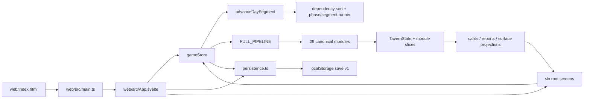

# Goblin Tavern Gameplay Audit — Phase 1 Structural Verification

**Report version:** 1.0  
**Audit framework phase:** Phase A — Structural verification  
**Snapshot date:** 2026-07-25  
**Status:** Complete — exit condition met  
**Gameplay verdicts issued:** None; runtime gameplay evaluation begins in Phase 2

## 1. Result

Phase 1 is complete for the supplied archive. The current application entry, routes, simulation boundary, 29-module pipeline, 25 engine phases, three day segments, state ownership, save envelope, registered content, compatibility surfaces, and documentation disagreements have been mapped against the exact extracted snapshot.

The structural verification gate passes:

- clean dependency installation completed;
- Svelte diagnostics completed with 0 errors and 0 warnings;
- TypeScript type checking completed successfully;
- the production bundle completed successfully;
- the local Vite entry and TypeScript entry module both returned HTTP 200;
- the repository's fast test tier completed with 277 test files and 3,531 tests passing;
- every primary screen is mapped to its entry, state owner, and downstream consumer;
- every canonical pipeline module is mapped to its hooks, state ownership, and principal consumer.

No gameplay behaviour has been marked pass or fail in this phase. Automated tests are evidence that the snapshot is structurally runnable, not substitutes for the player-facing runtime work in later phases.

## 2. Scope and evidence boundary

This phase follows `GAMEPLAY_AUDIT_FRAMEWORK.md`, Phase A only. It does not:

- play a day through the browser;
- claim that mapped paths are naturally reachable;
- judge balance, clarity, pacing, fun, consequence visibility, or long-horizon progression;
- promote empty or compatibility registries into gameplay defects;
- treat historical issue-tracker statements as current runtime evidence.

The supplied ZIP has no `.git` directory. Consequently, there is no commit SHA to record and source history cannot be authenticated from the archive. The archive checksum is the revision identity for this audit.

## 3. Snapshot and environment identity

| Item | Verified value |
|---|---|
| Uploaded archive | `Goblin-Tavern-main (8).zip` |
| Archive SHA-256 | `6a03761f79cf175a50fd27b9c6d65b4f8e5a7530695983a84f2f26b05b923324` |
| Archive integrity/path safety | Passed |
| Extracted source root | `audit_workspace/source/Goblin-Tavern-main` |
| Source files, excluding generated `node_modules` and `dist` | 1,217 |
| Git identity | Not available; archive contains no `.git` metadata |
| Package | `goblin-tavern@0.1.0` |
| Simulation version in initial state | `0.1.0` |
| Save envelope | version `1`, key `goblin-tavern:save:v1` |
| Lockfile | npm lockfile version 3 |
| Local Node | `v24.14.0` |
| Local npm | `11.9.0` |
| OS | Linux `6.12.13`, x86_64 |
| Browser executable in the shell environment | None found |
| CI Node declared by repository | Node 20 in `.github/workflows/deploy.yml` |
| Static deployed URL in archive | None; the Pages workflow supplies a dynamic deployment URL |

The local verification runtime is newer than the CI runtime. Phase 1 passed under Node 24; Node 20 parity remains a reproducibility check rather than a present failure.

### Resolved direct dependencies

| Package | Version |
|---|---:|
| `svelte` | 5.55.7 |
| `vite` | 5.4.21 |
| `@sveltejs/vite-plugin-svelte` | 4.0.4 |
| `typescript` | 5.9.3 |
| `svelte-check` | 4.4.8 |
| `vitest` | 1.6.1 |
| `tsx` | 4.22.4 |
| `zod` | 4.4.3 |
| `prando` | 6.0.1 |
| `jsdom` | 24.1.3 |

Font and testing-library packages are also lockfile-resolved and present.

## 4. Exact setup, launch, and verification commands

Run from the extracted source root:

```bash
npm ci --cache /tmp/goblin-tavern-npm-cache
npm run check
npm run typecheck
npm run build
npm test
npm run dev -- --host 127.0.0.1 --port 5173
```

Verified local URL:

```text
http://127.0.0.1:5173/
```

Launch-smoke results:

| Request | Result |
|---|---|
| `HEAD /` | HTTP 200, `text/html` |
| `HEAD /src/main.ts` | HTTP 200, `text/javascript` |

The Vite server reported ready in 1.279 seconds during the recorded smoke run. This confirms the entry path only; the UI was not played.

## 5. Verification results

| Check | Result | Evidence |
|---|---|---|
| Dependency install | Pass | 199 packages installed from lockfile |
| `npm run check` | Pass | `svelte-check found 0 errors and 0 warnings` |
| `npm run typecheck` | Pass | `tsc --noEmit`, exit 0 |
| `npm run build` | Pass | 884 modules transformed; output in `dist` |
| Build output | Pass with advisory | 102 files, 3.8 MB total |
| `npm test` fast tier | Pass | 277/277 files; 3,531/3,531 tests |
| Local HTTP entry | Pass | `/` and `/src/main.ts` returned 200 |

The build emitted one non-blocking Rollup/Vite advisory: the primary minified JavaScript chunk is approximately 1.70 MB (408.67 KB gzip), above the default 500 KB advisory threshold. This is recorded as structural evidence, not a gameplay finding.

The repository's full and heavy test tiers were not required by Phase A and were not run. The fast tier took 429.71 seconds in this environment.

## 6. Repository map

### Top-level inventory

| Area | Files | Role |
|---|---:|---|
| root | 10 | package, lockfile, configs, repository guidance |
| `.claude` | 2 | repository workflow guidance |
| `.github` | 1 | Pages build/deploy workflow |
| `docs` | 161 | requirements, plans, audits, issue tracker |
| `scripts` | 7 | test/readiness tooling |
| `specs` | 21 | content/card specifications |
| `src` | 626 | simulation, cards, reports, surface projections |
| `tests` | 295 | simulation, card, report, web, architecture coverage |
| `web` | 94 | Svelte application |

### Major source volumes

| Source area | Files | Approximate lines | Responsibility |
|---|---:|---:|---|
| `src/sim` | 353 | 71,166 | canonical state and deterministic simulation |
| `src/cards` | 216 | 30,460 | seed-to-card selection and rendering |
| `src/reports` | 51 | 9,380 | player-facing projections and reports |
| `src/surface` | 6 | 800 | bounded surface projections |
| `web/src` | 92 | 21,972 | routes, screens, components, persistence |
| `tests` | 295 | 89,479 | automated verification |
| `specs/cards` | 21 | 6,976 | content contracts |
| `docs` | 161 | 113,543 | design and project history |

## 7. Canonical source index

| Concern | Current source of truth |
|---|---|
| HTML entry | `web/index.html` |
| Svelte mount | `web/src/main.ts` |
| Root routing and autosave lifecycle | `web/src/App.svelte` |
| Sole web-to-engine boundary | `web/src/lib/sim/gameStore.svelte.ts` |
| Day beat/segment types | `web/src/lib/sim/daySession.ts` |
| Save schema, migration, import/export | `web/src/lib/sim/persistence.ts` |
| Root screens | `web/src/lib/screens/{Start,Day,Reports,Tavern,World,More}Screen.svelte` |
| Canonical module list | `src/sim/canonicalPipeline.ts` |
| Engine and segment runner | `src/sim/core/engine.ts` |
| Phase/segment definitions | `src/sim/core/phases.ts` |
| Canonical state type | `src/sim/state/TavernState.ts` |
| Initial state | `src/sim/state/defaults.ts` |
| Migrations | `src/sim/state/migrations.ts` |
| State/schema validation | `src/sim/state/validation.ts` |
| Issue generation | `src/sim/modules/issues` |
| Card registry and selection | `src/cards/registry.ts`, `src/cards/renderCard.ts`, `src/cards/pickCard.ts` |
| Web pending-to-response intent bridge | `web/src/lib/sim/intentBuilder.ts` |
| Response application | `src/sim/modules/responses` |
| Report projections | `src/reports/index.ts` |
| Surface projections | `src/surface` |
| Current project status | `docs/ISSUE_TRACKER.md`, subject to freshness notes below |
| CI/deployment | `.github/workflows/deploy.yml` |

`src/sim/testing/simRunner.ts` is now a compatibility re-export. Production web code, state validation, and persistence import `FULL_PIPELINE` directly from `src/sim/canonicalPipeline.ts`.

## 8. Application entry and screen ownership

`web/index.html` loads `/src/main.ts`. That module imports the self-hosted fonts and mounts `App.svelte`. `App.svelte` hydrates preferences before the game save, owns browser storage calls, and keeps the start screen outside the five persisted application routes.

### Root routes

| Entry/screen | Route | Primary state owner | Downstream consumer or mutation path |
|---|---|---|---|
| Start | pre-route `start` view | `App.svelte` local boot view; `gameStore.reset/hydrateFromSave`; preferences store | New game runs Segment A and enters Day; Continue restores `gameStore.route` |
| Day | `day` | `gameStore`: canonical state, beat, segment, picks, priorities, pending choices, completion flags | `beginDay`, `runService`, `endDay`; intent builder; daily report |
| Reports | `reports` | persisted reports subview; `latestResult`, `previousCalendar`, canonical state/history | daily/pressure/weekly/monthly/log projections; entity/action links |
| Tavern | `tavern` | persisted tavern subview; canonical tavern state; shared picks queue | tavern overview; action queue consumed by Segment B |
| World | `world` | persisted world subview; `state.world`; shared picks queue | world overview; entity links; relevant actions consumed by Segment B |
| More | `more` | preferences store, persistence layer, diagnostics data | settings, save/snapshot/import/export, help, diagnostics, about |

### Persisted subroutes

- Reports: `today`, `pressures`, `weekly`, `monthly`, `log`
- Tavern: `areas`, `stock`, `recipes`, `staff`, `projects`
- World: `regulars`, `suppliers`, `factions`, `cultures`, `npcs`, `rumours`

Global navigation and drilldown surfaces read the same store:

- Top bar: calendar, coin, top pressure, queued time, action-picker request.
- Bottom navigation: root route and unresolved Day work indicator.
- Glossary and cause drilldown: global overlays fed by canonical/projection data.
- Entity links: persisted destination subview plus consume-once transient target.

## 9. Import and call graphs

### Application to simulation



The web layer has one direct engine caller: `gameStore`. The interactive Day screen drives the store; it does not call the engine directly.

### Issue to response to report

```mermaid
flowchart LR
    Producers["simulation facts, causes, memories, pressures"] --> Generator["25 issue-seed generators"]
    Generator --> Rank["validate, score, rank, hand budget"]
    Rank --> SeedState["modules.issueSeeds: visible + surfaced"]
    SeedState --> Render["renderCard"]
    Render --> Pick["priority/specificity selection; fallback last"]
    Pick --> Choice["player card choice"]
    Choice --> Pending["gameStore.pendingBySeedId"]
    Pending --> Intent["intentBuilder at End Day"]
    Intent --> Response["responses module in Segment C"]
    Response --> Effects["immediate / delayed / future state changes"]
    Effects --> Causes["causes, attribution, history"]
    Causes --> Reports["daily/weekly/monthly/log projections"]
    Reports --> UI["Day and Reports screens"]
```



The web pending map is not canonical simulation state. Choices enter the simulation only when `intentBuilder` creates response intents and `endDay` supplies them to Segment C.

## 10. Day clock, phases, and boundaries

### Player-facing beats

`morning → plan → service → closing → report`

### Engine segments

| Segment | Store method | Phase range | Pause following segment |
|---|---|---|---|
| A | `beginDay()` | `startDay` through `forecastTraffic` | morning plan and queued owner actions |
| B | `runService()` | `beforeOwnerActions` through `closing` | service/closing card responses |
| C | `endDay()` | `applyResponses` through `advanceCalendar` | report, then next day |

The segment value `C` also denotes “ready to begin a new day.” Each store method is guarded, preventing accidental double execution of a segment.

### Canonical phase order

| # | Segment | Phase |
|---:|:---:|---|
| 1 | A | `startDay` |
| 2 | A | `identityGeneration` |
| 3 | A | `applyDayTypeModifiers` |
| 4 | A | `cultureUpdate` |
| 5 | A | `supplierUpdate` |
| 6 | A | `factionUpdate` |
| 7 | A | `regularCustomerUpdate` |
| 8 | A | `localEventUpdate` |
| 9 | A | `rumourUpdate` |
| 10 | A | `forecastTraffic` |
| 11 | B | `beforeOwnerActions` |
| 12 | B | `applyOwnerActions` |
| 13 | B | `afterOwnerActions` |
| 14 | B | `assignStaffPriorities` |
| 15 | B | `beforeService` |
| 16 | B | `service` |
| 17 | B | `afterService` |
| 18 | B | `closing` |
| 19 | C | `applyResponses` |
| 20 | C | `endDay` |
| 21 | C | `endWeek` |
| 22 | C | `endMonth` |
| 23 | C | `generateReports` |
| 24 | C | `validate` |
| 25 | C | `advanceCalendar` |

`simulateDay` remains the headless all-segment helper. The production web loop calls `advanceDaySegment`. The older `runSimulation` entry throws and is deprecated.

## 11. Canonical module map

Hooks below are current runtime hooks, not intended future behaviour.

| # | Module | Depends on | Hooks | Primary state ownership | Principal downstream consumer |
|---:|---|---|---|---|---|
| 1 | `areas` | — | `startDay`, `endDay`, `endWeek` | `state.areas` | service, actions, issues, tavern projection |
| 2 | `stock` | — | `startDay`, `endDay` | `state.stock`, `modules.stock` | service, recipes, suppliers, actions, reports |
| 3 | `staff` | — | `startDay`, `assignStaffPriorities`, `beforeService` | `state.staff` | service, actions, identity/issues, tavern projection |
| 4 | `customers` | `stock`, `areas` | `startDay`, `forecastTraffic`, `service`, `afterService` | `state.customerGroups` | service results, issues, reputation/report projections |
| 5 | `world` | — | `identityGeneration`, `localEventUpdate`, `rumourUpdate`, `endMonth` | `state.world` baseline/event/rumour branches | cultures, factions, World screen, issue generators |
| 6 | `cultures` | — | `cultureUpdate`, `closing` | `state.world.cultures` | customers, social issues, World projection |
| 7 | `factions` | — | `factionUpdate` | `state.world.factions` | social actions/issues, World projection |
| 8 | `suppliers` | — | `startDay`, `supplierUpdate` | `state.world.suppliers`, `modules.suppliers` | stock/action pricing, supplier issues, World projection |
| 9 | `regulars` | — | `startDay`, `regularCustomerUpdate`, `closing` | `state.world.regulars`, `modules.regulars` | regular cards/actions, memories, World projection |
| 10 | `adventurers` | — | `endWeek` | `state.world.hireableAdventurers` | expedition commissioning and World/NPC views |
| 11 | `expeditions` | `stock`, `adventurers` | `startDay` | `state.expeditions` | stock returns, reports, Tavern projects |
| 12 | `ownerActions` | `stock` | `startDay`, `applyOwnerActions`, `endDay` | `modules.ownerActions`; authorized writes across canonical state | service inputs, causes, projects/policies/reports |
| 13 | `service` | `customers`, `staff`, `stock`, `areas` | `startDay`, `beforeService`, `service`, `afterService`, `endDay` | runtime `modules.service`; coin/stock/staff/customer outcomes | causes, pressures, issues, service/report UI |
| 14 | `weekly` | `stock`, `customers` | `startDay`, `endDay`, `endWeek` | `modules.weekly` | weekly report, causes, monthly rollup |
| 15 | `monthly` | `weekly`, `stock` | `startDay`, `endWeek`, `endMonth` | `modules.monthly` | monthly report, local arcs, review issues |
| 16 | `localArcs` | `monthly` | `localEventUpdate`, `endMonth` | `modules.localArcs`, related world event signals | issues, report/world projections |
| 17 | `tavernIdentity` | — | `endDay` | `state.world.tavernIdentity` | World overview, openings/teleology conditions |
| 18 | `memories` | — | `startDay`, `endDay`, `endWeek` | `state.memories` | causes, pressures, issues, relationship surfaces |
| 19 | `history` | — | `endMonth` | `state.history` | Tavern log, cause/report history, pruning |
| 20 | `causes` | — | `startDay`, `endDay` | `state.causes`, `modules.causes` | attribution, pressures, issue seeds, drilldowns |
| 21 | `attribution` | — | `startDay`, `afterService`, `endDay`, `endWeek` | `modules.attribution` | explainability, missed opportunities, reports |
| 22 | `pressures` | `causes`, `memories` | `closing` | `state.pressures`, `modules.pressures` | feedback, issue seeds, Top bar/Reports |
| 23 | `feedback` | `pressures`, `memories` | `closing` | `modules.feedback` | feedback reports and future pressure context |
| 24 | `kernel` | — | none | stateless lifecycle coordinator/contract | ventures and arcs |
| 25 | `ventures` | `kernel` | `startDay`, `endDay` | `state.ventures` | openings, venture issues, transformations |
| 26 | `arcs` | `kernel` | `startDay` | `state.arcs` and linked actor fields | arc issues, card/report projections |
| 27 | `openings` | `kernel`, `ventures` | `startDay` | runtime `modules.openings` | opening issue generator and venture entry |
| 28 | `issueSeeds` | `causes`, `memories`, `pressures`, `customers`, `weekly`, `monthly` | `startDay`, `afterService`, `closing`, `endWeek`, `endMonth` | `modules.issueSeeds` | card composition, pending decisions, responses |
| 29 | `responses` | `issueSeeds` | `startDay`, `applyResponses` | `modules.responses`; authorized effect application | canonical state, causes/history, later reports |

All module dependency IDs resolve in `FULL_PIPELINE`; the engine performs topological validation and rejects missing or cyclic dependencies.

## 12. Canonical state map

### Top-level keys

```text
meta
calendar
coin
areas
stock
staff
customerGroups
reputation
recipes
expeditions
world
ventures
arcs
transformations
memories
history
causes
pressures
modules
```

### Initial identity and calendar

- Tavern: `the_crooked_keg` / “The Crooked Keg”
- Simulation version: `0.1.0`
- Day/week/month/year: `1/1/1/1`
- Absolute elapsed day: `0`
- Day type: `supplier_day`
- Season: `mudwake`
- Standard starting coin: `100`

Difficulty is applied only during new-game initialization:

- Easy: 150 coin and friendlier cleanliness/food-safety baselines.
- Standard: canonical baseline.
- Hard: 75 coin and harsher cleanliness/pressure baselines.

### Initial module slices

```text
stock
ownerActions
weekly
monthly
causes
pressures
feedback
issueSeeds
suppliers
regulars
localArcs
attribution
responses
```

Other runtime slices, such as `service` and `openings`, are created when their modules first write them.

## 13. Web-store and persistence ownership

`gameStore` owns reactive game/session state. `App.svelte` owns save scheduling and browser lifecycle flushes. `persistence.ts` is the sole owner of session `localStorage` I/O and validates/migrates loaded state through the current canonical pipeline.

### Game store fields

| Field | Owner/use | Saved in new envelope? | Reload behaviour |
|---|---|:---:|---|
| `state` | canonical `TavernState` | Yes | validated/migrated, then restored |
| `latestResult` | last closed-day result | Partial | reports, logs, validation, diffs saved; canonical state deduplicated |
| `previousCalendar` | calendar of the just-closed day | Yes, optional | restored for report labelling |
| `seedString` | base run seed | Yes as `simSeed` | restored |
| `picks` | shared owner-action queue | Yes | sanitized against hydrated state |
| `staffPriorities` | sticky staff-priority map | Yes | restored |
| `beat` | morning/plan/service/closing/report | Yes | restored/sanitized |
| `pendingBySeedId` | uncommitted card decisions | Yes | restored/sanitized |
| `serviceComplete` | day-view completion flag | Yes | restored |
| `closingComplete` | day-view completion flag | Yes | restored |
| `segment` | A/B/C engine position | Yes | restored or migrated |
| `dayBaseline` | start-of-day full-diff baseline | No for new saves | old saves may supply it; otherwise current state fallback |
| `dayLogs` | accumulated A/B logs | No | reset; mid-day reload loses earlier debug-log count |
| `route` | last root route | Yes | restored |
| `reportsSubview` | Reports tab | Yes | restored/default `today` |
| `tavernSubview` | Tavern tab | Yes | restored/default `areas` |
| `worldSubview` | World tab | Yes | restored/default `regulars` |
| `tavernSubviewTarget` | consume-once entity routing hint | No | cleared |
| `worldSubviewTarget` | consume-once entity routing hint | No | cleared |
| `actionPickerRequest` | consume-once picker open/focus hint | No | cleared |
| `savedSnapshotJustLoaded` | welcome-back UI flag | No | set true by hydration, then consumed |
| `lastSavedAt` | last successful flush timestamp | Indirectly | loaded from envelope `savedAt` |
| `hydrationError` | non-blocking load error | No | session-only |
| `saveError` | typed autosave failure | No | session-only |
| `runError` | last day-run exception | No | session-only |
| `serviceOutcome` | Segment B headline strip | No | omitted after mid-day reload |
| `dismissedMissedOpportunityIds` | bounded per-day dismissals | Yes, optional | restored; pruned at rollover |

There is an internal documentation disagreement around `dayBaseline`: comments near its field still say it is persisted mid-day, while `serializeForSave()` intentionally omits it and `PersistedSession` documents it as legacy-read-only after a quota fix. Current executable behaviour is omission from new saves.

### Preferences

Preferences use a separate version-1 storage envelope. Persisted preferences include font scale, reduced motion, theme, seed-tag visibility, end-day confirmation, first-use hints/seen terms, and last difficulty. The currently open hint slot is transient.

### Save lifecycle

1. Preferences hydrate first.
2. Session load returns fresh, loaded, invalid, or incompatible.
3. Loaded state passes migrations, pipeline-backed schema validation, route/subroute sanitation, pending/pick sanitation, and legacy day-segment migration.
4. `gameStore.hydrateFromSave` restores the reactive owner.
5. `App.svelte` autosaves relevant reactive fields and force-flushes on visibility/page-hide boundaries.

## 14. Registered content inventory

Counts were obtained after running the same initialization/registration paths used by canonical state construction.

| Registry/content set | Count | Notes |
|---|---:|---|
| Areas | 9 | all instantiated at day zero |
| Stock items | 20 | all instantiated at day zero |
| Recipes | 20 | all instantiated; 3 initially on menu |
| Customer groups | 9 | all instantiated |
| Staff roles | 6 | 3 staff members initially employed |
| Staff priorities | 12 | selectable sticky mappings |
| Owner actions | 41 | immediate, staffing, project, policy, social paths |
| Cultures | 8 | all instantiated in world state |
| Factions | 9 | all instantiated in world state |
| Suppliers | 9 | all instantiated in world state |
| Local arcs | 5 | registered definitions |
| Area traits | 14 | registered definitions |
| Area upgrades | 18 | registered definitions |
| Market conditions | 8 | registered definitions |
| Notable-NPC profiles | 11 | 11 notable NPCs instantiated |
| Staff identity profiles | 15 | content profiles |
| Issue generators | 25 | canonical generator registry after ensure-registration |
| Card entries | 24 | 23 dedicated cards plus fallback |
| Reputation registry | 1 | only `culinary_renown` is registry-backed |

Initial world state additionally contains 11 regular records, 11 notable NPCs, and 3 hireable adventurers. `ventures`, `arcs`, and `transformations` start empty by design.

Initial menu:

```text
dish_ale
dish_stew
dish_mushrooms
```

### Issue families and card coverage

The 25 generator families are:

```text
food_safety
stock_shortage
maintenance
staff_burnout
customer_complaint
violence
debt_rent
inspection
reputation_shift
monthly_review
staff_identity
regular_customer
supplier_relationship
faction_request
culture_conflict
area_atmosphere
seasonal_arc
policy_backlash
rumour_crisis
rival_tavern
venture
opening
staff_arc
liquor_compliance
licensed_service
```

The card registry has 23 dedicated selectors/templates and `fallback.everySeed`. Card selection is priority/specificity-based with fallback last.

### Reputation correction

`TavernState.reputation` contains ten fields:

```text
cheap
tasty
filthy
dangerous
cozy
strange
reliable
goblinAuthentic
respectable
culinary_renown
```

Only `culinary_renown` is registered in the expandable `reputationRegistry`; the other nine are fixed legacy state fields. Any document describing all ten as registered axes is structurally stale.

## 15. Empty, unregistered, and compatibility surfaces

These are mapped conditions, not gameplay findings:

| Surface | Current condition | Interpretation for later phases |
|---|---|---|
| `moduleRegistry` | empty | canonical execution uses explicit `FULL_PIPELINE` |
| generic `issueSeedRegistry` | empty | active issue path uses `issueSeedGeneratorRegistry` |
| `localEventRegistry` | empty | local arcs/world state provide other event signals; natural event reachability must be tested |
| `seasonalEventRegistry` | empty | seasonal-arc issue generation exists separately |
| `src/sim/testing/simRunner.ts` | compatibility re-export | not a production authority |
| deprecated `runSimulation` | throws | callers must use current engine entry points |
| `PersistedSession.dayBaseline` | legacy optional read | intentionally not written by current serializer |
| legacy `StaffRole` union | deprecated type alias | canonical role IDs are registry strings |
| dev venture spawn | test/dev gated | production venture entry is through openings/responses |

## 16. Documentation reconciliation

### Current issue tracker

`docs/ISSUE_TRACKER.md` was used only to clarify active intent:

- “Complete Surface” items 141–148 remain open, with 130 marked in progress.
- Progressive onboarding items 060–077 are planned/open rather than implemented.
- Choice-preview work 153 remains marked in progress.
- UI/UX work 157–163 is described as complete in Current Work.
- Issue 165 is recorded as completed in its later detailed entry.

The tracker contains at least one freshness conflict: index rows for ISSUE-158 and ISSUE-159 say open, while Current Work and their detailed entries say done. The source implementation contains their corresponding behaviour. This is a documentation freshness question, not a gameplay defect.

### Prior structural audit

`docs/audits/phase-01-architecture-map.md` is no longer current in two material ways:

- it maps a 25-module pipeline; the present canonical pipeline has 29 modules, adding `kernel`, `ventures`, `arcs`, and `openings`;
- its concern about production reaching the pipeline through `testing/` is resolved: current production imports `canonicalPipeline.ts` directly.

Its observations about empty generic registries and compatibility entry points remain relevant.

### Mid-day save audit

`docs/audits/2026-06-11-midday-save-and-report-reload-audit.md` explains why full `dayBaseline` persistence was removed to avoid quota overflow. The present code implements that removal. The same historical document's concern about persisted result diffs is no longer current: `serializeForSave()` now includes diffs in `latestResultLite`.

## 17. Updated uncertainty and freshness register

| ID | Status | Question carried into later phases |
|---|---|---|
| P1-U01 | Not yet tested | Which mapped routes and subviews are reachable through the shipped browser experience without prepared state? |
| P1-U02 | Requires runtime evidence | Does reload at each beat preserve all player-visible continuity when `dayBaseline`, `dayLogs`, and `serviceOutcome` are intentionally not written? |
| P1-U03 | Requires runtime evidence | Does a fixed-seed segmented UI day remain semantically equivalent to the headless full-day helper? |
| P1-U04 | Requires design clarification | Is the absent static deployed URL expected for this archive, or should Phase 2 use a particular deployed build? |
| P1-U05 | Environment gap | No shell browser executable was available; browser interaction must use the audit's browser surface or an explicitly supplied deployment in Phase 2. |
| P1-U06 | Freshness question | ISSUE-158/159 index statuses disagree with their detailed entries and present source. |
| P1-U07 | Freshness question | `dayBaseline` field comments disagree with the current serializer's intentional omission. |
| P1-U08 | Not yet tested | Are empty local/seasonal event registries deliberately dormant, or do they leave player-visible routes without natural producers? |
| P1-U09 | Not yet tested | How do openings, ventures, arcs, transformations, and post-completion steady state appear over long play? |
| P1-U10 | Design/status context | Planned progressive onboarding is not implemented, so current visibility is governed by the complete-surface design; its player impact belongs to later phases. |
| P1-U11 | Reproducibility | Local checks passed on Node 24 while repository CI declares Node 20. |
| P1-U12 | Structural advisory | The main production JavaScript chunk exceeds Vite's default size advisory; user impact is not established. |

## 18. Phase 1 exit-condition matrix

| Exit requirement | Status | Evidence location |
|---|:---:|---|
| Exact revision identity | Met | Sections 3–4 |
| Top-level/manifests/entry mapped | Met | Sections 6–7 |
| All primary screens mapped | Met | Section 8 |
| Engine/store call graph generated | Met | Section 9 |
| Issue/card/response/report graph generated | Met | Section 9 |
| Phases and segments enumerated | Met | Section 10 |
| Every canonical module mapped | Met | Section 11 |
| State/save schema recorded | Met | Sections 12–13 |
| Every persisted/transient store field owned | Met | Section 13 |
| Registered content enumerated | Met | Section 14 |
| Empty/compatibility surfaces identified | Met | Section 15 |
| Relevant docs reconciled | Met | Section 16 |
| Static/build verification complete | Met | Section 5 |
| Uncertainty list updated | Met | Section 17 |

## 19. Phase 2 handoff

Phase 2 should begin from a fresh local launch using a fixed seed and Standard difficulty, then capture runtime evidence in this order:

1. Fresh start and Continue boot paths.
2. Day beats and Segment A/B/C boundaries.
3. All five root routes and every persisted subview.
4. Quick Day eligibility and emergent-stop behaviour.
5. Cross-screen action-picker, entity-link, pressure CTA, glossary, and error recovery routes.
6. Reload at Morning, Plan, Service, Closing, and Report.
7. Equivalent fixed-seed headless full-day comparison.
8. A runtime reachability matrix marking each mapped path as reached, blocked, special-setup, or not yet tested.

No Phase 2 action was performed while producing this report.
