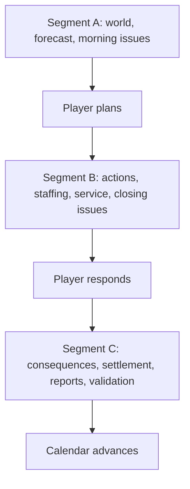
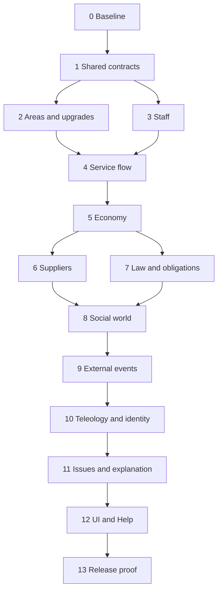

# Goblin Tavern Simulation Expansion and Obligation-Closure Plan

**Purpose:** Convert Goblin Tavern’s uneven but promising simulation into one coherent, deeply connected management simulation while completing every player-facing mechanic the repository already promises.

**Authority:** This is a standalone implementation document. It does not require any earlier audit, report, ledger, or conversation. The repository is the only external source of truth required to execute it.

**Scope rule:** Every advertised mechanic described below is assumed to be intentional and must be implemented. Do not resolve a missing capability by deleting its UI, weakening its wording, or reclassifying it as flavor. Every system identified as shallow is assumed to be intended to reach the same standard of statefulness, temporal behavior, player leverage, reciprocity, persistence, causality, and observability as the existing customer–staff–stock–service core.

---

## 1. What this plan is trying to build

Goblin Tavern already has a strong deterministic operating core:

1. the world and forecast update;
2. the player plans owner actions and staff priorities;
3. customers arrive and purchase recipes;
4. stock is consumed;
5. staff performance shapes service;
6. service produces revenue, shortages, incidents, mess, damage, satisfaction changes, memories, pressures, and issues;
7. the player responds;
8. daily, weekly, and monthly consequences settle;
9. the state is validated, reported, saved, and advanced.

The expansion should preserve that core while making the surrounding world equally real. Suppliers must transact rather than merely report “misses.” Inspectors must actually visit. Staff must be capable of leaving. Loans and invoices must exist as ledgers with due dates. Area upgrades must be buildable. Factions, cultures, regulars, notable NPCs, rivals, and rumours must act and react through persistent state rather than mostly moving descriptive meters. Long-horizon ventures and character arcs must have enough content and consequence to justify their general framework.

The target is not maximum micromanagement. The target is **causal completeness**:

- if the game creates an expectation, a legitimate player capability and an authoritative outcome must exist;
- if a system reports a threat, some system must be able to make that threat occur;
- if an actor has an identity, it should have persistent motives, resources, choices, and memory appropriate to its importance;
- if the player makes a decision, its consequences should travel through the simulation rather than terminate in a direct meter adjustment;
- if state visibly changes, the game should be able to explain why;
- if a long-term failure is possible, recovery or terminal resolution should also be modeled.

---

## 2. Current architecture that must be preserved

### 2.1 Canonical day

The simulation is a deterministic, discrete-day pipeline divided into three resumable segments.



The exact phase and module lists must be rediscovered from the current repository before implementation. In the audited layout, the primary entry points were:

- `src/sim/core/engine.ts`
- `src/sim/core/phases.ts`
- `src/sim/core/segments.ts`
- `src/sim/canonicalPipeline.ts`
- `src/sim/state/TavernState.ts`

**Verified 2026-07-29 (repo preparation):** all five entry points exist at
those paths and still hold the shapes this plan assumes —
`FULL_PIPELINE` in `canonicalPipeline.ts` is the ordered module array,
`SIMULATION_PHASES` in `phases.ts` is the 25-phase union, and
`DAY_SEGMENTS` / `SEGMENT_FIRST_PHASE` in `segments.ts` partition it into
A (`startDay…forecastTraffic`), B (`beforeOwnerActions…closing`), and C
(`applyResponses…advanceCalendar`). Rediscovery per §5.1 is still
required per phase; this note only confirms the map's starting points.

The active runtime covered areas, stock, staff, customers, world, cultures, factions, suppliers, regulars, adventurers, expeditions, owner actions, service, weekly and monthly settlement, local arcs, identity, memories, history, causes, attribution, pressures, feedback, teleology, issue seeds, and responses.

### 2.2 Existing strengths are constraints, not rewrite targets

Preserve:

- deterministic replay;
- named RNG streams;
- equivalence between full-day and segmented execution;
- immutable caller input and sanctioned state mutation;
- module dependency validation;
- exact phase/segment resume behavior;
- atomic time and coin checks;
- schema and cross-reference validation;
- causal diffs and readable reports;
- bounded memories, rumours, history, issue attention, and persistent populations;
- save/load at every supported day beat;
- one authoritative simulation path shared by UI, tests, and balance harnesses.

Do not introduce:

- a second simulation path used only by the UI;
- wall-clock timers;
- nondeterministic IDs or random calls;
- hidden background processes outside the canonical pipeline;
- player-facing future promises without registered domain consumers;
- duplicate authoritative records for the same concept;
- direct state mutations that bypass causes, invariants, and persistence;
- unbounded event, rumour, order, invoice, memory, or history collections.

### 2.3 Definition of “deep enough”

A system is not complete merely because it has many fields, files, cards, or descriptions. Each major domain should be evaluated against these eight properties.

| Property | Required evidence |
|---|---|
| State | It owns meaningful persistent state rather than only derived labels. |
| Inputs | Several independent upstream conditions can alter its behavior. |
| Time | Delays, accumulation, decay, recurrence, or lifecycle stages matter. |
| Autonomy | Relevant actors can select actions without waiting for a scripted card. |
| Reciprocity | The system changes other systems and receives consequences back. |
| Player leverage | The player has discoverable, resource-gated ways to influence it. |
| Observability | Reports, diffs, causes, and UI explain important changes. |
| Completion | Success, failure, interruption, replacement, and save/load paths exist. |

Not every system needs the same number of entities or rules. History can remain simpler than service. It cannot, however, be used as a substitute for the behavior it records.

---

## 3. Known starting inventory

Before changing code, verify these counts against the current repository and update the phase ledger if they have changed.

**Verified 2026-07-29 against `HEAD` — every count still holds.** The
right-hand column was read out of the live registries (module array,
phase union, `Registry.all()` after each `ensureRequired*Registered()`
bootstrap, and `createInitialTavernState()` for founding staff), not
re-counted by hand.

| Surface | Audited inventory | Verified 2026-07-29 | Where it is counted |
|---|---:|---:|---|
| Runtime modules | 29 | 29 | `src/sim/canonicalPipeline.ts` → `FULL_PIPELINE` |
| Simulation phases | 25 | 25 | `src/sim/core/phases.ts` → `SIMULATION_PHASES` |
| Day segments | 3 | 3 | `src/sim/core/segments.ts` → `DAY_SEGMENTS` |
| Owner actions | 41 | 41 | `src/sim/registries/actionRegistry.ts` |
| Staff priorities | 12 | 12 | `src/sim/registries/staffPriorityRegistry.ts` |
| Pressure domains | 21 | 21 | `src/sim/registries/pressureRegistry.ts` |
| Feedback-loop detectors | 13 | 13 | `src/sim/modules/feedback/feedbackLoopRegistry.ts` |
| Issue-generator families | 25 | 25 | `src/sim/modules/issues/issueSeedGenerators.ts` → `ALL_SEED_GENERATORS` (25 generators, 25 distinct families) |
| Card templates including fallback | 24 | 24 | `src/cards/templates/index.ts` → `REQUIRED_CARDS` |
| Areas | 9 | 9 | `src/sim/registries/areaRegistry.ts` |
| Area-upgrade definitions | 18 | 18 | `src/sim/content/tavern/areaUpgradeRegistry.ts` |
| Stock records | 20 | 20 → **22** (Phase 2) | `src/sim/registries/stockRegistry.ts` |
| Recipes | 20 | 20 → **22** (Phase 2) | `src/sim/registries/recipeRegistry.ts` |
| Customer groups | 9 | 9 | `src/sim/registries/customerRegistry.ts` |
| Founding staff | 3 | 3 | `createInitialTavernState()` → `state.staff` |
| Cultures | 8 | 8 | `src/sim/content/cultures/cultureRegistry.ts` |
| Factions | 9 | 9 | `src/sim/content/factions/factionRegistry.ts` |
| Suppliers | 9 | 9 | `src/sim/content/suppliers/supplierRegistry.ts` |
| Market conditions | 8 | 8 | `src/sim/content/suppliers/marketConditionRegistry.ts` |
| Local-arc definitions | 5 | 5 | `src/sim/content/events/localArcRegistry.ts` → `STARTER_LOCAL_ARC_DEFINITIONS` |
| Venture blueprints | 1 | 1 | `src/sim/modules/ventures/ventureCatalog.ts` → `VENTURE_BLUEPRINTS` |
| Hardcoded character arcs | 1 | 1 | `src/sim/modules/arcs/staffMasteryArc.ts` |

Two adjacent counts the audited table omits, recorded here because later
phases touch them: **6 staff roles** (`staffRegistry`) and **10
reputation axes** (`state.reputation`).

**Counts moved by later phases, recorded here as they land** (the frozen
`repo-map.json` is the authority; this table is orientation):

| Phase | Count | Change | Why |
|---|---|---|---|
| 1 | Runtime modules | 29 → 33 | the four shared-contract modules |
| 1 | Simulation phases | 25 → 26 | `resolveScheduledEvents` (the wrap-up beat) |
| 2 | Stock records | 20 → 22 | `timber` + `cut_stone`, the materials §2.3 makes a build consume |
| 2 | Recipes | 20 → 22 | the 1:1 `dish_<id>` rows the stock/recipe pairing invariant requires; both carry `upkeep`, so nothing serves them |
| 2 | Owner actions | 41 → 41 | seven upgrade-lifecycle actions in, seven retired project actions out |

**Area-upgrade definitions stay at 18 through Phase 2** — the phase makes
the existing catalogue buildable rather than growing it.

The last known clean baseline contained 291 passing test files and 3,702 passing tests, plus clean type checking, Svelte checking, and a production build. These numbers are historical orientation, not hardcoded future requirements. The current repository’s equivalent gates become authoritative in Phase 0.

**Current gate baseline, measured 2026-07-29 on the same `HEAD`** — this
is the "no intended behavior change" reference Phase 0 freezes against:

| Gate | Command | Result |
|---|---|---|
| Full suite | `npm run test:full` | **299 files / 3,831 tests passing**, ~333 s |
| Types | `npm run typecheck` | clean |
| Svelte | `npm run check` | 979 files, 0 errors, 0 warnings |
| Build | `npm run build` | passes; single 1,741 kB JS chunk (421 kB gzip) still raises the >500 kB warning §13.5 asks to split |

The fast tier (`npm test`) excludes the heavy multi-day playtests listed
in `vitest.config.ts` (`HEAVY_TEST_GLOBS`); Phase 0 should record which
tier each new probe belongs to as it adds them.

**Phase 0 closed 2026-07-29 (ISSUE-170), no behavior change.** The
authoritative baseline is now the frozen artifacts under
`docs/plans/expansion/`, not this table. Post-Phase-0 gates:

| Gate | Command | Result |
|---|---|---|
| Full suite | `npm run test:full` | **301 files / 3,874 tests passing**, ~344 s |
| Fast tier | `npm test` | 293 files / 3,745 tests passing, ~235 s |
| Types | `npm run typecheck` | clean |
| Svelte | `npm run check` | 980 files, 0 errors, 0 warnings |
| Build | `npm run build` | passes; the 1,741 kB chunk warning §13.5 asks to split is unchanged |

Every probe route measures under ~1.3 s, so all thirteen sit in the fast
tier and neither Phase 0 test file joins `HEAVY_TEST_GLOBS`.

---

## 4. Confirmed gaps that this plan must close

### 4.1 Broken gameplay obligations

All nine contracts below must end with a natural player path and an authoritative simulation result.

| ID | Broken contract | Required end state |
|---|---|---|
| OBL-01 | Area upgrades are advertised and defined but cannot be installed. | A player can discover, quote, start, fund, build, complete, damage, disable, repair, and persist an upgrade. |
| OBL-02 | Future hooks for quitting, loan repayment, and eviction drain without performing their promised event. | Every mechanical future hook has a typed owner, exact-once resolver, visible warning, domain mutation, and later acknowledgment. |
| OBL-03 | Inspection suspicion and warnings never produce an inspector visit. | Chronic or acute risk can schedule a visit, evaluate the tavern, create consequences, allow response, and persist. |
| OBL-04 | Supplier credit and invoice UI exist without a producer or payment capability. | Credit orders create supplier-specific invoices with terms; payment, default, collections, and relationship outcomes work. |
| OBL-05 | Easy promises slower decay but only alters initial values. | Difficulty persists in state and changes ongoing documented rules, including slower Easy decay. |
| OBL-06 | Quick Day is advertised but its zero-card eligibility is unreachable. | Quick Day uses a reachable eligibility rule and stops honestly when new mandatory decisions emerge. |
| OBL-07 | Queued-action Help reverses the real same-day/tomorrow behavior. | Help and UI derive timing from the actual planning horizon. |
| OBL-08 | Rumour decay and staff-mastery transitions can change visible state without matching causes. | Every material targeted change is covered by a bounded cause or grouped cause with valid target coverage. |
| OBL-09 | Tavern nicknames can be displayed but cannot be naturally earned. | Simulation evidence can create, strengthen, contest, decay, and display nickname rumours. |

### 4.2 Simulation-depth gaps

The following are implementation requirements, not optional ideas:

- cash must respond meaningfully to persistent quality and reputation collapse;
- service must model capacity, queues, throughput, patience, abandonment, and staff allocation;
- areas must model usable capacity, spatial/functional relationships, construction, materials, hazards, and upgrades;
- staff must have schedules, availability, relationships, development, labor terms, absence, burnout outcomes, and autonomous separation;
- customers and regulars must make service-level choices rather than existing only as aggregate demand and descriptive individuals;
- suppliers must operate an actual order–delivery–invoice chain;
- inspections, rent, loans, arrears, and eviction must form real external-obligation lifecycles;
- cultures and factions must have goals, resources, actions, memory, and reciprocal consequences;
- notable NPCs and rivals must be capable of visible autonomous moves;
- rumours must spread through actors or channels rather than only appearing and decaying in a container;
- beliefs and attribution must alter decisions, not only generate explanation;
- expeditions must contain decisions and risks between commission and final resolution;
- local arcs must progress through state and actor behavior rather than mostly age once per month;
- identity must exert causal force and use hysteresis rather than being only threshold labels;
- teleology must contain enough ventures, arcs, openings, failures, and permanent transformations to exercise its general lifecycle;
- issue cards and response profiles must expose and influence real domain processes rather than impersonating missing simulation through authored meter changes;
- pressure and feedback systems must remain diagnostic but point to causal edges actually executed elsewhere;
- failure-floor and pressure-ceiling saturation must preserve information and recovery momentum;
- memory patterns must be based on explicit evidence, not use strength as an accidental event counter;
- direct mutations and causal gaps must be eliminated from player-facing state;
- difficulty must change ongoing behavior and be covered by long-run balance tests.

---

## 5. Work protocol for every phase

Each phase is an implementation unit. A phase may be split into several commits or pull requests, but it is not complete until its full vertical slice passes.

For every phase:

1. **Rediscover current code.** Search by module ID, type, action ID, UI string, and registry symbol. Do not rely on old line numbers.
2. **Write or update the phase ledger.** List state owners, producers, consumers, UI surfaces, save fields, reports, pressures, issues, and tests.
3. **Write failing contract tests first.** Include natural player setup, not only direct fixture injection.
4. **Define authoritative ownership.** One domain owns each state transition. Other systems request or observe it.
5. **Implement state, rules, player capability, autonomous behavior, reporting, and persistence together.**
6. **Add deterministic RNG streams before adding random behavior.**
7. **Add schema migration in the same phase as any persisted field.**
8. **Run focused tests, then full repository gates.**
9. **Run full-day versus segmented equivalence for affected routes.**
10. **Perform at least one save/reload at every day beat crossed by the new lifecycle.**
11. **Verify bounded growth.** Define caps, pruning, expiry, or archival for every new persistent collection.
12. **Update help from shared rule metadata.** Do not create a second prose-only version of timing, costs, or eligibility.

A phase fails if:

- only the data model or UI exists;
- a test reaches the feature only by injecting impossible state;
- a card promises a consequence owned by no domain;
- a process works in batch simulation but not the segmented route;
- save/load changes the deterministic outcome;
- the system’s only consequence is a direct pressure or reputation adjustment;
- a player cannot discover what action is available and why;
- old saves silently lose or fabricate material obligations.

---

## 6. Implementation sequence at a glance

The **Tracker** column is the repository's own numbering, assigned during
the 2026-07-29 preparation pass: each plan phase is one `ISSUE-NNN` in
`docs/ISSUE_TRACKER.md` carrying one repo phase number (the repo's
file-naming convention, continuing from the audit arc's 199–206). Plan
phase numbers below are this document's; repo phase numbers are what
test files and any phase docs are named after.

| Phase | Tracker | Primary result | Obligation closures |
|---:|---|---|---|
| 0 | ISSUE-170 · repo 207 | Frozen baseline and complete implementation ledger | Coverage only |
| 1 | ISSUE-171 · repo 208 | Typed events, obligations, difficulty, actor, meter, and causality foundations | Shared foundation for OBL-02, OBL-05, and OBL-08 |
| 2 | ISSUE-172 · repo 209 | Functional areas, construction, and complete upgrade lifecycle | OBL-01 |
| 3 | ISSUE-173 · repo 210 | Staff schedules, relationships, labor lifecycle, and real resignation | Staff portion of OBL-02 |
| 4 | ISSUE-174 · repo 211 | Capacity-constrained service, customer choice, and active regulars | None in isolation; deepens the operational core |
| 5 | ISSUE-175 · repo 212 | Coherent economy, financial failure, recovery, policies, and adaptive demand | Supports OBL-04 and OBL-05 |
| 6 | ISSUE-176 · repo 213 | Orders, deliveries, supplier autonomy, credit, and invoices | OBL-04 |
| 7 | ISSUE-177 · repo 214 | Loans, rent, tenancy, inspection visits, and external enforcement | Loan/eviction portions of OBL-02 and OBL-03 |
| 8 | ISSUE-178 · repo 215 | Autonomous factions, cultures, NPCs, rumours, and behavioral attribution | Rumour portion of OBL-08 |
| 9 | ISSUE-179 · repo 216 | Rival competition, state-driven local arcs, deeper expeditions, and world events | None in isolation; closes major depth gaps |
| 10 | ISSUE-180 · repo 217 | Populated teleology, causal identity, character arcs, and earned nicknames | OBL-09 and mastery portion of OBL-08 |
| 11 | ISSUE-181 · repo 218 | Domain-backed issues, responses, consequences, pressures, feedback, and memory | Final shared closure of OBL-02 |
| 12 | ISSUE-182 · repo 219 | Ongoing difficulty, reachable Quick Day, correct planning horizon, UI, and Help | OBL-05, OBL-06, and OBL-07 |
| 13 | ISSUE-183 · repo 220 | Migration, long-run balance, performance, and final obligation proof | Release proof for all requirements |

## 6.1 Inherited work this plan absorbs

Three issues left open by the closed 2026-07-26 audit arc fall inside
phases above. They keep their IDs and stay `open` in the tracker; the
absorbing phase closes them rather than a separate pass:

| Issue | Absorbed by | Why |
|---|---|---|
| ISSUE-168 — satisfaction→traffic elasticity so coin can bind on neglect | Phase 5 (§5.1, §5.4) | It *is* the "cash growth during total collapse" requirement; §5.1 is the larger statement of the same lever. Re-baseline the balance matrix once, in Phase 5, rather than twice. |
| ISSUE-167 — strategy-arm diversification + two residual slice-level balance gaps | Phase 13 (§13.3) | The long-run matrix supersedes the 2026-07-28 sweep; distinct per-bot response policies are what §13.3's strategy list needs anyway. |
| ISSUE-169 — visible-turn rotation for the remaining rotating seed families | Phase 11 (§11.6) | Attention fairness owns rotation; extending `reconcilePicksWithSurfaced` beyond `violence` is one item in that pass. |

## 6.2 One recorded decision this plan reverses

**Quick Day (OBL-06 vs. audit record `DC-01`).** On 2026-07-28 the audit
arc recorded, with the user's agreement, that *Quick Day is retired as a
player-facing route for 0.1.0* — the teleology reserve guarantees ≥1
opportunity card per day, so the zero-card morning its eligibility rule
requires is a state the design intends never to exist (5,000 seeds never
reached it), and the unreachable button was left in the tree only until
the paused UI arcs resumed.

OBL-06 and §12.2 of this plan require the opposite: a reachable
eligibility rule, honest emergent-stop behavior, and availability in
naturally produced states — and §"Scope rule" forbids closing the gap by
deleting the UI. This document is the later authority and the only
unpaused work, so **Phase 12 implements Quick Day and `DC-01` is treated
as superseded.** Flagged rather than silently applied: if retirement was
the intent, say so before Phase 12 starts and OBL-06 becomes a deletion
instead. Nothing earlier in the sequence depends on which way it goes.

`DC-09` (onboarding vs. complete-surface exposure) and `DC-10`
(supported environments / persistence promise) remain open and untouched
by this plan; they gate the paused onboarding and persistence arcs.

---

# Phase 0 — Freeze the current baseline and create the implementation ledger

## Objective

Establish the exact current architecture, tests, save schema, public promises, and behavioral baselines before expanding the simulation.

## Required work

### Repository map

Map:

- package scripts and required runtime versions;
- the canonical pipeline, phases, segments, and module dependencies;
- every module-owned persistent slice;
- every direct mutation of `TavernState`;
- every RNG stream and every unscoped random call;
- every save version and migration;
- all actions, staff priorities, pressure calculators, feedback detectors, issue generators, card templates, response profiles, future hooks, upgrade definitions, world definitions, and teleology blueprints;
- all Help/glossary promises and every UI capability they name.

Create a machine-readable implementation ledger in the repository. The
preparation pass reserves **`docs/plans/expansion/ledger.csv`** for it,
with any generator or validator under `scripts/` — one location, so
later phases update the ledger rather than each growing a private copy
(the repo's documentation policy forbids re-expanding the docs tree with
per-phase prose; a data file is the exception this plan needs). At
minimum, each row should contain:

- stable requirement ID;
- owning phase;
- originating promise or weakness;
- state owner;
- producer;
- player capability;
- autonomous trigger;
- consumers;
- UI/report surfaces;
- tests;
- migration status;
- completion status.

### Baseline probes

Freeze deterministic fixtures for:

- a fresh run on every difficulty;
- a normal full day;
- the same day through Segments A, B, and C;
- week and month boundaries;
- a no-action route;
- a quality-focused route;
- a profit-focused route;
- a staff-focused route;
- a supplier-focused route once suppliers become transactional.

Record:

- coin and ledger totals;
- traffic and satisfaction;
- cleanliness, damage, and area capacity;
- staff morale, fatigue, stress, loyalty, and availability;
- stock and recipe output;
- active obligations;
- pressure contributors;
- issue counts and response results;
- persistent collection sizes;
- validation failures.

## Required tests

- current typecheck, Svelte check, unit/integration suite, and production build;
- full-day/segmented equivalence;
- save/load at Morning, Plan, Service, Closing, and Report;
- deterministic replay using the same state, input, and seed;
- current long-run invariant harness;
- scan proving that all player-facing future hooks are represented in the ledger, even before they are fixed.

## Completion gate

Phase 0 ends with no intended behavior change. The repository has an authoritative baseline, a complete requirement ledger, and reproducible probes that later phases can compare against.

## What Phase 0 actually landed (2026-07-29, ISSUE-170)

Three frozen artifacts under `docs/plans/expansion/`, each derived from the
live code and each gated by a test — none of them hand-maintained prose:

| Artifact | Regenerate with | Holds |
|---|---|---|
| `ledger.csv` | `npm run ledger:check` (`-- --sync-hooks` to re-derive the HOOK block) | 127 rows: `OBL-01…09`, `DEP-01…20` (plan §4.2's twenty bullets), and one `HOOK-*` row per player-facing future-hook family |
| `baseline-probes.json` | `npm run baseline:probes` (`-- --write` to re-freeze) | 13 route snapshots, each recording every metric the "Record:" list above names |
| `repo-map.json` | `npm run repo:map` (`-- --write` to re-freeze) | package scripts, runtime versions, pipeline/phases/segments, module-owned slices, the 15 named RNG streams, the (empty) unscoped-random-call lists, save version + the 12-step migration chain, plan §3's inventory, and all 127 Help/glossary promises |

Code: probes in `src/sim/testing/expansionBaseline.ts` (pure, headless);
I/O and scanners in `scripts/expansion-{ledger,baseline,repo-map}.ts`;
gates in `tests/sim/phase207.baselineAndLedger.test.ts` and
`tests/sim/phase207.dayBeatPersistence.test.ts`.

Three notes on how the deliverable differs from the letter of the list
above, each deliberate:

- **The supplier-focused route is frozen now, not deferred.** The plan says
  "once suppliers become transactional"; `auto_always_restock` is the
  closest reachable procurement route today, and freezing it gives Phase 6
  a before-picture to diff against instead of a blank.
- **A fourteenth route, `responsive-route`, was added.** Every route the
  plan lists answers no cards, so all of them record an empty pending queue
  and zero response results — two of the metrics the "Record:" list
  requires. `responsive-route` answers every resolvable card at Pause 2,
  which is what makes the OBL-02 before-picture legible: hooks enqueue and
  drain, and `applyPendingEntry` resolves them to a memory draft or a
  zero-weight cause with no domain mutation behind either.
- **Per-entity hook ids collapse to one family row.** `` `staff_quit_risk_${id}` ``
  is one obligation, not one per employee, so the ledger key is
  `HOOK-staff_quit_risk_*`. The scan reads source rather than running the
  sim on purpose: a generator that only fires on a rare state must still be
  in the ledger, and no seeded playtest can prove it reached every one.

The ledger's owning-phase column for `HOOK-*` rows is an **initial**
classification by subject (`scripts/expansion-ledger.ts` `HOOK_PHASE_RULES`,
defaulting to Phase 11). Phase 1 §1.1 types every one of them and registers
an owner regardless; correct a row's phase in place if its domain moves.

---

# Phase 1 — Build shared simulation contracts

## Objective

Create the cross-domain foundations required for real obligations, autonomous actors, scheduled processes, deeper meters, and complete causal explanation.

## 1.1 Typed scheduled events and future consequences

Replace opaque future-hook strings as mechanical authority with a typed registry. A mechanical scheduled event must declare:

- event type and schema;
- owning module;
- target entity and fallback behavior if the target disappears;
- scheduled beat/day and optional warning window;
- repeat, cancellation, supersession, and expiry rules;
- deterministic resolver;
- authoritative mutation;
- cause, memory, history, pressure, and report outputs;
- save/migration schema;
- acknowledgment state;
- exact-once key.

Narrative expectations may still exist, but must use a distinct type and cannot use wording that promises a concrete event.

Add startup or test-time validation that fails when:

- a mechanical event has no registered owner;
- a response schedules an unregistered event;
- an event resolves without an authoritative mutation or explicit no-op reason;
- two domains claim ownership of the same event type.

Do not treat a zero-weight cause or memory as resolution.

## 1.2 Shared obligation and contract records

Add reusable primitives for:

- payable and receivable obligations;
- principal, accrued charges, due dates, grace periods, partial payment, default, settlement, forgiveness, and collections;
- purchase orders and delivery promises;
- employment terms and notice/separation events;
- regulatory cases and scheduled visits;
- tenancy and escalation state;
- construction commitments and milestone completion.

These primitives should share lifecycle conventions without forcing unrelated domains into one giant module. Suppliers own invoices, staff own employment, monthly/regulatory systems own inspections, and landlord/finance systems own tenancy and loans.

## 1.3 Persistent ruleset and difficulty

Persist the selected difficulty or ruleset in authoritative state. Give rules a versioned definition rather than scattering `if easy` checks.

The ruleset must be queryable by:

- area deterioration;
- spoilage;
- staff fatigue/recovery;
- pressure adjustment decay;
- rumour and memory decay where documented;
- economy and obligation grace periods;
- issue fairness;
- recovery assistance.

Easy must produce genuinely slower ongoing decay under equal seeded inputs. Standard remains the reference ruleset. Hard should increase difficulty through coherent ongoing rules rather than only a worse opening state.

## 1.4 Causal mutation coverage

Unify material mutations behind sanctioned helpers or explicit domain events. Add:

- grouped causes for high-volume homogeneous changes such as daily rumour decay;
- causes for arc creation, stage change, status change, and permanent transformation;
- event-to-cause links;
- a supported convention for collection-element targets;
- a targeted diff-to-cause audit.

Grouped causes must remain readable and bounded. Do not emit one permanent record per tiny field if a grouped cause can identify all affected targets.

## 1.5 Informative meters

Keep visible `[0,100]` meters where useful, but stop discarding information at clamps. Introduce hidden or adjacent state such as:

- dissatisfaction debt and recovery momentum below visible zero;
- pressure excess and contributor magnitudes above visible 100;
- trend velocity;
- hysteresis state for identity and actor decisions;
- duration at floor/ceiling.

Downstream behavior must use the richer state where necessary. UI can remain simple while reports expose why recovery is slow or why a capped pressure is still worsening.

## 1.6 Actor-action interface

Define a small deterministic interface reusable by factions, cultures, suppliers, rivals, notable NPCs, staff, and regulars:

- current goals;
- resources or influence budget;
- perceived state;
- memories/beliefs;
- eligible actions;
- scored target selection;
- deterministic tie breaking;
- action cost;
- cooldown and commitment;
- visible intent or next move;
- outcome and learning.

Do not implement generic “AI” detached from domain rules. Each domain supplies its own goals, actions, and scoring.

## 1.7 Narrow the engine extension surface

Preserve the central engine while making new domains harder to connect incorrectly:

- give module-owned persistent slices explicit types and versioned schemas;
- declare phase reads, writes, and produced domain events;
- validate cross-phase assumptions instead of relying only on canonical ordering conventions;
- introduce narrow domain-facing mutation helpers rather than continually widening `SimContext`;
- identify compatibility barrels and prevent them from becoming alternate implementations;
- add architecture tests for module order, same-phase dependencies, event ownership, and stable segment boundaries.

Do not perform a big-bang engine rewrite. Migrate one domain at a time behind compatibility adapters and remove an adapter once no active caller depends on it.

## Required tests

- event registration and orphan rejection;
- exact-once drain across normal play, retry, save/load, import, and segment resume;
- cancellation and missing-target behavior;
- difficulty divergence under identical seeds;
- no causal gaps for the targeted diff classes;
- no duplicate IDs or unbounded contract growth;
- actor decision determinism;
- old-save migration to the new ruleset and event schemas.

## Completion gate

The shared foundations are real and tested. Later phases can add domain behavior without inventing new schedulers, obligation ledgers, actor frameworks, or causal conventions.

---

# Phase 2 — Deepen areas, construction, and physical tavern capacity

## Objective

Turn the nine areas and eighteen upgrade definitions into a physical operating model that constrains service, work, safety, and progression.

## 2.1 One authoritative area model

Each area should own, where applicable:

- usable floor or abstract capacity;
- seats, tables, beds, storage, workstations, and fixtures;
- access/adjacency links to other areas;
- cleanliness, smell, condition, damage, hazards, and traits;
- active upgrades and their condition;
- assigned work and blocked capacity;
- maintenance requirements;
- environmental influence on connected areas.

This can remain a graph or zone model; it does not require a tile simulation. The key requirement is that areas have functional relationships instead of isolated linear meters.

## 2.2 Complete upgrade lifecycle

Use `src/sim/content/tavern/areaUpgradeRegistry.ts` or its current equivalent as the catalog. Every upgrade definition must have:

- eligibility conditions;
- valid target areas;
- discoverable player control;
- quote with coin, owner time, materials, labor, and build duration;
- start, pause, fund, resume, cancel, and complete paths where appropriate;
- in-progress state;
- capacity or functional effects;
- atmosphere/identity effects;
- maintenance burden;
- damage, disabled, repair, and replacement behavior;
- causes, reports, issue hooks, and persistence.

Unify the existing owner-project and upgrade models. A project that constructs an upgrade must write one authoritative upgrade record, not a trait plus an unrelated display state. Non-upgrade projects may continue to use the general project system.

## 2.3 Work and construction capacity

Model:

- which staff or hired labor can contribute;
- concurrent-work limits;
- material consumption;
- blocked area capacity during construction;
- variable progress from labor, damage, shortages, and interruptions;
- safety or service consequences of operating around unfinished work.

## 2.4 Area interaction

Add bounded propagation where it creates meaningful decisions:

- kitchen filth affecting food safety;
- cellar pests affecting stock;
- roof or plumbing damage affecting connected rooms;
- crowding increasing mess, noise, conflict, and wear;
- privy capacity affecting patience and satisfaction;
- garden state affecting yield;
- seating layout affecting cultural comfort and service throughput.

Avoid an all-to-all network. Each propagation edge must have a clear physical or functional reason.

## 2.5 Work scheduling and time

Retain the readable 360-minute owner budget, but represent accepted work as scheduled blocks when timing or concurrency matters. Model:

- owner and staff work that can occur concurrently;
- area access and travel/setup cost only where it creates a real tradeoff;
- exclusive workstations or blocked rooms;
- task interruption and resumption;
- variable completion time from skill, tools, damage, and staffing;
- construction or repair that spans service;
- conflicts between owner responses, projects, procurement, and immediate upkeep.

The player should not need to arrange every minute manually. Priorities and queued actions can produce the schedule, while previews explain the resulting conflicts and completion horizon.

## Player-facing work

Update:

- area detail sheets;
- project/upgrade planners;
- quotes and disabled reasons;
- capacity and blockage indicators;
- construction progress;
- repair/disable state;
- report explanations;
- Help generated from upgrade metadata.

## Required tests

- natural discovery and construction of every upgrade family;
- quote and authoritative cost agreement;
- insufficient coin, time, material, and labor rejection;
- start → in progress → interrupted → resumed → installed;
- installed effect on service or another consuming system;
- damage → disabled → repair;
- save/load at every construction state;
- deterministic construction progress;
- no duplicate trait/upgrade representation;
- bounded area effect propagation.

## Completion gate

OBL-01 is closed. Areas are functional capacity owners that materially shape service and work rather than only supplying threshold meters.

## What Phase 2 actually landed (2026-07-30, ISSUE-172)

Detail lives in `docs/plans/expansion/ledger.csv` rows **`OBL-01`**,
**`DEP-03`** and the three `HOOK-*` rows named below — no per-phase plan
doc, per the arc's convention. What follows is the shape of it and the
judgement calls that a later phase needs to know about.

**§2.1 one authoritative area model.** Capacity is four abstract kinds
(`seats`, `workstations`, `storage`, `beds`, in
`src/sim/registries/areaCapacityTypes.ts`), each with at least one real
consumer. It is **derived, never stored** — base size from
`areaRegistry` + installed fittings − blockage, computed in
`src/sim/modules/areas/capacity.ts`. A stored `usableSeats` would be a
second representation of the same truth that could disagree with the
upgrade records, which is the duplication §2.2 forbids applied to the
number rather than the record. Adjacency is static too: **11 links across
9 areas** (36 pairs are possible), declared once per unordered pair and
read from both ends.

**§2.2 the upgrade lifecycle, and the unification.** `AreaUpgradeState` is
now the one authoritative construction record: the accepted quote, the
labour banked against it, the materials consumed, why the last tick
stalled, and — once installed — the fitting's own condition and upkeep
clock. `src/sim/modules/areas/construction.ts` is the only writer;
owner actions, scheduled events and propagation edges all *request*
transitions there. Statuses gained `paused` and `cancelled` so
start → pause → resume → cancel is a real path and a superseded fitting
has somewhere honest to land.

**The five project starters that built upgrades are retired.** Each of
them wrote a *trait* plus its own progress row while the matching
`AreaState.upgrades` record sat at `available` forever — the exact
duplication §2.2 names. They live on as `legacyProjectType` on their
upgrade definitions, and `fund_active_project` / `cancel_project` went
with them because their only possible targets were those five records.
Owner actions therefore stay at **41**: seven in, seven out. The general
project system (`OwnerProjectState`, the slice, the tick) is deliberately
kept with an empty starter list, since the plan permits non-upgrade
projects to keep using it. **In-flight and completed legacy project rows
convert to authoritative upgrade records on load**
(`ensureAreaConstructionFields`), so no save loses work it paid for — and
the upkeep clock starts from the day the save is at rather than being
backdated into a bill the player never incurred.

**§2.3 work and construction capacity.** Builds need coin, **materials
drawn from stock** (`timber`, `cut_stone` — the only two new content items
this phase adds, procured through the existing `restock_item`), and
**labour points** banked day by day. An unattended site banks 1/day; a
staff member on `minor_repairs` adds more; the owner can put a shift in
for `TIME_COST_SHORT`. Only `cleaner_bouncer` may take `minor_repairs`, so
a crew is a standing choice with a cost, and it is what raises the
concurrent-site limit above one.

**§2.4 bounded propagation.** Eight edges, listed in one file, each naming
the physical route it travels; the two that cross rooms are checked
against the adjacency graph by `findUngroundedPropagationEdges` rather
than trusted. Every edge reads one snapshot taken before the pass and
writes at most one target, so nothing cascades inside a single day —
chains form across days, which is legible.

**§2.5 scheduling.** The day's schedule is **load-bearing, not a
display**: `tickConstruction` advances only the sites whose block came out
`scheduled`, and a conflicted block always carries a reason. The locked
360-minute owner budget is untouched (`phase-186-day-clock-time-economy.md`
§2.5); travel/setup is charged in **labour** rather than minutes, because
the minute budget belongs to that contract and this phase does not get to
reprice it.

**Three future-hook families moved from narrative to mechanical**
(`src/sim/modules/areas/areaEvents.ts`): `failed_patch_possible`,
`area_collapse_risk_*` and `area_project_completion_*`. Each performs an
authoritative mutation and each has a genuine explained no-op for the
player who put the room right in the meantime. Doing this needed one
**additive extension to the Phase 1 bridge**: `futureHookPrefixes` on a
scheduled-event definition, because Phase 1 matched a hook name against
the event-type key exactly and the parameterised families are the
majority of the `HOOK-*` rows. The owning domain still supplies the
adapter and can still decline. Three area-ish families **stay narrative
with the reason recorded** rather than fudged — `area_failure_possible`
(declared at seed level, and only profile-level hooks reach the bridge, so
Phase 11 owns it), `cellar_capacity_unlocked_*` (honouring it means
installing a fitting nobody paid for; Phase 5 owns the monthly domain) and
`main_room_too_dark` (a test fixture, not shipped content).

**CON-05 is closed as a side effect.** `applyDebtToRecovery` finally has
its production caller: an installed fitting's cleanliness/condition
improvement is spent against banked meter debt first, so one upgrade does
not undo a fortnight of neglect.

**Calibration judgement worth carrying forward.** `main_room` seats **90**
(pooled customer-facing seating 110) was chosen so the *reference route
never overcrowds* — its busiest measured evening is 103 patrons. Capacity
binds when the **player** makes it bind: a build closing 30% of the main
room, a room left to rot below condition 35, or patronage grown past the
house. An earlier calibration (60 seats) taxed every opening night and
displaced the `violence` family from the DC-06 attention budget, which is
the wrong shape for a constraint. Queues, patience and abandonment are
Phase 4's; this phase stops at crowding.

**Baseline drift, regenerated deliberately.** All 13 frozen probes moved
and were rewritten (`npm run baseline:probes -- --write`). The drift is
the phase's own consequences: +2 stock and +2 recipe records in every
`collections` count, `activeProblems` where a propagation edge fired, and
on the managed multi-week routes the crowding/storage rules shifting
traffic, satisfaction and coin by a few percent. The reference `no-action`
route moved by one visitor. `repo-map.json` moved on three sections
(`moduleStateSlices` gains `areas`, the migration chain gains
`ensureAreaConstructionFields`, `stockRecords`/`recipes` 20 → 22) plus the
two new glossary terms.

**Eight review findings fixed before merge** (Codex on PR #247 — one P1,
seven P2), each with a regression test in the phase's own files:

- **P1, and the one that would have shipped a dead end:** a save written
  before this phase keeps its own `stock` map, and nothing merged newly
  registered records into it — so `timber` and `cut_stone` never existed
  for an existing player. Every material line read "0 held" and rejected
  the build, while `restock_item` enumerates `state.stock` and so could
  never offer a way to buy any: permanently unbuildable.
  `ensureRegistryRecords` now merges missing stock and recipe records at
  their registry defaults (quantity 0 — an empty shelf, not free timber),
  leaving anything the save already has exactly as the player left it.
- A fitting's **identity effects now follow its status**. `rat_proof_barrels`
  scrubs `pest_prone` on install, and a broken one used to keep scrubbing
  it forever — the pest calculator went on granting a benefit the record
  called out of service. Suspend on break, restore on repair, guarded so
  it only ever undoes what that fitting is responsible for and never
  invents a trait the room did not come with.
- **Crew labour splits across SCHEDULED sites, not live ones.** Dividing by
  every `in_progress` record meant a site the schedule had conflicted still
  took a share of the carpenter — and that share simply vanished. This is
  why `getSiteLabourPerDay` moved to `schedule.ts` and the labour/site
  primitives to a new `labour.ts`: quoting needs the schedule's verdict, and
  the two files would otherwise import each other.
- **Workstation capacity was declared with consumers claimed and had none.**
  It now genuinely constrains: the concurrent-site limit is the tighter of
  supervision and usable workstations (never zero, or repairing the place
  would become unreachable), and `getKitchenThroughputFactor` decides how
  much of what patrons wanted actually reaches them — centred on the
  kitchen's registry base, so a tavern that has built and broken nothing
  scores exactly 1.
- **A superseded upgrade cannot be rebuilt.** `cancelled` is restartable and
  superseded fittings land there, so the thatch the beams replaced could be
  built again — both installed, the patch's benefit re-applied, two upkeep
  clocks for mutually exclusive roof work.
- **Cellar pests go for the food.** The edge picked the biggest stack in the
  cellar, which is reliably firewood or timber — non-perishable, so their
  spoilage is never read and the edge had no consequence at all. This is
  the one fix visible in the frozen probes: `month-boundary` had firewood
  sitting at 72 spoilage, which meant nothing.
- **Migrated builds no longer finish on materials they never drew.** A
  converted legacy project had no `materialsUsed`, so the tick treated
  whatever was in store as delivered. The migration stamps it settled (the
  legacy quote charged coin and never materials — retroactively billing
  would change a closed deal), and the tick now *consumes* anything a
  record still owes rather than merely checking it could.
- **A patch failure binds to the room whose patch made the promise**, matched
  on the day the memory and the event were both created, rather than to
  whichever patched room happens to be worst today.

Gates: `npm run test:full` **307 files / 4,027 tests**, `npm test` 299 /
3,898, `typecheck` clean, `check` 1,024 files / 0 errors, `build` passing
(same known >500 kB chunk warning §13.5 asks Phase 13 to split), and all
three expansion artifacts clean — `ledger:check` 134 rows,
`baseline:probes` 0 drifted, `repo:map` 0 sections drifted. Tests:
`tests/sim/phase209.areaUpgradeLifecycle.test.ts` (35),
`phase209.areaCapacityAndPropagation.test.ts` (27),
`phase209.constructionBeatPersistence.test.ts` (3). All three run in
seconds, so none joins `HEAVY_TEST_GLOBS`.

---

# Phase 3 — Turn staff into a persistent workforce

## Objective

Deepen staff from service-quality inputs into people with schedules, contracts, relationships, development, needs, and autonomous employment decisions.

## 3.1 Employment lifecycle

Implement:

- applicant or labor-market generation;
- role demand and coverage;
- hiring terms;
- wages and scheduled payment;
- availability, shifts, absence, illness/injury, and leave;
- probation or early fit where appropriate;
- training, skill growth, cross-training, and promotion;
- raises or renegotiation;
- discipline, firing, notice, quitting, and replacement;
- rehiring or references if supported by the world.

Founding staff must no longer be structurally immune to consequences. If a story-critical character requires protection, use an explicit narrative transformation or alternate role rather than silently preventing resignation.

## 3.2 Work assignment

Extend the existing twelve priorities into real allocations:

- station or area assignment;
- service versus cleaning, repair, security, procurement, or construction work;
- coverage gaps;
- handoff and multitasking costs;
- skill fit;
- fatigue accumulation;
- recovery;
- overtime or overload;
- queue bottlenecks consumed by Phase 4.

Priorities remain useful high-level instructions. The simulation derives assignments from them and reports why capacity rose or fell.

## 3.3 Relationships and autonomous behavior

Staff should maintain bounded relationship state with:

- the owner;
- selected coworkers;
- relevant factions, regulars, or suppliers when repeated interaction justifies it.

Relationships, beliefs, workload, pay, safety, loyalty, and career goals should influence:

- cooperation;
- conflict;
- training;
- willingness to cover;
- service incidents;
- absence;
- raise demands;
- resignation.

Do not run every possible pair every day. Create relationships from actual repeated contact and cap each person’s active social edges.

## 3.4 Resolve the quitting promise

`staff_quit_risk_<staff>` or its migrated typed equivalent must:

1. warn the player;
2. identify preventable contributors;
3. allow meaningful counterplay;
4. evaluate the target’s current state when due;
5. cancel, defer, negotiate, or perform separation;
6. remove or reassign the employee safely;
7. update service coverage and hiring needs;
8. create causes, memories, history, pressures, issues, and reports;
9. resolve exactly once.

## Required tests

- wage payment and nonpayment across multiple weeks;
- hiring, coverage, absence, training, promotion, and replacement;
- staff relationship creation and bounded growth;
- burnout causing real availability or separation risk;
- successful intervention versus resignation;
- quitting during active project, arc, and scheduled shift;
- target already fired or absent when a quit event resolves;
- save/load and deterministic applicant generation;
- service outputs traceable to actual assignment and staff state.

## Completion gate

The staff system can produce and recover from staffing failures. The quitting portion of OBL-02 is closed, and staff state has consequences beyond six service-quality numbers.

## What Phase 3 actually landed (2026-07-30, ISSUE-173)

Per-requirement detail lives in `docs/plans/expansion/ledger.csv` row **`DEP-04`**
and the twelve `HOOK-*` rows named below — no per-phase plan doc, per the arc's
convention. What follows is the shape of it and the judgement calls a later
phase needs to know about.

**Founding staff are no longer immune, and that is the whole phase in one
change.** `staffModule`'s `startDay` used to *throw* when `cook`, `server` or
`cleaner_bouncer` was missing, `validateStaff` reported it as a structural
error, and `fire_staff` refused to offer them as targets. So the game's central
staff promise — people leave when you treat them badly — was structurally
impossible for exactly the three people it could have been about. All three
guards are gone. A missing role is now a **coverage gap** with a measurable
cost: the roster reports it, the crew who did come in carry it in stress, and
the tavern keeps trading badly until the player hires someone. The two Phase 86
tests that pinned the exemption are **inverted** rather than deleted, because
"the run survives losing a founding role" is the property that replaces the
guard.

**§3.1 the employment lifecycle.** `EmploymentRecord` (the Phase 1 family) is
the authoritative terms record — wage, notice clock, discipline rung, and the
transition history — and `src/sim/modules/staff/employment.ts` is its only
writer and **the only remover of staff**. That single-writer rule is doing real
work: a safe separation is not `delete state.staff[id]`, it is severance, the
record archived, the person's social edges dropped, their actor record dropped,
every scheduled event about them withdrawn, a vacancy opened, the colleagues
told, and a cause/memory/history/pressure left behind. Performed in two places,
one of them forgets half of it.

**§3.1 the labor market, and why hiring changed shape.** `hire_staff` kept its
id and its 40-coin fee but now targets an **applicant**, not a role. The old
action took a role id and minted somebody at that role's registry defaults, so
hiring was a purchase at a fixed price with a fixed outcome and "hiring terms",
"role demand" and "replacement" had nowhere to live. The board holds up to eight
people, refreshes weekly, expires them after a fortnight, and **always answers
an open vacancy** — a market that could leave the player permanently unable to
replace a cook would be the same dead end the Phase 2 review found with
unbuyable materials. Generation runs on a new named stream (`labor_market`), so
an extra roster refresh cannot rename the cook already in the kitchen; a second
new stream (`staff_wellbeing`) carries the illness rolls for the same reason.

**§3.2 the roster is the record service is derived FROM.** Each row ends in one
number, `contribution` (`skillFit × shiftCoverage × (1 − handoff)`), and every
factor that produced it is on the same row with a note.
`priorityEffects.ts` multiplies each member's published modifiers by it, which
is what makes "service outputs traceable to actual assignment" a checkable join
rather than a claim. **The default assignment is exactly neutral** — one body
per role, on its role's default priority, in that priority's default area, on
the default shift, scores 1 — so the reference route's service-quality numbers
did not move and every deviation is something the player did.

**Shifts are not a second clock.** The 360-minute owner budget
(`phase-186-day-clock-time-economy.md` §2.5) is untouched. A shift changes
*what* is covered: two bodies on the same role and the same shift overlap and
leave the rest of the day short, so the second counts for a quarter less. A
`double` is more hours from one body at an overtime price; `rest` is double
recovery and no cover. Within-day service flow stays Phase 4's.

**The service module's fatigue rule MOVED rather than being duplicated.** Phase
12 had a traffic-driven rule (`traffic ÷ 30` or `÷ 60` by role, plus per-priority
strain and per-incident stress) in `service/resolveService.ts`. Adding a second
one in the roster would have been two writers of one meter both charging for the
same day — the player's fatigue climbing at twice the rate either rule intended,
which is what the first draft did. The whole computation is now in
`roster.ts applyDayLoad`, and the service module **reads the roster row** for its
`staffChanges` report (staff runs at pipeline position 61, service at 71). Two
improvements came with the move and neither touches the reference route: the
divisor keys off **work kind** rather than role, which is what §3.2's "service
versus cleaning, repair, security" allocation means; and overtime, coverage-gap
and conflict burdens are added on top, all three of which are zero by default.

**Absence has a floor, deliberately.** Illness risk is exactly **zero** below
fatigue 40, stress 60 and a full week without a rest day. Without it a day-zero
crew could lose somebody on the opening morning, which reads as the simulation
being arbitrary rather than as a consequence — and it cost a Phase 12 test its
bouncer on day one before the floor went in. Above the floor the risk climbs
with fatigue, stress and consecutive days worked, and it is scaled by the
ruleset's existing `staffRecoveryMultiplier` rather than by a new knob.

**§3.1 wages are partial-first, and a shortfall is a real debt.** The Phase 14
rule was a switch: cover the whole bill or pay nobody. Non-payment was therefore
a mood — nothing was owed afterwards, so no rule could read it and "nonpayment
across multiple weeks" had nothing to accumulate. Now the till pays as far as it
goes, longest-serving first, and the remainder becomes a **per-person payable in
the shared obligation ledger** with the ruleset's grace days and late-charge rate
captured at open time. `pay_staff_wages` is the first owner action to settle an
obligation, which is the gap Phase 1 recorded as belonging to "whichever phase
gives the player something worth paying". **When the till covers the bill no
obligation is opened at all**, so the happy path is byte-identical and the ledger
stays a record of real arrears rather than a receipt printer.

**§3.3 relationships, built from contact and capped.** One edge per pair, stored
once under a canonical id (mirroring it on both people would be the duplication
§2.2 forbade for capacity). An edge starts *forming* on first contact and only
has consequences after three days together; four active edges per person, 48
total, expiring after three weeks without contact. Contact comes from exactly
three real events — two people rostered on the same station, an owner action
aimed at somebody, and a referral hire vouching for a starter — so §3.3's "do not
run every possible pair every day" is true by construction. What the edges buy:
who covers an absence, who can train whom, who takes a departure badly, and the
owner's own standing, which gates raise requests and negotiation.

**§3.3 autonomous staff, through the Phase 1 actor contract.** Staff are its
first real consumer, and it earns its keep: without commitment windows somebody
could ask for a raise, call in sick and resign in one evening, and without
**visible intent** a resignation would be an ambush. An actor decides at
`endDay`, the intent is announced in that day's report, and it is carried out the
following evening — so the player always gets a turn. Five actions:
`request_raise`, `ask_for_training`, `cover_for_coworker` (the positive one, and
a real mutation — the colleague's fatigue actually falls), `call_in_sick`, and
`give_notice`, which routes through the quit-risk event rather than straight to
notice so the warning and the counterplay still happen.

**§3.4 twelve hook families move from narrative to mechanical**, closing the
staff half of `OBL-02`: `staff_quit_risk_*`, `wage_expectation_*`,
`raise_promised_*`, `coverage_gap_*`, `training_helper_*`, `authority_test_*`,
`staff_bonus_expected_*`, `cross_staff_grumble_*`, and the four
"they-remember-this" families (`staff_backing_remembered_*`,
`staff_publicly_backed_*`, `staff_betrayal_remembered_*`,
`staff_emotional_debt_*`) which share one resolver because they differ only in
sign and magnitude — four near-identical resolvers would be four places to fix
the same bug. Those four are deliverable *because* §3.3 exists: they move the
owner relationship edge, a record with real downstream consumers, rather than
nudging loyalty.

**One Phase-3 family stays narrative, and its ledger row moved rather than being
fudged.** `apology_expectation_*` takes a **customer group** as its subject
(`apology_expectation_${group.id}`), so it belongs to the domain Phase 4 owns.
Its row is re-assigned to Phase 4 / ISSUE-174 in place, per the ledger's own rule
that the phase column is the initial assignment — the Phase 2 precedent for the
three area-ish families that stayed narrative.

**The quit-risk resolver, against §3.4's nine requirements.** Warned three days
out and named in the report with every contributor itemised and the action that
fixes each (items 1–2, read from records: the arrears figure, the discipline
rung, the owner edge, the coverage log, an unanswered request in memory — not a
severity band). The resolver re-reads live state when due (item 4) and has four
branches (item 5): `cancelled` when the player talked them round, `no_op` when
the contributors were addressed, `rescheduled` five days out when they were
half-addressed, and a separation — notice served, or an immediate walk-out at the
top weight. `separateStaff` performs it safely (item 6), coverage recomputes and
a vacancy opens (item 7), and causes/memories/history/pressures/reports all land
(item 8). Exactly once (item 9) via the definition's key *and* a live-event guard
in `scheduleQuitRisk`, so three profiles worrying about the same cook cannot cost
three cooks.

**Negotiation is gated on two things, and the second is what keeps it honest.**
Standing has to outweigh half the risk weight — and **no material preventable
grievance may still be outstanding**. Without the second gate a stranger could
talk their way out of three weeks of unpaid wages, because an unknown
relationship starts at neutral trust rather than at nothing; that would make the
counterplay a free undo and the derived Help a lie.

**Two new roles, and why they had to exist.** `head_server` and `head_keeper`
are the top rung for the two families that had none: a server or a
cleaner/bouncer who reached their skill ceiling had nowhere to be promoted to, so
"promotion" would have meant a wage rise with a new label — the fake depth §5
fails a phase for. Same priorities as the role below (no new player vocabulary),
a real ceiling above it, and an opening skill set *just under* the parent role's
ceiling, because that opening skill **is** the promotion gate. `staffRoles`
6 → 8; `staffPriorities` stays 12, because §3.2 makes the existing twelve
load-bearing rather than adding to them.

**`src/sim/core/diff.ts` now sorts its module walk** — the fix Phase 1 recorded
as outstanding on `CON-04`. The walk used `Object.keys` insertion order, so the
*order* of emitted diff paths depended on how a `Record` happened to enumerate,
which is not stable across a save: a slice built by a factory and the same slice
rebuilt by the migration chain hold the same fields in a different order, and the
§5.10 reload gate read that as a different day. Phase 1 removed the symptom by
excluding the meters slice from diffing; the staff slice tripped it again and its
diff is wanted, so the walk is sorted. Contents are unchanged — only order.

**Two migration judgement calls, both recorded.** `ensureStaffWorkforceFields`
derives the workforce fields from identity rather than rolling them, so no RNG
cursor moves and no generated name shifts; and employment starts being tracked on
**the day the save is at** rather than being backdated, the same call Phase 2 made
for the upkeep clock. It also only seeds employment records when the `employment`
key is *absent* — an empty-but-present map means "nobody recorded yet", which is
what a day-zero snapshot looks like. That distinction is load-bearing: the web
layer's day baseline is a state object that goes through the chain on reload, and
fabricating records into a fresh baseline made a reloaded day differ from an
uninterrupted one. `modules.staff` is now seeded in `createInitialTavernState`
for the same reason.

**Baseline drift, regenerated deliberately.** All 13 frozen probes moved
(`npm run baseline:probes -- --write`). The drift is the phase's own
consequences: staff meters under the one fatigue rule rather than two, `causes`
counts up (the workforce emits its own attribution), `history` counts down, and
loyalty down by roughly one unanswered raise request per month on the passive
routes — which is the designed consequence of a player who answers nothing.
`repo-map.json` moved on `rngStreams` (15 → 17), the migration chain (+
`ensureStaffWorkforceFields`), `inventory.ownerActions` (41 → 51),
`inventory.staffRoles` (6 → 8), and `glossaryTerms` (129 → 135). The Wave 7
balance harness's published figures were **re-pinned** with the movement recorded
in the test: 3.36 → 3.21 cards/day and 828 → 823 patrons, while `finalCoin` stays
at 1,043 — which is the evidence that this phase changed how the crew works and
not what the tavern earns per patron. Phase 5 owns the economy; Phase 13
re-baselines the long-run matrix. The stale `wages` glossary entry was rewritten
rather than left: it described the all-or-nothing rule, which is exactly the
second prose-only copy §5.12 forbids.

**Eleven review findings fixed before merge** (Codex on PR #248 — three P1,
eight P2), each with a regression test that fails on the pre-fix tree:

- **P1, and the one that made non-payment free:** the weekly settlement cleared
  arrears without spending the coin. `payDownArrears` marked the obligations
  settled and told the staff member they had been paid, but the settlement's only
  `spendCoin` charged that week's wages — so the same funds cleared back pay
  again every week and a player could carry permanent arrears at no cost. Back
  pay now moves the coin on its own ledger line, because "we finally paid what we
  owed" and "we paid this week" are different entries in a P/L.
- **P1: a kept promise read as broken.** The hook-routed `raise_promised_*`
  branch carries no terms, and the fallback compared the wage now against the
  wage on the employment record — which granting the rise is exactly what moves.
  `EmploymentRecord.lastRaiseOnDay` records the *event* instead of the level, so
  the resolver asks whether a rise happened since the promise was made.
- **P1: an absence decided in the evening cost nothing.** Actors run at `endDay`,
  when the shift is already worked, but `setAbsence` always opened the window
  today — so `call_in_sick` expired the next morning. Nobody ever missed a
  roster, no service was ever short-handed by it, and repeated absence could
  never reach `ABANDONMENT_DAYS`. `includeToday: false` shifts the window one day
  forward for anything decided after the day is spent.
- **Cover is only offered by somebody on duty.** `findWillingCover` filtered on
  `unavailable` alone, so it could name a colleague on a rest day or working out
  notice; `buildRoster` then rejected them, and because the search returns one
  name the next willing colleague was never considered. The check belongs in the
  search, not the caller.
- **A promotion no longer cancels a live quit risk.** It still answers the raise
  demand outright, but the risk may be about back pay, exhaustion or a discipline
  record, none of which a new title fixes — cancelling it let a promotion do what
  `negotiate_with_staff` is deliberately forbidden from doing. The promotion's
  own loyalty and morale gains lower the score, and the resolver re-reads live
  contributors when the day comes.
- **A promotion vacates a post.** The rungs above a founding role declare no
  daily demand, so promoting the server left the floor short with no recorded
  vacancy — and the board only always-answers *recorded* vacancies, so the gap
  could sit there indefinitely. Recorded only when the old role is genuinely
  short now.
- **`pay_staff_bonus` answers `staff_bonus_expected_*`.** The action writes the
  shared memory id `staff_bonus_paid_recently` and names the person in
  `actors`/`metadata`, not in the id; the resolver matched per-staff ids only, so
  the player could pay the bonus and still take the penalty for not paying it.
- **The mentor named by `training_helper_*` is the one who teaches.** The hook's
  subject is the mentor — the response profile gives *that* person the mentoring
  fatigue and the loyalty for it — so reading the subject as the learner sent the
  event hunting for a mentor for the best hand on the crew, and it no-opped.
  `findTrainingLearner` is the mirror of `findTrainingHelper`.
- **A dismissal at the top of the discipline ladder does not cost crew morale.**
  Everybody watched the warnings land; charging the same crew-wide hit as for an
  arbitrary firing made the ladder mechanically pointless and taxed the player
  for following it. The friend-specific reaction still lands either way.
- **One outcome row per firing.** A separation event is still live in the queue
  while its own resolver runs, so `separateStaff`'s cleanup archived it as
  `cancelled` and the shared resolver then archived the same firing as
  `resolved` — two rows and two contradictory totals. `activeEventId` excludes
  the event performing the separation without weakening the sweep for its
  siblings.
- **Nobody who came back this morning is taken out again the same morning.**
  Returns are processed before the illness roll so that somebody whose leave ends
  today is available; the roll then considered that still-tired person and could
  take them straight back out before they reached a roster.

Four of those live in resolvers only a routed future hook reaches, so the
regressions drive them through a **hook courier**: a test-local module that does
exactly what `ctxApplier.routeFutureHook` does — registry lookup, the owning
module's own adapter, `scheduleEvent` — and nothing else. That is the Phase 1
`obligationProbe` precedent (a real module on a real pipeline using the
sanctioned API), not fixture injection: every field of every event is built by
the shipped adapter.

**A second review round found seven more, and the player found an eighth.**
A follow-up Codex pass on the same PR, plus the user reporting that they could
no longer find anywhere to hire:

- **Hiring had no surface left.** This is the one that matters most, and no
  review tool found it: `hire_staff` stopped taking a role and started taking a
  PERSON off a weekly board that expires, and the Tavern > Staff panel was never
  updated. It listed the people you already employ, and its empty state told the
  player to "hire from the World → Hireable list" — the adventurer roster, which
  has nothing to do with staff. The board, the asks, the shelf life and the open
  vacancies existed only in the sim and in the action picker's target sub-sheet,
  findable only by a player who already knew the action's target list had changed
  meaning. That is §5.12's "cannot discover what action is available" failure, on
  the phase's own headline capability. `StaffPanelData` now carries a `hiring`
  block — applicants with role, skill, ask, provenance and days left, each with
  the same `hire_staff` ref every other row-level action uses, plus open
  vacancies with their reason and age — and the panel renders it under the
  roster, with an empty state that says whether the board is "not yet" or
  "nobody today".
- **A bonus promise was judged on the ordinary wage.** `wage_expectation_*`
  comes from `pay_bonus_profile` — a one-off bonus, promised as the new floor —
  but the resolver asked whether the week's wages had been paid, which a bonus
  never changes and the next settlement always makes true. It never once landed.
  It now asks whether the money went up AGAIN, through the same "did extra coin
  reach them" reader `staff_bonus_expected` uses.
- **The worker whose load was lightened counted as their own cover.**
  `coverage_gap_*` comes from `reduce_workload_profile`, which marks nobody
  absent and changes no shift, so counting every body on the role — the subject
  included — made a one-person role read as covered by the very person whose work
  had been taken away. The count is of somebody ELSE now, against a demand floor
  of one, and the fatigue lands on the colleagues rather than on them.
- **Abandonment could not fire, twice over.** The rule read one absence's length
  against `ABANDONMENT_DAYS`, and the only thing that writes an unexcused absence
  takes a single day at a time on a seven-day cooldown — and the check ran after
  the return pass, which clears an absence the morning its `untilDay` arrives, so
  even a four-day one would have been cleared first. The employment record now
  carries the RUN of unexcused days inside a remembered window
  (`UNEXCUSED_MEMORY_DAYS = 21`), and the check happens before returns.
- **An actor handed in notice while its own warning was still running.**
  `scheduleQuitRisk` returned `false` for three different reasons and the actor
  read all of them as "the warning has run its course". A live promise — with
  days of window and a live contributor list — was skipped and notice went
  straight in, bypassing the counterplay §3.4 exists for. The result is a
  discriminated `'scheduled' | 'already_live' | 'suppressed' | 'no_target'`.
- **The weekly actor allowance refilled mid-week.** The pass runs at `endDay`, so
  topping up on `isEndOfWeek()` handed the actor a fresh three points before day
  seven's own action — a fourth move in a three-move week, charged to the week
  after. It refills on day one now.
- **Off-duty colleagues were still teaching.** The cover search learned to check
  who is actually in; `findTrainingHelper` had not, and nothing downstream
  rechecks it, so an ill or resting colleague granted the enhanced training bonus
  and was reported as having shown the learner the job. All three searches now go
  through one `isOnDuty` predicate.
- **A retention talk worked on somebody with nothing to talk about.**
  `negotiate_with_staff` accepted every live employee, and a settled one has no
  contributors and no material blocker — so `persuaded` came back true
  automatically and the player could spend a short conversation, every day, on
  everybody, for +10 morale / +12 loyalty / −6 stress and a step of standing. It
  is now offered only against something ANNOUNCED: a quit risk on the calendar, a
  resignation on the record, or an intention the actor declared last night. A
  contributor-score threshold was tried and rejected — the score reads live
  meters, which are shed each morning and rebuilt over the trading day, so the
  same person scores 35 when the resolver reads them at wrap-up and nearly
  nothing when owner actions apply; the action would have appeared in the
  evening's plan and refused itself the next afternoon.

Two of the second round's regressions need a domain call made at the beat the
staff actor makes it — a day's unexcused absence, a quit risk scheduled while
another is live — so the test module grew a second `endDay` seam beside the hook
courier. It calls the same exported domain functions the actor calls, at the same
beat; it does not write the state they would have produced.

Gates: `npm run test:full` **311 files / 4,109 tests**, `typecheck` clean,
`check` 1,038 files / 0 errors, `build` passing (same known >500 kB chunk
warning §13.5 asks Phase 13 to split), and all three expansion artifacts clean —
`ledger:check` 134 rows, `baseline:probes` 0 drifted, `repo:map` 0 sections
drifted. Neither review round moved a frozen artifact: every fix is a consequence
the baseline routes never reached. Tests:
`tests/sim/phase210.workforceLifecycle.test.ts` (36),
`phase210.retentionAndQuitting.test.ts` (35),
`tests/reports/tavernOverviewProjection.test.ts` (+3 hiring-board cases),
`tests/web/components/staffHiringBoard.test.ts` (3 — the board renders, the row's
Hire button queues `hire_staff` against that applicant's id, an empty board
explains itself),
`phase210.workforceBeatPersistence.test.ts` (6 — a reload at all five player
beats with somebody on notice, somebody owed back pay, a cross-trained second
trade and a live relationship graph, plus full-day-vs-segmented equivalence
across a fortnight that crosses a separation and a wage settlement). All of them
run in seconds, so none joins `HEAVY_TEST_GLOBS`.

---

# Phase 4 — Add explicit service flow, customer choice, and regular behavior

## Objective

Deepen the strongest existing system by modeling how customers move through limited tavern capacity and how staff, rooms, recipes, time, and patience create service outcomes.

## 4.1 Deterministic within-service substeps

Add a bounded service-resolution model within Segment B. It may use fixed ticks, waves, or event batches, but must remain deterministic and performant.

Model at minimum:

- arrivals by customer group and party/cohort;
- table/seat demand;
- queue entry;
- seating and area choice;
- order selection;
- kitchen preparation queue;
- server delivery capacity;
- table occupancy and turnover;
- payment or tab resolution;
- abandonment, reduced spend, or dissatisfaction from delay;
- cleaning and reset capacity;
- incidents and closing state.

Do not simulate every animation or second. Use the least granular model that creates real bottlenecks and recoverable operational choices.

## 4.2 Customer choice

Replace fixed purchase intent as the sole decision with a scored choice that can consider:

- menu availability;
- ingredient feasibility;
- price and wealth;
- preference and taboo;
- prior experience;
- waiting time;
- identity and reputation;
- culture;
- group purpose;
- competitor appeal;
- regular favorite;
- novelty or seasonal context.

Preserve customer groups as scalable persistent populations. Service can instantiate bounded parties or cohorts without turning every patron into a permanent entity.

## 4.3 Regular customers

Regulars must be able to:

- visit as identifiable participants;
- select a favorite seat/area and actual order;
- form a tab or patron-specific debt;
- remember service and incidents;
- develop relationships;
- make requests or pursue a small goal;
- alter visit probability based on belief, treatment, stock, and identity;
- recommend, criticize, or stop visiting;
- return under changed conditions.

Favorite stock must affect behavior rather than remain descriptive metadata.

## 4.4 Incidents and scenes

Move incident production toward interactions:

- crowding plus slow service can produce impatience;
- incompatible parties placed together can produce conflict;
- understaffing can cause errors or unpaid tabs;
- actual recipe service can trigger a taboo or delight;
- security coverage changes escalation;
- area damage blocks capacity and feeds later service.

Authored content can describe the result, but the trigger must be a real service state.

## 4.5 Patron-specific tabs

Replace aggregate unpaid-tab deduction as the final authority with bounded debt records attached to regulars, groups, or anonymous cohorts. Include:

- principal;
- debtor identity level;
- collection probability;
- policy effect;
- repayment, forgiveness, escalation, and write-off;
- relationship and attribution consequences.

## Required tests

- capacity bottlenecks under equal demand;
- seating, kitchen, server, and cleaning bottleneck isolation;
- patience and abandonment;
- table turnover and upgrade effects;
- actual served recipe driving preference/taboo results;
- regular order, seat, tab, memory, and return behavior;
- deterministic substep equivalence across full-day and segmented execution;
- bounded party/event counts under extreme traffic;
- no double sale, stock consumption, or payment;
- reports reconcile service substeps to aggregate ledger totals.

## Completion gate

Service no longer resolves as one opaque aggregate pass. Capacity, queues, allocation, patience, and individual regular behavior create the day’s results.

## What Phase 4 actually landed (2026-07-31, ISSUE-174)

Per-requirement detail is in `docs/plans/expansion/ledger.csv` (row `DEP-05`
plus nine `HOOK-*` rows). No per-phase plan doc, per the arc's convention.

**The shape of the old pass, and why it had to go.** Service used to be one
multiplication: turnout × a spend rate × a satisfaction factor, with stock
drawn down afterwards to match. Nothing inside it could be a bottleneck,
because there was no inside. Two systems the previous phases had just built
were therefore unreachable from the till — Phase 2's `getKitchenThroughputFactor`
and Phase 3's roster contribution both fed report lines and nothing else. Now:

- **Patrons arrive as parties across six waves.** `SERVICE_WAVES = 6`,
  `MAX_PARTIES_PER_DAY = 48`, `MAX_PARTY_SIZE = 12` — the §5.11 caps, and
  headcount is conserved exactly when the party cap binds (surplus patrons
  join existing parties rather than vanishing). Party size and the arrival
  curve are keyed on `trafficPattern`, so a `busy_night` is a different
  *shape* of evening and not just a larger number. Regulars get their parties
  first, so a named participant is never squeezed out by the cap.
- **Four stages can each be the tightest.** `capacity.ts` derives per-wave
  ceilings for seating, kitchen prep, delivery and table reset from the real
  area roster and the real staff roster. `stageFactor(contribution, floor)`
  is built so the default crew scores exactly 1 — the reference route did not
  move because the crew changed, only because service now has an interior.
  The kitchen is deliberately the tightest stage (`BASE_PREP_PER_WAVE = 40`
  against `BASE_DELIVERY_PER_WAVE = 48`), which is what finally connects
  Phase 2's kitchen upgrades to the day's takings. `findBottleneck` names the
  binding stage and the report says so in words.
- **Patience is a clock, and abandonment is an outcome.** A party leaves the
  queue, leaves after being seated, or is still waiting at close —
  `PartyOutcome` has four values and the aggregate can no longer round them
  into one satisfaction number. Seating buys a party one extra wave of
  patience; `DWELL_WAVES = 1` governs turnover, and table reset is scaled by
  the area's actual mess, so a dirty room is slow rather than merely
  unpleasant.
- **Customers choose, on eleven bounded terms.** `choice.ts` scores each menu
  recipe on preference, price, quality, experience, wait, reputation, culture,
  purpose, competitor, regular favourite and novelty (`TERM_CAP = 2` each),
  with hard vetoes only for off-menu items and a group's `dislikedTags`.
  **Stock is deliberately not a veto** — wanting what the house ran out of is
  the whole content of a shortage, so an unmet want is recorded against the
  recipe's tightest input instead of being quietly rewritten into a want for
  something else.
- **Regulars are people with a history.** `serviceMemory` (half-life 14 days,
  capped at 8 entries), `ownerStanding`, a learned `favoriteRecipeId` and
  `favoriteAreaId`, `consecutiveBadVisits`, `stoppedVisiting`, `wordOfMouth`
  and an `openRequest`. `assessVisit` is pure and returns its own drivers, so
  why a regular did not come is answerable rather than inferred. Three bad
  visits lapse them (`BAD_VISITS_BEFORE_LAPSE = 3`, `MIN_LAPSE_DAYS = 5`), and
  the way back is a real condition, not a timer.
- **Tabs are owed by somebody.** `TabDebtorKind` is `regular | group |
  anonymous`, collection probability follows from that (0.7 / 0.4 / 0.15), and
  `collect_tab` / `forgive_tab` are the counterplay. `sweepPatronTabs` on
  `endDay` is the §5.11 rule: `TAB_DUE_DAYS = 5`, `MAX_OPEN_PATRON_TABS = 40`,
  `TAB_WRITE_OFF_DAYS = 5`.
- **Nine hook families became mechanical** — five service
  (`brawl_possible`, `security_routine`, `food_poisoning_outbreak`,
  `apology_expectation` inherited from Phase 3, `banned_group_returns`) and
  three regular (`favour_owed`, `grudge`, `word_credibility`).
  `merchant_flight_possible` is recorded as staying narrative and its ledger
  row moved to Phase 6, where its subject (a supplier relationship) will exist.
- **Four owner actions** — `collect_tab`, `forgive_tab`, `greet_regular`,
  `answer_regular_request`. Owner actions 51 → 55.

**Ownership, stated once so it stays stated.** Customers own demand and
satisfaction; service owns the flow, the slates and area wear; regulars own
identity, memory, requests and outcomes. `customers/purchases.ts` and
`customers/impact.ts` were **deleted** rather than left as a second writer —
the Phase 3 lesson about two rules moving one meter, applied before it could
bite. `customers/serviceHook` now publishes a `CustomerDemand` and nothing
else, and folds the flow's outcome back into its turnouts afterwards.

**Judgement calls worth carrying forward.** Coin is booked at **delivery**,
not at "served", because otherwise the ledger and `coinEarned` disagree by
whatever the last wave could not carry out. Tabs are computed **per head** and
rounded **once per debtor** — rounding per party inflated slates to 43% of
takings. `coinByGroup` stays **gross**, because `netCoinEarned = coinEarned -
unpaidTabs` already subtracts them and netting twice is a silent 2× on the
worst nights. The brawl rule uses **ratios and peak concurrent occupancy**
rather than the night's total, so a busy tavern is not automatically a violent
one. Shortages dedupe **per group**, because two cohorts wanting the same
missing dish is two facts.

**Determinism cost more care than the rules did.** Zod rebuilds objects in
schema order and the day diff renders module slices as JSON strings, so key
order is load-bearing: a reloaded day serialised differently from the live one
until the literal order matched the schema order, `bottleneck` moved last in
`ServiceFlowResultSchema` (the flow assigns it last), and `normaliseParty`
began rebuilding parties in schema order while **omitting** absent optionals —
an explicit `undefined` survives `structuredClone` but breaks the baseline-patch
encoder. `regularDefaults.ts` is shared by the factory, by emergence and by the
migration, so a migrated save and a fresh one produce byte-identical regulars.
Two new named RNG streams (`service_flow`, `regular_behaviour`) keep the flow's
rolls from shifting anybody's generated name; streams 17 → 19.

**Three probes drifted and were regenerated deliberately** —
`quality-focused`, `staff-focused` and `responsive-route`, all on `causes`
only, which is the tab write-off sweep recording why a slate was closed. The
Wave 7 balance harness was **re-pinned with the movement recorded**: 3.21 →
3.18 cards/day, 823 → 819 patrons, `finalCoin` 1,043 → 1,078. That the till
moved by 3% while the entire interior of service was replaced is the evidence
that the calibration held; `SERVINGS_PER_PATRON = 2.4` was chosen against the
till, not against a plate count. `repo-map.json` moved on `rngStreams`,
`ownerActions` and `glossaryTerms` (135 → 143 — eight new mechanic terms:
`service_flow`, `bottleneck`, `party`, `patience`, `patron_tab`,
`owner_standing`, `regular_request`, `lapsed_regular`).

**One pre-existing gap found and deliberately not fixed here.**
`reconcilePicksWithSurfaced` only covers the `violence` family, so
`regular_customer` rotation is unenforced — that is ISSUE-169, which the
tracker assigns to Phase 11 (§11.6 attention fairness). It is recorded in
`tests/sim/phase54.regularCustomer.test.ts` with a note rather than patched
out of sequence.

Gates: `npm run test:full` **316 files / 4,162 tests**, `typecheck` clean,
`check` 1,052 files / 0 errors, `build` passing (same known >500 kB chunk
warning), and all three expansion artifacts clean — `ledger:check` 134 rows (done 33),
`baseline:probes` 0 drifted, `repo:map` 0 sections drifted. Tests:
`tests/sim/phase211.serviceFlow.test.ts` (19),
`phase211.regularsAndTabs.test.ts` (11),
`phase211.serviceEvents.test.ts` (10),
`phase211.regularEvents.test.ts` (8),
`phase211.serviceBeatPersistence.test.ts` (5 — a reload at every day beat the
new lifecycle crosses, with a live slate, an open request and a lapsing
regular, plus full-day-vs-segmented equivalence). All five run in seconds, so
none joins `HEAVY_TEST_GLOBS`.

---

# Phase 5 — Repair economy, demand, failure, and recovery

## Objective

Make money, reputation, quality, demand, obligations, and recovery form a coherent survival economy without forcing a single optimal strategy.

## 5.1 Economy–quality feedback

Persistent service collapse must affect:

- traffic;
- spend per patron;
- customer mix;
- price tolerance;
- supplier access and terms;
- staff recruitment and wage demands;
- faction and landlord behavior;
- repair and insurance-like costs where supported;
- recovery cost and time.

The effect must depend on persistence and severity, not one bad day. Use the richer floor/ceiling state from Phase 1 so two taverns showing zero satisfaction can still have different trajectories.

## 5.2 Operating costs and reinvestment

Model enough recurring cost to make growth and neglect meaningful:

- wages;
- rent;
- stock purchases;
- maintenance;
- spoilage and waste;
- utilities or abstract operating overhead if consistent with the game;
- financing charges;
- construction and upgrade upkeep;
- emergency premiums caused by neglect.

Costs must be visible and attributable. Do not add arbitrary money sinks without a simulated cause.

## 5.3 Failure and recovery states

Define explicit states and transitions for:

- cash stress;
- insolvency;
- missed payroll;
- arrears;
- constrained operation;
- restructuring;
- temporary closure;
- permanent loss condition, if the game intends one;
- recovery from social and financial collapse.

A soft-fail sandbox can remain playable, but the simulation must acknowledge that operating with zero satisfaction is not equivalent to healthy profit. If permanent game over is undesirable, use restructuring, forced downsizing, creditor terms, or degraded service capacity.

## 5.4 Pricing and adaptive demand

Deepen:

- price elasticity by group and reputation;
- substitution between recipes;
- menu breadth and availability;
- quality expectations;
- value perception;
- competitor choice;
- recovery lag after price or quality changes.

Avoid a single global formula. Preserve distinct viable identities such as cheap/high-volume, premium/specialist, community-focused, or expedition-driven.

## 5.5 Weekly and monthly accounting

Weekly and monthly reports must reconcile:

- all sales;
- all costs;
- credit purchases;
- paid and unpaid invoices;
- loans;
- tabs;
- wages;
- rent;
- fines;
- construction;
- write-offs;
- expedition costs and returns.

No report field may remain a placeholder.

## 5.6 Policies as operating rules

Policies must become enforceable ongoing rules rather than passive tags. For each policy define:

- who carries it out;
- which service or world decisions it changes;
- enforcement time or operating cost;
- compliance and violation evidence;
- actor support or backlash;
- suspension and repeal behavior;
- identity and attribution effects.

A policy with no current enforcer may be inconsistently applied rather than silently granting its full effect. Reports must show both the intended rule and actual compliance.

## Required tests

- multi-seed 28-, 90-, and 180-day strategy matrices;
- persistent zero satisfaction materially harming future revenue;
- several viable strategic identities;
- no unavoidable death spiral from one bad day;
- insolvency, restructuring, closure, and recovery;
- exact ledger reconciliation;
- price elasticity and substitution;
- difficulty-specific economic behavior;
- save/load across every financial state.

## Completion gate

Cash is no longer compatible with indefinite total service collapse unless another clearly modeled strategy genuinely supports it. Financial success, social success, failure, and recovery are legible but not identical.

---

# Phase 6 — Create a transactional supplier and procurement system

## Objective

Turn suppliers into counterparties whose decisions and failures change actual stock availability, cash flow, relationships, and service.

## 6.1 Purchase orders

Restocking must create an order or immediate market purchase with:

- chosen supplier;
- requested stock and quantity;
- quoted unit price and quality;
- lead time;
- delivery day/window;
- payment terms;
- supplier capacity;
- substitutions allowed or forbidden;
- cancellation and amendment rules.

Immediate purchases may remain for emergency channels, but should have distinct cost and availability.

## 6.2 Supplier decisions

Supplier quotes and fulfillment should consider:

- provided goods;
- market conditions;
- relationship;
- reliability;
- capacity;
- existing commitments;
- player credit history;
- faction or cultural ties;
- beliefs and attribution;
- urgency;
- contract terms.

Reliability rolls must occur on real orders. A missed or partial delivery must delay or reduce stock, change the order, and create downstream shortages or alternatives.

## 6.3 Credit and invoices

Implement:

- credit eligibility and limit;
- deposit or net terms;
- invoice creation from delivered goods;
- supplier-specific due date;
- partial payment;
- scheduled payment capability;
- late fee or renegotiation;
- default;
- collections or supply suspension;
- relationship and belief consequences;
- settlement and archival.

Weekly invoice summaries must be derived from real invoice records. Debt tolerance must affect decisions rather than exist only in display data.

## 6.4 Procurement counterplay

Provide:

- alternative suppliers;
- relationship negotiation;
- rush orders;
- lower-quality substitutions;
- order splitting;
- stockpiling tradeoffs;
- local-market fallback;
- contract or partnership progression;
- dispute and reconciliation.

## Required tests

- quote → order → delivery → invoice → payment;
- partial and missed delivery on an existing order;
- delayed delivery affecting a real service day;
- credit denial, approval, default, renegotiation, and recovery;
- supplier relationship and belief affecting terms;
- alternate-source counterplay;
- exact stock and ledger reconciliation;
- no double delivery or double invoice after reload;
- bounded archival of old orders and invoices;
- natural UI path for all supplier actions.

## Completion gate

OBL-04 is closed. Supplier misses are failed transactions rather than diagnostic text, and procurement is a strategic loop connected to service and finance.

---

# Phase 7 — Implement loans, tenancy, regulation, and inspection

## Objective

Make external obligations operate as real legal, financial, and regulatory processes with warnings, counterplay, evaluation, escalation, and resolution.

## 7.1 Loans

A loan must own:

- lender;
- principal;
- disbursement;
- interest or fixed fee;
- payment schedule;
- next due amount;
- grace period;
- partial payment;
- delinquency;
- renegotiation;
- default;
- collections;
- settlement.

Borrowing must be a deliberate capability with visible terms. `loan_due_soon` must resolve against a real loan and cannot be scheduled when no loan exists.

## 7.2 Landlord and tenancy

Model:

- rent schedule;
- arrears;
- landlord concern and beliefs;
- notices;
- repair responsibilities where appropriate;
- negotiation;
- payment plans;
- inspection/access requests;
- eviction threat;
- eviction proceeding or equivalent terminal tenancy event;
- cure, settlement, relocation, or closure.

An eviction warning must identify what can prevent or delay it. The due event must re-evaluate current state and resolve exactly once.

## 7.3 Inspection lifecycle

Implement:

1. suspicion and evidence accumulation;
2. warning thresholds;
3. visit scheduling;
4. player-visible preparation window where applicable;
5. inspector identity or regulatory case;
6. an actual visit beat or explicit day event;
7. evaluation of food safety, cleanliness, spoilage, damage, house rules, records, and recent evidence;
8. pass, conditional pass, warning, fine, mandated remediation, closure, or escalation;
9. appeal, compliance, bribery/refusal, or other choices only if consistent with the game;
10. follow-up and case closure.

The inspection must consume actual current state, not only the pressure meter. Pressure remains a forecast of risk, not the event itself.

## 7.4 Reports and calendars

Add:

- scheduled obligation view;
- loan and rent ledger;
- inspection/case status;
- due dates;
- warning provenance;
- player options;
- exact settlement entries;
- history and causes.

## Required tests

- loan disbursement through settlement;
- loan due warning, payment, partial payment, default, and renegotiation;
- landlord arrears through cure and eviction escalation;
- target state changing between warning and due event;
- inspection trigger, scheduled visit, pass/fail, remediation, and follow-up;
- inspection under every difficulty;
- exact-once events through save/load/import;
- player counterplay before consequences;
- no inspection promise without a reachable visit;
- no loan or eviction event without a real owning record.

## Completion gate

The loan and eviction portions of OBL-02 and all of OBL-03 are closed. External obligations have real lifecycles instead of warnings that terminate in metadata.

---

# Phase 8 — Build an autonomous social world

## Objective

Give factions, cultures, notable NPCs, rumours, beliefs, and selected relationships enough agency to create reciprocal world behavior.

## 8.1 Factions

Every active faction definition must have:

- goals;
- resources or influence;
- current priorities;
- membership or represented constituency;
- memory of treatment;
- a bounded action set;
- eligible targets;
- deterministic target scoring;
- commitments and cooldowns;
- visible intent;
- outcomes that can succeed, fail, or be opposed.

Replace pure threshold `+1/-1` drift as the main behavior. Relationships can still summarize history, but moves must come from faction decisions such as support, requests, boycotts, inspections, sponsorships, supply influence, protests, protection, or rival backing.

## 8.2 Cultures

Model dynamic:

- comfort;
- familiarity;
- trust;
- accommodation history;
- relationships with areas, policies, recipes, events, and other cultures;
- calendar observance;
- group-specific service evidence;
- misunderstanding and reconciliation.

Food taboo and delight must depend on what was actually served or offered to that culture, not merely on tagged stock somewhere in storage. Seating tension must depend on actual placement and crowding from Phase 4.

Cultures need not behave like political factions. Their autonomous effects can occur through group attendance, preference shifts, recommendations, event organization, and community response.

## 8.3 Notable NPCs and actor memory

Important NPCs should have:

- a current goal;
- relationships;
- schedule or availability;
- relevant possessions/resources;
- memories and beliefs;
- a small action set;
- visible participation in service, factions, suppliers, regulation, or arcs.

Do not promote every generated name into a full agent. Use importance and repeated interaction thresholds.

## 8.4 Rumour network

Implement bounded propagation through:

- sources;
- audiences or channels;
- credibility;
- topic/entity targets;
- distortion;
- public/private reach;
- reinforcement and contradiction;
- correction;
- decay;
- faction, culture, regular, and NPC sharing behavior.

All material decay and deletion must be causally covered. Rumours should alter beliefs and decisions while retaining anti-recursion and bounded-growth protections.

## 8.5 Attribution becomes behavioral

Strong beliefs should influence capped, domain-owned decisions such as:

- supplier quotes and willingness to extend credit;
- faction target selection;
- regular visits and recommendations;
- staff cooperation, stress, and resignation;
- customer-group forecast;
- landlord and inspector interpretation where legitimate.

Attribution does not directly mutate unrelated domains. It supplies a bounded input to their decision rules.

## Required tests

- faction goal selection, action, cost, outcome, and learning;
- culture comfort/familiarity changes from actual service;
- notable NPC action and schedule;
- rumour source → channel → audience → belief → bounded decision effect;
- contradiction and correction;
- deterministic action selection;
- relationship and rumour caps;
- anti-recursion under repeated propagation;
- grouped rumour-decay causes;
- no unexplained targeted social-state changes.

## Completion gate

OBL-08 is closed for rumour and social transitions. The world is no longer primarily a collection of named meters; selected actors make visible moves from goals, resources, memory, and belief.

---

# Phase 9 — Deepen rivals, local arcs, expeditions, and external events

## Objective

Turn longer-horizon external systems into ongoing processes with intermediate decisions, actors, branches, and permanent consequences.

## 9.1 Rival tavern

Replace summarized rival pressure as the entire competitor model with a rival actor that can:

- choose a market position;
- recruit staff;
- change prices or menu focus;
- court customer groups;
- seek faction support;
- spread or respond to rumours;
- exploit player weakness;
- recover from its own setbacks.

Customers should be able to choose the rival based on actual relative appeal. Rival pressure remains a summary of this competition.

## 9.2 Local arcs

Move arcs from mostly monthly age progression toward event- and state-driven stages. Each arc should support:

- start conditions;
- actors and ownership;
- daily or weekly progress where appropriate;
- explicit goals;
- player interventions;
- opposing moves;
- multiple stage transitions;
- timeout;
- success, compromise, failure, and aftermath;
- permanent or long-lived changes;
- cooldown or recurrence.

Expand content until the framework is exercised across materially different shapes. At minimum, the catalog must collectively test:

- a state-driven crisis;
- a faction conflict;
- a supplier/market disruption;
- a cultural event;
- a rival move;
- a regulatory event;
- a recovery arc;
- an arc that permanently changes an area, actor, or rule.

Existing mushroom blight, miner payday, inspection campaign, rival expansion, and festival content should be migrated rather than duplicated where their concepts remain useful.

## 9.3 Expeditions

Add:

- route or destination choice;
- supplies/loadout;
- runner or party composition where supported;
- contract and compensation terms;
- intermediate seeded events;
- risk/reward decisions;
- injury, delay, retreat, rescue, recall, and loss;
- communication or delayed information;
- effects on stock, world actors, rumours, and future opportunities.

Keep event count bounded and make expedition seeds stable from commission through resolution.

## 9.4 Month modifiers become processes

Rain, festivals, taxes, mold, quiet roads, adventurer season, and future modifiers should create specific state changes or actor actions rather than only small daily nudges. Each modifier needs:

- source;
- forecast;
- duration;
- affected systems;
- counterplay;
- accumulated consequences;
- report and history.

## Required tests

- rival strategy divergence and customer switching;
- arc start, branch, intervention, failure, recovery, and permanent result;
- deterministic expedition intermediate events;
- loadout and recall consequences;
- save/load at every arc and expedition stage;
- no duplicate reward or event after reload;
- modifier forecast through expiry;
- bounded active arcs and external events.

## Completion gate

Rivalry, local arcs, expeditions, and month-scale events create real multi-stage world behavior rather than mostly tags, age counters, and final-result rolls.

---

# Phase 10 — Populate teleology, identity, and recognition

## Objective

Make openings, ventures, character arcs, transformations, tavern identity, and nicknames a substantial long-term progression layer.

## 10.1 Venture catalog

Retain and migrate the liquor-license venture. Add enough ventures to exercise:

- player-invested progress;
- coin, time, material, staff, and approval requirements;
- branching milestones;
- changing world conditions;
- missed opportunity and return;
- collaboration or opposition from actors;
- success;
- abandonment;
- recoverable failure;
- permanent scar;
- permanent transformation.

Required venture shapes include:

- physical expansion using the upgrade system;
- supplier partnership with a beneficial and harmful branch;
- faction-approval project;
- staff-led initiative;
- cultural accommodation or festival transformation;
- recovery/restructuring venture after severe failure.

## 10.2 Character arcs

Move beyond one hardcoded mastery arc. Arcs should be data-driven where practical and able to consume:

- staff assignments;
- service scenes;
- coworker relationships;
- pay and workload;
- beliefs;
- training;
- player support or neglect;
- faction, culture, regular, and expedition contact.

Include success, conflict, departure, transformation, and changed-role outcomes. Arc transitions must emit causes and survive target changes.

## 10.3 Identity with causal force

`knownFor`, house rules, and atmosphere should:

- use hysteresis;
- track supporting evidence;
- change gradually;
- influence customer choice, hiring, suppliers, factions, cultures, ventures, and rumours;
- allow competing or contradictory identities;
- be recoverable but not instantly reversible.

Identity labels summarize simulation evidence; they do not replace it.

## 10.4 Natural nickname production

Create a bounded nickname producer that:

1. detects a persistent, distinctive identity pattern;
2. requires sufficient public evidence;
3. selects wording from the actual cause;
4. creates a source-attributed `nickname` rumour;
5. allows reinforcement, competition, contradiction, and decay;
6. displays the strongest legitimate nicknames;
7. can lose or replace a nickname over time.

Tests must earn a nickname through normal simulation. Injecting a tagged rumour proves only the consumer.

## Required tests

- each venture lifecycle shape;
- opening lapse, park, return, commitment, completion, and death;
- character arc branching from real service evidence;
- permanent transformation effects;
- identity hysteresis and downstream use;
- natural nickname earning, reinforcement, replacement, and loss;
- causes for arc creation/stage/status/transformation;
- save migration from existing venture and mastery states;
- bounded openings, arcs, and nickname rumours.

## Completion gate

OBL-09 and the mastery portion of OBL-08 are closed. Teleology is realized gameplay rather than a general framework demonstrated by one venture and one arc.

---

# Phase 11 — Reconnect issues, responses, pressures, feedback, memory, and history

## Objective

Refit the game’s strongest authored orchestration layer around the now-deeper domain simulation so cards explain and influence real processes rather than standing in for them.

## 11.1 Domain events first, cards second

Issue generators should consume:

- active domain events;
- actor intentions;
- obligation deadlines;
- service incidents;
- pressure contributors;
- arc milestones;
- belief or rumour thresholds;
- unresolved consequences.

A card may expose, prioritize, or frame a process. It must not be the only place the process exists.

## 11.2 Responses become domain commands

Where possible, response profiles should request actions such as:

- negotiate invoice;
- assign inspection remediation;
- alter an order;
- mediate staff conflict;
- support or oppose a faction move;
- recall an expedition;
- fund a venture;
- issue a public correction.

The owning domain evaluates acceptance, cost, timing, target availability, and outcome. Avoid encoding NPC agreement as an unconditional meter bundle.

Immediate direct effects remain appropriate for truly immediate actions, but must still have causal ownership.

## 11.3 Complete future-consequence closure

Enumerate every current and newly added mechanical future event. For each, prove:

```text
promise → typed event → warning → player counterplay → due evaluation
→ authoritative domain mutation → report/cause/memory → exact-once closure
```

Add a registry test that fails if any card, response, Help entry, or issue stakes text refers to an event with no registered lifecycle.

This closes the shared infrastructure portion of OBL-02.

## 11.4 Pressure and feedback integrity

Pressures remain diagnostic summaries. Improve them by:

- retaining contributor magnitudes at caps;
- distinguishing independent causes from correlated restatements;
- showing duration and velocity;
- linking to the owning domain process;
- removing or merging redundant pressure families;
- ensuring direct adjustments decay predictably;
- preventing a response from “solving” pressure without changing its cause.

Every feedback-loop detector must identify causal edges that real domains execute. If an edge does not exist, either implement it in its owner or label the detector as a risk hypothesis rather than an active loop.

## 11.5 Memory, patterns, and history

Memory patterns should count explicit events or evidence records rather than infer occurrence count from strength. Add:

- evidence references;
- recurrence windows;
- supersession;
- contradiction;
- pattern break/recovery;
- actor-specific interpretation.

History remains a bounded chronology, but must link important entries to their domain event, causes, actors, obligations, and results. It should not independently mutate gameplay.

## 11.6 Attention fairness

Retain the full-day attention budget and surfaced-seed resolvability. Verify that:

- mechanically urgent processes cannot disappear because authored novelty scoring is low;
- withheld cards do not pause hidden consequences;
- the player receives enough warning to exercise real agency;
- recurring issues preserve continuity without spam;
- the fallback template never hides missing domain-specific controls.

## Required tests

- all issue families bind to real current state;
- domain event exists without requiring a card to create it;
- response preview and authoritative domain outcome agree;
- NPC acceptance/opposition is evaluated by domain rules;
- all mechanical future events have consumers;
- no exact-once regression;
- attention withholding versus consequence progression;
- capped pressure contributor visibility;
- feedback-edge ownership;
- pattern detection from explicit evidence;
- targeted diff-to-cause audit with zero unexplained material changes.

## Completion gate

All of OBL-02 is closed. The issue/response layer remains sophisticated, but its complexity now reveals and steers equally sophisticated world processes.

---

# Phase 12 — Complete difficulty, controls, UI, reports, and Help

## Objective

Make every implemented system discoverable and ensure all player-facing explanations are derived from authoritative rules.

## 12.1 Difficulty

Expose the persisted ruleset and its real ongoing effects. For each difficulty, show:

- starting differences;
- decay and recovery modifiers;
- obligation grace;
- economy or pressure effects;
- any issue-fairness changes.

Do not claim a modifier that no runtime hook consumes. Add seeded comparison tests demonstrating every documented difference.

This closes OBL-05.

## 12.2 Quick Day

Implement Quick Day as the intended convenience feature using a reachable rule such as:

- the morning contains no unresolved mandatory decisions;
- all currently surfaced choices are optional or explicitly delegated;
- no required owner-plan correction is pending.

Quick Day must:

1. show what defaults will be used;
2. run the same canonical segments;
3. stop when an emergent mandatory issue appears;
4. explain why it stopped;
5. never skip an obligation deadline or unaffordable default;
6. remain deterministic;
7. be available in naturally produced states.

Help must say that emergent issues can stop the shortcut before the report.

This closes OBL-06.

## 12.3 Planning horizon

All queued-action timing text must derive from `planningHorizon` or the current equivalent:

- before Segment B, queued actions affect today’s upcoming service;
- after Segment B, they affect tomorrow’s service.

Use the same shared label in planner, Help, confirmation, save resume, and disabled reasons.

This closes OBL-07.

## 12.4 New management surfaces

Provide complete, readable surfaces for:

- area capacity and upgrades;
- construction and blocked capacity;
- staff schedules, coverage, contracts, development, and relationships;
- service queues and bottlenecks;
- orders, deliveries, suppliers, invoices, credit, and payments;
- loans, rent, arrears, tenancy, and inspections;
- faction/culture goals and visible next moves;
- rumours and belief provenance;
- rival position;
- local arcs, expeditions, ventures, and transformations;
- identity evidence and nicknames;
- scheduled obligations and upcoming events.

The UI should show decision-relevant state, not every internal field.

## 12.5 Reports and causality

Reports must reconcile operational detail into readable summaries:

- service flow → sales and satisfaction;
- procurement → stock and invoices;
- staffing → capacity and quality;
- construction → area capacity;
- actor moves → world changes;
- obligations → settlement;
- issues/responses → domain outcomes;
- causes → significant diffs.

Empty states must distinguish:

- not yet available;
- available but none active;
- blocked and why;
- completed/archived;
- missing data or invalid state.

## Required tests

- naturally reachable Quick Day;
- emergent-stop behavior;
- queued-action timing before and after Segment B;
- every Help promise joined to a capability and result;
- keyboard/touch/accessibility behavior for new controls;
- deep links and return navigation;
- UI quote versus authoritative result;
- reports reconcile to domain ledgers;
- no dead controls or display-only mechanics;
- live route without application-origin console errors.

## Completion gate

All nine original obligation failures are closed. A player can find, understand, execute, and observe every mechanic named by the game.

---

# Phase 13 — Long-run balance, migration, performance, and release proof

## Objective

Prove that the expanded simulation remains deterministic, playable, bounded, explainable, and compatible with existing saves across meaningful time horizons.

## 13.1 Save migration

Migrate old saves by:

- assigning the original ruleset/difficulty where inferable or choosing an explicit documented default;
- translating pending future hooks into typed events only when a legitimate owning record can be created;
- preserving unresolved choices;
- migrating projects and upgrade-compatible traits without duplicating effects;
- initializing staff contracts and schedules from existing staff;
- initializing supplier relationships without fabricating orders or invoices;
- initializing richer meter state from visible values;
- preserving ventures, arcs, transformations, regulars, rumours, history, and causes;
- rejecting invalid references with actionable recovery.

Never fabricate debt, resignation, inspection, or invoice liability solely because old flavor text existed.

## 13.2 Determinism and interruption

For every new process, compare:

- batch full-day;
- segmented A → B → C;
- save/load after A;
- save/load after B;
- save/load before and after due-event resolution;
- export/import;
- repeated simulation from the same seed.

Results must match at all authoritative fields except explicitly non-authoritative UI state.

## 13.3 Long-run matrix

Run at least:

- every difficulty;
- multiple deterministic seeds;
- 28-, 90-, and 180-day horizons;
- no-action;
- maintenance/quality;
- profit/price;
- staff-friendly;
- supplier/credit;
- expansion;
- faction/community;
- premium/specialist;
- recovery after induced crisis.

Measure:

- solvency and closure/restructuring;
- customer mix, traffic, spend, satisfaction debt, and recovery;
- stock availability, orders, delivery reliability, and invoice aging;
- staff coverage, turnover, relationships, and burnout;
- area capacity, upgrade utilization, hazards, and maintenance;
- actor action diversity;
- active and resolved arcs/events;
- issue volume and attention pressure;
- causes and unexplained diffs;
- collection growth and save size;
- CPU time and memory.

The goal is not equal outcomes. Strategies must produce materially different but comprehensible trajectories, and more than one strategy must remain viable.

## 13.4 Obligation closure audit

Automatically join:

```text
player-facing expectation
→ discoverable capability
→ eligibility
→ authoritative application
→ domain process
→ outcome
→ report/cause
→ persistence
```

Also run the reverse:

```text
capability or visible state
→ meaningful acknowledgment, use, or explanation
```

No mechanical promise may terminate in metadata, an empty placeholder, a display-only field, or a zero-weight cause.

## 13.5 Performance and delivery

Profile:

- service substeps under high traffic;
- actor decision passes;
- rumour propagation;
- causal diff matching;
- long-run simulation;
- save serialization;
- UI projections.

Maintain caps and indexes before weakening simulation rules. Split web bundles where practical if the production build still produces a large-chunk warning. Performance optimization must preserve deterministic ordering.

## Final release gates

- full current test suite passes;
- typecheck passes;
- Svelte check passes with no errors;
- production build passes;
- full-day and segmented results are equivalent;
- all beat reloads pass;
- exact-once events pass;
- all ledgers reconcile;
- no orphan promise/event/action/upgrade/invoice references;
- no unexplained targeted material changes;
- all persistent collections remain bounded;
- old saves migrate safely;
- all difficulties show their documented ongoing behavior;
- multi-seed long-run matrix has no invariant failures;
- every original obligation has a natural-play proof;
- the live player route exposes no dead controls or app-origin console errors.

## Completion gate

The expanded game is release-ready only when the implementation ledger has no unresolved requirement and the old audit findings can be reproduced only as negative regression tests.

---

## 7. Phase dependency map



Phases 2 and 3 may be developed in parallel only after Phase 1 is complete. All later phases should remain ordered because they consume the preceding domains.

---

## 8. Complete requirement-to-phase coverage

| Requirement group | Primary phase | Final proof |
|---|---:|---|
| Typed future events and orphan validation | 1, 11 | Every mechanical promise has an exact-once domain consumer. |
| Persistent difficulty and slower Easy decay | 1, 5, 12 | Equal-seed routes diverge according to documented ongoing rules. |
| Causal gaps and direct mutation | 1, 8, 10, 11 | Targeted diff audit reports zero unexplained material changes. |
| Meter floors, ceilings, and hysteresis | 1, 5, 10, 11 | Failure and recovery remain differentiated at visible clamps. |
| Area linearity and missing physical relationships | 2, 4 | Capacity, flow, hazards, and connected effects alter service. |
| Uninstallable area upgrades | 2 | Natural build, use, damage, repair, and persistence. |
| Fixed-time projects and no labor capacity | 2, 3 | Work uses materials, labor, interruption, and concurrent capacity. |
| Staff protected from quitting | 3 | Real warning, counterplay, separation, and replacement. |
| Thin staff relationships and labor lifecycle | 3 | Contracts, shifts, absence, development, relationships, and turnover. |
| Aggregate service with no capacity | 4 | Seats, queues, kitchen, servers, cleaning, patience, and abandonment. |
| Fixed customer baskets and main-room-only effects | 4, 5 | Choice responds to menu, price, service, area, culture, and rivals. |
| Descriptive regulars and aggregate tabs | 4 | Regulars order, sit, owe, remember, relate, and alter future visits. |
| Cash growth during total collapse | 5 | Persistent quality collapse becomes financially consequential. |
| No explicit failure/recovery economy | 5, 7 | Insolvency, restructuring/closure, and recovery are simulated. |
| Placeholder weekly/monthly accounting | 5, 6, 7 | Reports reconcile all real obligations and transactions. |
| Diagnostic supplier misses | 6 | Missed/partial delivery changes an actual order and stock. |
| Missing supplier credit and invoices | 6 | Credit order through payment/default and relationship outcome. |
| Loan hook without a loan | 7 | Real loan ledger and due lifecycle. |
| Eviction hook without tenancy resolution | 7 | Arrears through cure, negotiation, or eviction outcome. |
| Inspection without a visit | 7 | Warning through visit, evaluation, consequence, and follow-up. |
| Threshold-only factions | 8 | Goals, influence, action selection, targets, and reciprocal outcomes. |
| No-op culture update | 8 | Comfort, familiarity, accommodation, and group behavior change. |
| Static world/NPC containers | 8 | Important actors have goals, schedules, actions, memory, and effects. |
| Rumours without propagation | 8 | Source/channel/audience spread changes beliefs and decisions. |
| Attribution that rarely changes behavior | 8, 11 | Beliefs make bounded domain-owned decision differences. |
| Rival as summarized pressure | 9 | Rival acts and customers compare alternatives. |
| Age-heavy monthly local arcs | 9 | State-driven, actor-owned, branching multi-stage arcs. |
| Opaque expeditions | 9 | Loadout, intermediate events, decisions, recall, and aftermath. |
| Thin month modifiers | 9 | Forecast processes with counterplay and accumulated outcomes. |
| Sparse venture and character-arc content | 10 | Catalog exercises branching, failure, return, scars, and transformations. |
| Identity as threshold labels | 10 | Evidence, hysteresis, causal use, contradiction, and recovery. |
| Nickname display without producer | 10 | A normal run earns and later changes a nickname. |
| Issue complexity exceeding world depth | 11 | Cards expose real processes and responses send domain commands. |
| Authored NPC acceptance | 11 | Owning actor evaluates the proposal from state and belief. |
| Rare/unrealized delayed consequences | 1, 7, 11 | Long-run routes naturally schedule and resolve meaningful events. |
| Pressure duplication and saturation | 1, 11 | Contributors, excess, ownership, and redundancy are explicit. |
| Feedback detectors without causal edges | 5–11 | Every active loop points to edges executed by owning domains. |
| Memory strength used as event count | 11 | Patterns reference explicit evidence and recurrence windows. |
| Unreachable Quick Day | 12 | Natural eligibility and honest emergent-stop behavior. |
| Incorrect queued-action Help | 12 | Shared horizon label matches actual segment timing. |
| New systems hidden or report-only | 2–12 | Every phase includes discoverable controls and acknowledged results. |
| Long-run validity, save growth, and performance | 13 | Multi-seed 180-day matrix, migrations, bounds, and profiling pass. |

---

## 9. Final target-state checklist

The work is complete when all answers below are **yes**.

### Operational tavern

- Do areas constrain capacity and flow?
- Can upgrades be built, used, damaged, disabled, and repaired?
- Do staff schedules and assignments create service bottlenecks?
- Do customers queue, choose, wait, abandon, pay, or owe?
- Do recipes, stock, staff, areas, and service still form one reconciled loop?

### Economy and obligations

- Does persistent collapse harm future financial viability?
- Can the tavern fail, restructure, and recover?
- Do purchase orders result in actual deliveries?
- Can a delivery be late, partial, substituted, or missed?
- Do credit purchases create invoices?
- Can invoices, rent, wages, loans, tabs, and fines be paid, negotiated, defaulted, and settled?
- Can an inspector actually visit?
- Can a landlord actually escalate?
- Can staff actually quit?

### People and world

- Do important staff, regulars, suppliers, factions, cultures, NPCs, and rivals have appropriate goals and actions?
- Do beliefs and relationships alter those actions?
- Do rumours move through identifiable sources and audiences?
- Do cultures react to actual accommodation and service?
- Do factions spend influence on visible moves?
- Does the rival compete through the same world the player inhabits?

### Long horizon

- Do expeditions contain intermediate state and decisions?
- Do local arcs branch through actors and events?
- Are there several materially different ventures and character arcs?
- Can long-horizon content fail and leave scars?
- Does identity change behavior?
- Can normal play earn a nickname?

### Trust and engineering

- Does every promise join to a capability and an outcome?
- Does every mechanical future event have one owner?
- Is every material visible change explained?
- Do UI, Help, preview, simulation, and report agree?
- Are segmented and batch routes identical?
- Does save/load preserve exact outcomes?
- Are all growing collections bounded?
- Are strategies meaningfully different across long runs?
- Does every documented difficulty modifier actually run?

If any answer is no, the corresponding phase remains incomplete.
